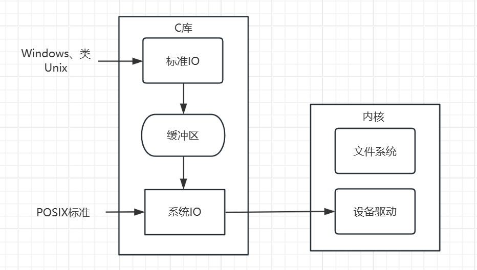

# 4.1 文件IO

# 什么是文件IO

文件 I/O（Input/Output）指的是计算机程序与外部文件系统（通常是磁盘存储）之间的数据传输和交互过程。文件 I/O 允许程序读取和写入文件，以便永久性地保存和检索数据。这在许多应用程序中都是必不可少的，例如文本编辑器、数据库管理系统、图像处理软件等。

文件 I/O 可以分为两种主要类型：

1. 文件读取（Input）：程序从外部文件中读取数据。这可以包括从文件中读取文本、二进制数据、配置文件、日志文件等。读取文件的过程通常涉及打开文件、读取文件内容，然后关闭文件。读取的数据可以用于进一步的处理或显示给用户。
2. 文件写入（Output）：程序将数据写入外部文件中。这通常涉及打开文件、将数据写入文件，然后关闭文件。写入文件的数据可以包括程序生成的文本、日志信息、配置更改等。

文件 I/O 是通过编程语言提供的文件操作函数和库实现的。不同的编程语言提供了不同的文件 I/O 接口，例如在C/C++中，你可以使用 `fopen`​、`fprintf`​、`fread`​、`fwrite`​ 等函数进行文件 I/O 操作。在Python中，你可以使用 `open`​ 函数进行文件读写操作。这些函数提供了访问文件系统的方法，以便程序可以与文件进行交互。

文件 I/O 对于数据的永久性存储和检索非常重要，因为它允许程序在多次执行之间保留数据，或者允许程序与其他应用程序之间交换数据。

‍

‍

# 分类

在Linux中，文件IO分为`系统调用IO`​和`标准IO`

首先介绍`系统调用IO`​，先说明一下POSIX标准，POSIX（Portable Operating System Interface for Unix，可移植操作系统接口）是一组操作系统标准，主要用于类Unix操作系统，如Linux。POSIX定义了一组API（Application Programming Interface），用于处理文件 I/O 和其他系统级操作。POSIX I/O 系统调用是与文件 I/O 相关的一部分，提供了一种标准的方式来进行文件读取和写入操作。

然后是`标准IO`​，其实标准IO就是在`系统调用IO`​上进行封装的。

> 两者的区别在哪？

​`系统调用IO`​的读写是直接访问内核进行操作的，`标准IO`​在此基础上定义了一个缓冲区，为了解决频繁访问内核而导致效率低。

比如有这样一个场景，在程序中需要循环读取或者写入，而且每次只写一个字节，那系统IO就会每次访问内核，并且只写入一个字节，但是标准IO的做法就是，先把内容读/写到缓冲区，当满足一定条件的时候，一次性访问内核。

​​

> **标准IO不仅适用于类Unix系统，还使用Windows，因为Windows也在自己的系统调用上封装了一模一样的标准IO，虽然底层实现不一样，但是顶层实现是一样的，所以标准IO基本通用于Windows、MacOS、Linux**

‍
