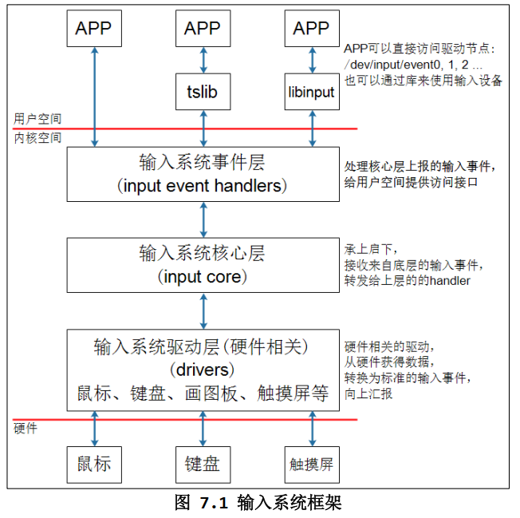
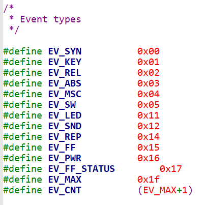
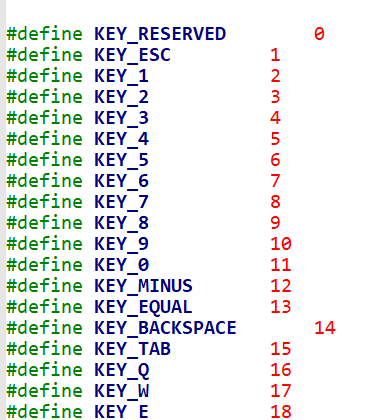
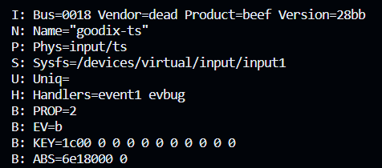
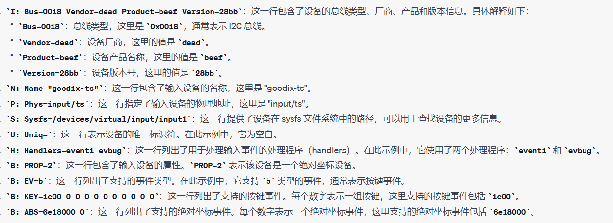
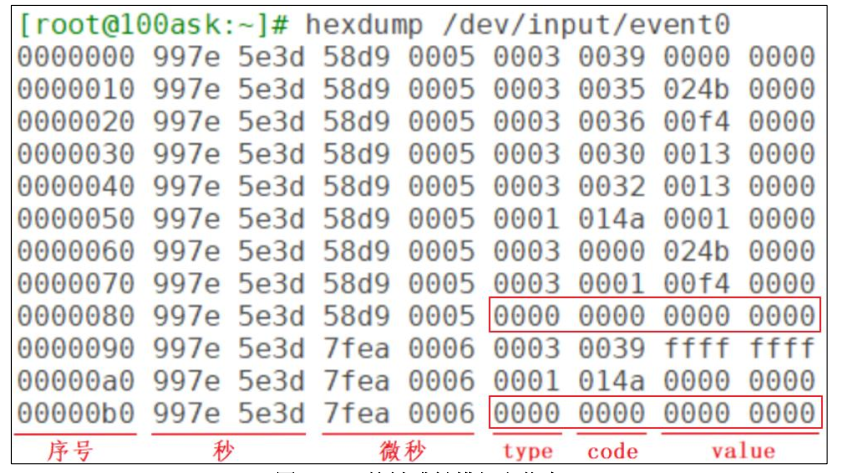

# 8.1 Linux输入系统简介

# 1. 什么是输入系统？

Linux输入系统（Linux Input System）是用于处理和管理各种输入设备的软件框架。它允许Linux操作系统与多种输入设备（如键盘、鼠标、触摸屏等）进行通信和交互。Linux输入系统的主要任务包括以下几个方面：

1. 设备驱动程序：Linux输入系统通过设备驱动程序与硬件设备通信。每种输入设备都需要一个对应的设备驱动程序，以便将设备的输入事件传递给操作系统。
2. 事件处理：输入设备会产生各种事件，例如按键事件、鼠标移动事件、触摸事件等。Linux输入系统负责捕获和处理这些事件，然后将它们传递给应用程序，以便应用程序可以作出相应的响应。
3. 抽象层：Linux输入系统提供了一个抽象层，使应用程序可以独立于具体的硬件设备类型。这意味着应用程序不需要直接处理底层硬件差异，而可以使用通用的接口来处理输入事件。
4. 多设备支持：Linux输入系统支持同时连接多个输入设备，并能够正确处理多个设备产生的输入事件。这对于多用户系统或嵌入式系统中的多个输入设备非常重要。
5. 用户空间接口：Linux输入系统为用户空间提供了接口，允许应用程序通过读取特定的设备文件（通常位于`/dev/input/`​目录下）来获取输入事件。这使得应用程序可以轻松地与输入设备进行通信。
6. 驱动程序模型：Linux输入系统遵循Linux的设备驱动程序模型，通过字符设备驱动程序来管理输入设备。这种模型允许开发者编写自定义设备驱动程序，以支持新的输入设备。

总之，Linux输入系统是一个关键的子系统，它使Linux操作系统能够与各种输入设备无缝交互，为用户提供了广泛的输入选择，以及为应用程序开发者提供了**统一的接口**来处理输入事件。这有助于实现多种应用场景，包括桌面计算机、嵌入式系统、娱乐设备等。

> **Linux为输入设备构造了统一的驱动程序，可以通过统一的接口获取不一样的设备数据**

**输入系统框架：**

​​

# 2. 应用程序如何访问设备节点？

1. **用户程序访问输入设备**：用户程序可以直接访问输入设备节点（例如 `/dev/input/event0`​）来发起读操作。用户程序可以使用系统调用（如 `read`​）来**等待**输入事件的到来。
2. **硬件中断**：当用户操作输入设备时，硬件会产生中断信号，通知操作系统有输入事件发生。
3. **输入系统驱动层处理中断**：在硬件中断发生时，输入系统的驱动程序会介入，**读取硬件生成的原始数据**。这些数据通常是硬件特定的，需要进行**解析和转换**。
4. **输入事件转换**：输入系统驱动程序会将原始数据转换为标准的输入事件（`struct input_event`​结构体）。这些事件包括事件类型（如按键按下、按键释放、鼠标移动等）、事件代码（键码、按钮编号等）和事件值（按键状态、鼠标坐标等）。
5. **核心层处理**：核心层负责将输入事件传递给适当的处理程序（handler）。不同的 handler 处理不同类型的输入事件。例如，`evdev_handler`​用于直接传递输入事件给用户程序。核心层还支持多个用户程序同时访问相同输入设备。
6. **用户程序处理**：用户程序可以通过直接访问设备节点或使用相关库（如 tslib、libinput）来处理输入事件。这些库通常提供了更高级的接口，以简化事件处理。用户程序可以根据输入事件执行相应的操作，例如响应按键、移动鼠标等。
7. **等待数据**：当用户程序正在等待输入事件时，`evdev_handler`​可以唤醒用户程序，以便它可以继续读取和处理数据。

> **内核的标准输入事件结构体：**

```c
struct input_event {
	struct timeval time;	/*事件发生的时间戳*/
	__u16 type;		/*事件的类型*/
	__u16 code;		/*事件的代码*/
	__s32 value;	/*事件的值*/
};

struct timeval {
	__kernel_time_t		tv_sec;		/* 事件发生的秒数*/
	__kernel_suseconds_t	tv_usec;	/* 事件发生的微秒数*/
};
```

​`struct input_event`​ 是一个结构体，用于表示 Linux 输入系统中的输入事件。该结构体包含了输入事件的各个关键属性，如时间戳、事件类型、事件代码和事件值。以下是对这些字段的说明：

1. ​`struct timeval time`​：这是一个包含时间信息的结构体，表示事件发生的时间戳。它包括两个字段：

    * ​`time.tv_sec`​：事件发生的秒数，通常用于表示自 1970 年 1 月 1 日以来的秒数（Unix 时间戳）。
    * ​`time.tv_usec`​：事件发生的微秒数，表示秒的小数部分。
2. ​`__u16 type`​：这是一个 16 位的无符号整数，表示事件的类型。不同的事件类型定义了事件的性质，例如按键事件、鼠标事件、触摸事件等。不同类型的事件具有不同的事件代码和事件值的含义。
3. ​`__u16 code`​：这是一个 16 位的无符号整数，表示事件的代码。事件代码定义了事件的具体性质，例如按下的键码、鼠标的按钮编号、触摸事件的类型等。事件代码通常与事件类型相关联，以确定事件的含义。
4. ​`__s32 value`​：这是一个 32 位的有符号整数，表示事件的值。事件值提供了事件的具体信息，例如按键事件的状态（按下或释放）、鼠标事件的相对位移、触摸事件的坐标等。事件值的含义取决于事件类型和事件代码。

通过结构体 `struct input_event`​，Linux 输入系统能够以一种标准化的方式描述和传递各种输入事件。用户程序可以根据这些属性来理解和处理输入事件，以实现与输入设备的交互。这种标准的输入事件表示有助于编写通用的输入处理代码，无论是处理键盘、鼠标、触摸屏还是其他输入设备。

‍

# 3. 输入系统应用编程需要掌握的知识

#### 3.1 内核中如何表示一个输入驱动程序？

通常使用**input_dev结构体**来表示一个输入设备，也就驱动程序才会用到这个，先了解

下面不是全部代码：

```c
struct input_dev {
    const char *name;                /* 输入设备的名称 */
    const char *phys;                /* 输入设备的物理地址 */
    struct input_id id;              /* 输入设备的ID，包括总线类型、厂商ID、产品ID和版本 */
    unsigned long propbit[BITS_TO_LONGS(INPUT_PROP_CNT)]; /* 属性位掩码 */

    struct input_absinfo absinfo[ABS_CNT]; /* 绝对坐标信息 */
    unsigned long absbit[ABS_CNT];         /* 绝对坐标位掩码 */

	unsigned long evbit[BITS_TO_LONGS(EV_CNT)];		/*支持哪类事件？EV_KEY?EV_ABS?*/
    unsigned long keybit[BITS_TO_LONGS(KEY_CNT)]; /* 按键事件位掩码：支持按键的话，支持哪些按键？ */
    unsigned long relbit[BITS_TO_LONGS(REL_CNT)]; /* 相对坐标事件位掩码 ：支持相对坐标的话，支持哪些？*/
	.....

    struct mutex mutex;                /* 互斥锁，用于保护输入设备的状态 */
    struct list_head node;             /* 输入设备链表节点 */

    /* 输入事件的处理函数，用于生成和发送输入事件 */
    void (*event)(struct input_dev *dev, unsigned int type, unsigned int code, int value);

    /* 驱动程序私有数据指针，用于存储设备特定的数据 */
    void *private;

    struct device dev;                 /* 设备模型中的设备结构体 */

    const struct input_device_id *id_table; /* 输入设备ID表，用于匹配驱动程序 */

    struct rc_dev *rc_dev;            /* 遥控设备结构体 */

    int user;                         /* 输入设备的用户引用计数 */
};

```

#### 3.2 应用程序可以得到什么数据？

就是上面提到的`input_event`​**标准输入事件结构体:**

```c
struct input_event {
	struct timeval time;	/*事件发生的时间戳*/
	__u16 type;		/*事件的类型*/
	__u16 code;		/*事件的代码*/
	__s32 value;	/*事件的值*/
};
```

拿按键事件来举例:

> **事件类型**定义在内核头文件`input-event-code.h`​里：

​​

常用事件解释：

**EV_SYN**:synchronous,同步事件 | >在引用程序读取一个输入设备的时候，通过同步事件来确定数据结束，后续没有输入了

**EV_KEY**: Key Event, 按键事件 | 用于表示按键的按下和释放事件，例如键盘按键、鼠标按钮等。

**EV_REL**: Relative Event, 相对坐标事件 | 用于表示设备上的相对坐标变化，例如鼠标移动事件。

**EV_ABS**: Absolute Event, 绝对坐标事件 | 用于表示设备上的绝对坐标位置，例如触摸屏事件。

> **事件代码:**

​​

> **事件的值**

* ​`0`​：表示按键释放（松开）事件。
* ​`1`​：表示按键按下（按住）事件。
* ​`2`​:   表示按键长按事件。

‍

# 4. 输入系统编程如何调试？

#### 4.1 确定设备信息

输入设备的设备节点名为`/dev/input/eventX`​

查看全部设备节点：

```c
ls /dev/input/* -l
```

​​

> 但是这样只是查看当前系统下的所有设备节点，具体设备对应哪个节点如何确定？

使用命令：

```c
cat /proc/bus/input/devices
```

​​

​​

> 其中EV=b，b是十六进制，转换成二进制为1011，每一位代表一个事件，1代表设备支持该事件，0代表不支持

* 最右边的位（最低位）对应 `EV_SYN`​，即同步事件类型。
* 下一个位对应 `EV_KEY`​，即按键事件类型。
* 下一个位对应 `EV_REL`​，即相对坐标事件类型。
* 最左边的位（最高位）对应 `EV_ABS`​，即绝对坐标事件类型。

然后KEY、ABS也是对应的表示方法。

‍

#### 4.2 使用命令读取输入设备的数据

```c
hexdump /dev/input/event1
```

​​

type 为 3 ， 对 应 EV_ABS ； code 为 0x35 **对 应ABS_MT_POSITION_X**； code 为 0x36 **对应 **​****ABS_MT_POSITION_Y****​ **。**   
上图中还发现有 2 个同步事件：它的 **type**、 **code**、 **value** 都为 **0**。表示电容屏上报了 2 次完整的数据。

> 我们编写系统输入应用程序，重要的就是处理设备上报的数据。不需要接触到驱动层。

‍
