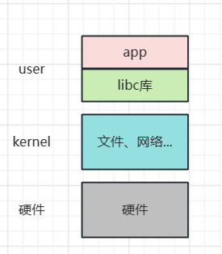

# 一、第一个hello world程序

## 1. hello world!

不管什么语言，什么平台，你的第一个程序都可以是hello world，来分析一下Linux环境下的hello world：

```c
#include <stdio.h>
/* 执行命令: ./hello Linux
 * argc = 2
 * argv[0] = ./hello
 * argv[1] = Linux
 * 输出：hello Linux！
 */

int main(int argc, char **argv)
{
        if (argc >= 2)
                printf("Hello, %s!\n", argv[1]);
        else
                printf("Hello, world!\n");
        return 0;
}
```

和普通的main函数不一样的是，这里添加了两个参数：`int argc`​, `char **argv`​，分别的作用是：

1. **argc（参数个数）：**

    * ​`argc`​ 是一个整数（int）类型的参数，表示命令行参数的个数，包括程序名称本身。
    * 它始终至少为 1，因为第一个参数通常是程序的名称（例如，"./myprogram"）。
    * ​`argc`​ 的值取决于用户在终端上执行程序时传递的参数的数量。
    * 例如，如果你在终端上运行 `./hello Linux`​，则 `argc`​ 的值将为 2。
2. **argv（参数向量）：**

    * ​`argv`​ 是一个字符指针数组（`char **`​），用于存储命令行参数的字符串。
    * ​`argv[0]`​ 存储了程序的名称，而 `argv[1]`​、`argv[2]`​、`argv[3]`​，等等，存储了用户传递的其他参数，如果你在终端上运行 `./hello Linux`​，`argv[1]=“Linux”`​
    * ​`argv`​ 数组的长度与 `argc`​ 相关，通常 `argv`​ 的长度为 `argc + 1`​，因为需要一个额外的元素来存储程序名称。

所以这两参数就是接受用户传入的参数的。

‍

> **怎么才能在开发板上运行这个hello程序呢？**

方法肯定是编译成可执行程序，然后传输到开发板上执行，但是问题是能直接使用ubuntu的gcc编译工具编译吗，当然不行，因为涉及的平台和架构不一样，这里就需要用到前面配置过的**交叉编译工具链**了。

先看看使用不同工具编译文件的具体属性，使用`file`​命令：

1. gcc编译的：

```c
> file hello-gcc
hello-gcc: ELF 64-bit LSB shared object, x86-64, version 1 (SYSV), dynamically linked, interpreter /lib64/ld-linux-x86-64.so.2, BuildID[sha1]=c6041b3088d4587d9f40e68f61f51441f875e7ab, for GNU/Linux 3.2.0, not stripped
```

可见是64位，适用于x86平台的。

2. 交叉编译工具链：

```c
> file hello-mygcc
hello-mygcc: ELF 32-bit LSB executable, ARM, EABI5 version 1 (SYSV), dynamically linked, interpreter /lib/ld-linux-armhf.so.3, for GNU/Linux 4.9.0, not stripped
```

32位的，适用于ARM平台，也正是开发板对应的平台。

‍

## 2. 一个hello.c的申引

> **想必没有具体了解过**​ `**.h**`​**文件的作用和意义吧。**

头文件（Header file）通常以 `.h`​ 扩展名结尾，是一种在编程中常用的文件类型，它具有以下作用：

1. **声明函数和变量：**  头文件包含了函数和变量的声明，使你能够在源代码文件中访问和使用它们，而无需在源文件中重新定义它们。这有助于代码的模块化和重用。
2. **包含常量和宏定义：**  头文件可以包含常量、宏定义和类型定义，以便在程序中使用它们。这有助于提高代码的可读性和可维护性。
3. **提供接口和接口文档：**  头文件定义了函数和变量的接口，通常包括函数的参数和返回类型，以及变量的数据类型。这允许其他开发人员了解如何正确使用你的代码。
4. **分离接口和实现：**  使用头文件可以将接口和实现分开。头文件通常包含接口部分（声明），而源文件包含实现部分。这使得可以轻松更改实现而不必更改接口。
5. **便于模块化编程：**  头文件允许你将代码分解为多个文件，每个文件负责不同的功能或模块。这有助于提高代码的组织性和可维护性。

‍

一句话就是`.h`​声明，`.c`​实现。

> **Linux的头文件都存储在哪？**

可以是系统目录，可以是自定目录（指定目录，在编译的时候需要加上`-I`​参数指定其路径）

> 还有一种和头文件很类似的东西，就是库，在后面介绍

> **在编译过程中常见的错误：**
>
> 1. 头文件找不到（需要查看系统目录下有没有，或自己去指定目录）
> 2. 函数未定义（可能是缺少库）

‍

## 3. 系统调用

> **就是说有一些函数调用用户库就可以完成功能，但是有一些函数需要和内核打交道，就成用户态进入了内核态（kernel）**

 `libc`​ 是用户态库（User-Space Library），包含了一组函数和例程，用于在用户空间执行各种任务。其中，`libc`​ 包括了许多标准C库函数，如 `open`​、`read`​、`write`​ 等，用于文件操作、I/O、字符串处理等。当你在应用程序中调用这些函数时，它们在用户空间执行。

然而，一些操作需要与操作系统内核进行交互，例如文件操作、网络通信、进程管理等。在这种情况下，用户态的应用程序需要进入内核态以便操作系统内核执行相关任务。这通常通过系统调用（System Call）来实现。

系统调用是一种特殊的函数调用，它允许用户态程序请求操作系统内核执行特定任务。例如，当你在用户态应用程序中调用 `open`​ 函数时，`libc`​ 会将请求传递给操作系统内核，内核会打开文件并返回结果。这个过程涉及从用户态切换到内核态，执行系统调用，然后再返回到用户态。

用户态到内核态的切换是一个开销较大的操作，因为它涉及到上下文切换和特权级别的转换。为了实现这种切换，操作系统提供了一组特定的系统调用，而用户态库（如 `libc`​）将这些系统调用封装成易于使用的函数。

总的来说，用户态库允许应用程序在用户空间执行一般任务，但在需要操作系统内核执行的任务时，它会通过系统调用将控制权切换到内核态。这种切换是操作系统提供的界面，允许用户程序与操作系统进行交互并执行特权操作。

> **就是一个程序的层次组成：**

​​

‍
