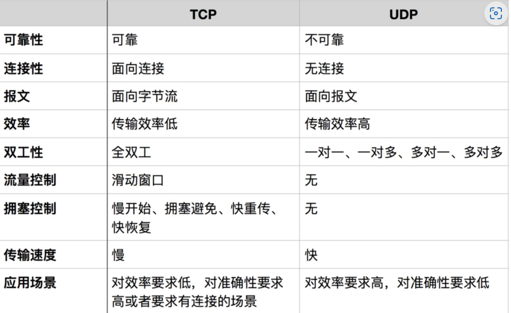
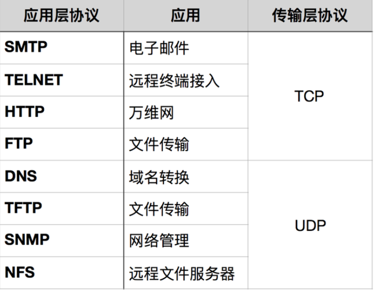
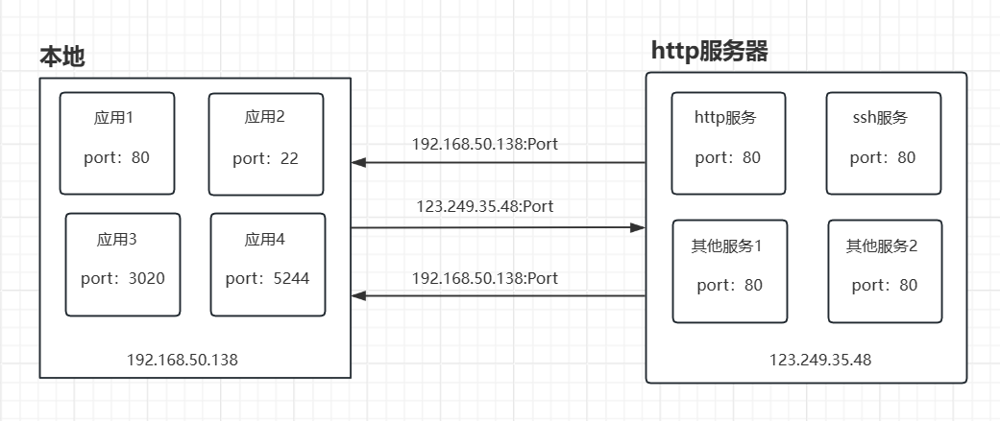

# 九、网络编程基础

# 1.TCP和UDP

​​

#### 1.1 TCP

TCP 是**面向连接**的、**可靠**的流协议。流就是指不间断的数据结构，当应用程序采用 TCP 发送消息时，虽然可以保证发送的顺序，但还是犹如没有任何间隔的数据流发送给接收端。TCP是面向**面向字节流**，虽然应用程序和TCP的交互是一次一个数据块（大小不等），但TCP把应用程序看成是一连串的无结构的字节流。TCP有一个缓冲，当应用程序传送的数据块太长，TCP就可以把它划分短一些再传送。

TCP 为提供可靠性传输，实行“**顺序控制**”或“**重发控制**”机制。此外还具备“**流控制（流量控制）** ”、“**拥塞控制**”、提高网络利用率等众多功能。

TCP有以下特点：

* TCP充分地实现了数据传输时各种控制功能，可以进行丢包时的重发控制，还可以对次序乱掉的分包进行顺序控制。而这些在 UDP 中都没有。
* 此外，TCP 作为一种面向有连接的协议，只有在确认通信对端存在时才会发送数据，从而可以控制通信流量的浪费。
* 根据 TCP 的这些机制，在 IP 这种无连接的网络上也能够实现高可靠性的通信（ **主要通过检验和、序列号、确认应答、重发控制、连接管理以及窗口控制**等机制实现）。

‍

#### 1.2 UDP

UDP 是**面向报文**的，所谓面向报文，是指面向报文的传输方式是应用层交给UDP多长的报文，UDP就照样发送，即一次发送一个报文。因此，应用程序必须选择合适大小的报文。若报文太长，则IP层需要分片，降低效率。若太短，会是IP太小。

UDP 是**不具有可靠性**的数据报协议，细微的处理它会交给上层的应用去完成。在 UDP 的情况下，虽然可以确保发送消息的大小，却不能保证消息一定会到达。因此，应用有时会根据自己的需要进行重发处理。

UDP有以下特点：

* UDP 不提供复杂的控制机制，利用 IP 提供面向无连接的通信服务。
* 传输途中出现丢包，UDP 也不负责重发。
* 当包的到达顺序出现乱序时，UDP没有纠正的功能。
* 并且它是将应用程序发来的数据在收到的那一刻，立即按照原样发送到网络上的一种机制。即使是出现网络拥堵的情况，UDP 也无法进行流量控制等避免网络拥塞行为。
* 如果需要以上的细节控制，不得不交由采用 UDP 的应用程序去处理。
* UDP 常用于以下几个方面：

  * 1.包总量较少的通信（DNS、SNMP等）；
  * 2.视频、音频等多媒体通信（即时通信）；
  * 3.限定于 LAN 等特定网络中的应用通信；
  * 4.广播通信（广播、多播）。

> 总结来说就是，如果你需要可靠的数据传输、流式传输和拥塞控制，TCP可能更合适。如果你需要低延迟、广播、多播或者不需要数据可靠性，UDP可能更适合。

‍

#### 1.3 两者的应用

​​

‍

# 2. IP和端口

​​​​

> * 在网络通信中，IP地址和端口号通常一起使用来标识目标设备上的特定服务。
> * 一个连接通常由本地IP地址、本地端口、远程IP地址和远程端口组成，以唯一标识连接。
> * 例如，当你使用Web浏览器访问网站时，浏览器通过IP地址找到目标服务器，然后使用目标服务器的端口号（通常是80）来访问Web服务。

‍
