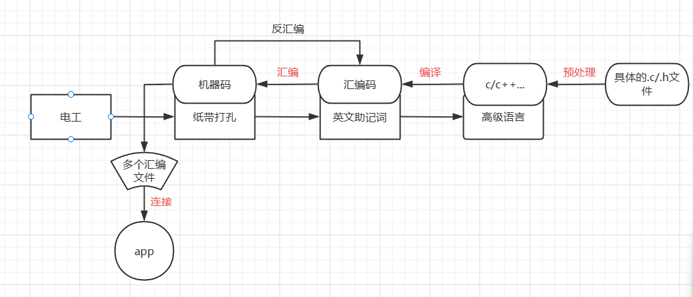

# 二、gcc编译器

## 1. gcc编译过程

把一个.c文件要经过预处理(preprocessing)、编译(compilation)、汇编(assembly)和链接(linking)等 4 步才能变成可执行文件。

​​

​​

1. 预处理：

```shell
    //默认不生成.i文件
    gcc -E add.c
    gcc -E add.c -o add.i
```

* -E 选项告诉编译器只进行预处理操作
* -o 选项把预处理的结果输出到指定文件

2. 编译：

```shell
    gcc -S add.i
    gcc -S add.c
    gcc -S add.c -o add.s
```

* -S 选项告诉编译器，进行预处理和编译成汇编语言操作

3. 汇编:

```shell
    gcc -c add.s
    gcc -c add.c
    gcc -c add.c -o add.o
```

* -c 选项告诉编译器，进行预处理、编译和汇编操作

4. 链接：

```shell
    gcc add.o
    gcc add.c
    gcc add.c -o add
```

还可以编译多个文件：

```shell
    gcc add.c minus.c main.c -o exec
```

‍

## 2. gcc常用选项

|选项|描述|
| :----: | ------------------------------------------------------|
|-E|预处理，开发过程中快速确定某个宏可以使用，”-E -dM”|
|-c|把预处理、编译、汇编都做了，但是不链接|
|-o|指定输出文件|
|-I|指定头文件路径|
|-l|指定链接哪个库文件|
|-L|指定链接库文件目录|

> ＃include使用的<>代表到编译工具指定的系统目录下去查找头文件，“”代表当前目录下
>
> 使用不同的编译工具，其查找的头文件目录也不一样，编译时加上-v选项可以查看详细信息。

比如使用gcc编译,查找的头文件路径：

```c
 /usr/lib/gcc/x86_64-linux-gnu/9/include
 /usr/local/include
 /usr/include/x86_64-linux-gnu
 /usr/include
```

使用交叉编译工具链，查找的头文件路径：

```c
 /home/hqyj/100ask_imx6ull-sdk/ToolChain/arm-buildroot-linux-gnueabihf_sdk-buildroot/bin/../lib/gcc/arm-buildroot-linux-gnueabihf/7.5.0/include
 /home/hqyj/100ask_imx6ull-sdk/ToolChain/arm-buildroot-linux-gnueabihf_sdk-buildroot/bin/../lib/gcc/arm-buildroot-linux-gnueabihf/7.5.0/include-fixed
 /home/hqyj/100ask_imx6ull-sdk/ToolChain/arm-buildroot-linux-gnueabihf_sdk-buildroot/bin/../lib/gcc/arm-buildroot-linux-gnueabihf/7.5.0/../../../../arm-buildroot-linux-gnueabihf/include
 /home/hqyj/100ask_imx6ull-sdk/ToolChain/arm-buildroot-linux-gnueabihf_sdk-buildroot/arm-buildroot-linux-gnueabihf/sysroot/usr/include
```

> 也可以使用-I来指定头文件目录

```c
gcc -c -o main.o main.c -I ./ -v
＃ 指定在当前目录查找头文件
```

所以解决头文件找不到的错误，一个是可以指定头文件目录，第二个是把头文件加入到编译器指定的目录。

‍

> 使用-l指定库文件时，会去编译器指定的目录查找，如果是自己编译的库，可以把库放到编译器指定的库目录，也可以用-L选项指定库文件所在的目录。
>
> 假如我有个动态库：libsub.so，我编译链接库的时候就使用：.... -lsub -L ./
>
> -l使用，需要省略前缀和后缀

如果编译的时候是自己指定的动态库，在执行程序的时候可能找不到相应的库，解决方法是：

1. 把动态库文件，放到系统下的/lib目录
2. 还可以自己指定目录，比如放在/a目录，然后执行：

```c
export LD_LIBRARY_PATH=$LD_LIBRARY_PATH:/a
# 修改环境变量
```

‍
