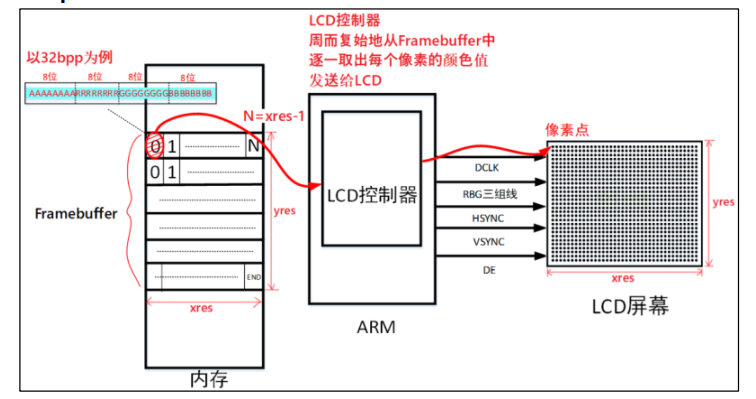
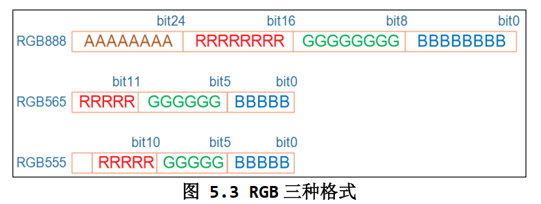
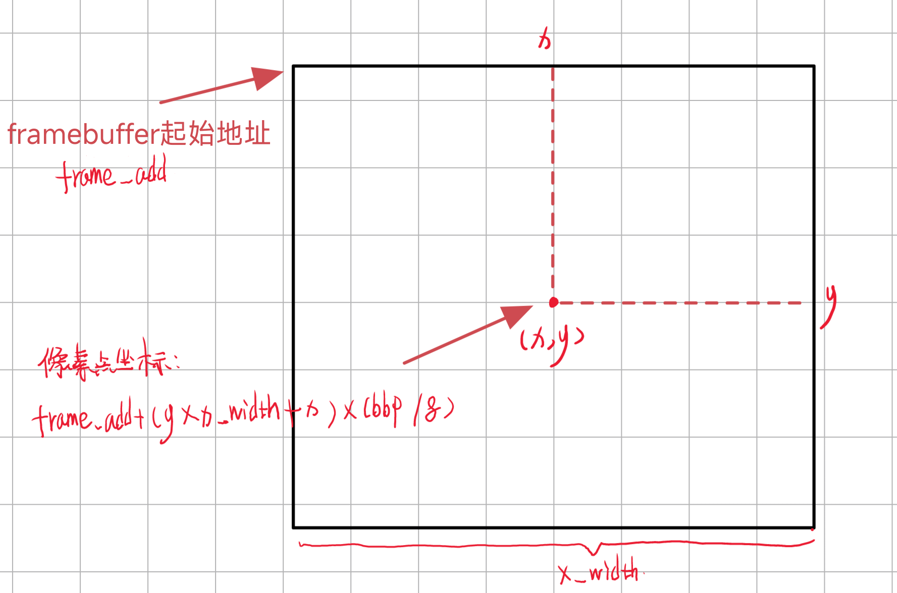

# 五、Framebuffer应用编程

Framebuffer 是一种系统级接口，。它允许开发人员直接与计算机的图形硬件进行交互，以实现像素级的图形渲染。Framebuffer 接口通常是操作系统的一部分，特别是在Linux和类Unix系统上，用于控制显示设备和管理屏幕上的图像。

Framebuffers 在嵌入式系统和一些图形应用程序中广泛使用，因为它们提供了更高级别的图形库无法提供的底层硬件控制和性能优化的功能。开发人员可以通过 Framebuffer 直接访问像素数据，并控制屏幕上的图像渲染，这对于需要定制化、性能要求高或实时图形处理的应用程序非常有用。

因此，Framebuffer 是一个系统级接口，与操作系统紧密相关，用于管理图形显示硬件。它通常用于嵌入式系统、嵌入式图形用户界面和特定类型的图形应用程序。

## 1. Framebuffer简介

Framebuffer是LCD的一种驱动程序：

​​

在嵌入式Linux中通常使用Framebuffer来驱动LCD，Frame是一帧，buffer是缓存，所以Framebuffer就是用于保存一帧图像的内存，Framebuffer里面保存了每个像素点的数据。

> 对于应用程序来说，只需要把数据交给Framebuffer就可以了，再由LCD控制器把Framebuffer中的数据周期的发送给LCD，但是要修改像素点的颜色的时候，需要知道以下内容：

1. **屏幕分辨率，包括宽度（水平像素数）和高度（垂直像素数）**
2. **每个像素的bbp(bits per pixel)-&gt;每个像素用多少位来表示颜色**

​

​

* 对于 32BPP（32位每像素），通常只使用低 24 位来表示颜色信息，而高 8 位通常用于表示透明度（alpha 值）。大多数 LCD 屏幕不使用这些高 8 位，但某些图形处理操作可能需要它们。
* 对于 24BPP（24位每像素），硬件上通常使用 32 位来表示像素，其中 24 位用于颜色信息，而剩余的 8 位通常不被使用。这与 32BPP 类似，只是在内存中存储的位数不同。
* 对于 16BPP（16位每像素），常见的格式是 RGB565，其中 5 位用于红色、6 位用于绿色和 5 位用于蓝色。较少情况下会使用 RGB555，其中 5 位用于红色、5 位用于绿色和 5 位用于蓝色。你可以通过 `ioctl`​ 调用读取驱动程序中的 RGB 位偏移来确定使用哪种格式。

> **怎么计算一个像素点的地址？**

通过计算特定像素点的偏移，你可以找到像素的地址。通常，计算像素地址的公式是：

```
pixel_address = framebuffer_base_address + (y * screen_width + x) * (bits_per_pixel / 8)
```

* ​`framebuffer_add`​ 是 framebuffer 内存的起始地址。
* ​`x`​ 和 `y`​ 是像素的水平和垂直坐标。
* ​`x_width`​ 是屏幕的宽度（以像素为单位）。
* ​`bpp`​ 是每个像素的位深度，通常是 32。
* ​`(bpp / 8)`​ 用于将位转换为字节。

​​​​

通过像素点的地址就可以操作这个像素点了。

‍

## 2. 应用编程

‍

1. 打开 Framebuffer 设备：

    ```c
    fd_fb = open("/dev/fb0", O_RDWR);
    ```

    在这一步，程序打开 Framebuffer 设备 `/dev/fb0`​，以便后续可以读取屏幕信息并绘制图形。
2. 获取屏幕信息：

    ```c
    if (ioctl(fd_fb, FBIOGET_VSCREENINFO, &var))
    ```

    使用 `ioctl`​ 调用获取屏幕信息，将结果存储在 `var`​ 结构体中，以便了解有关屏幕的参数和属性。
3. 计算屏幕相关信息：

    ```c
    line_width = var.xres * var.bits_per_pixel / 8;
    pixel_width = var.bits_per_pixel / 8;
    screen_size = var.xres * var.yres * var.bits_per_pixel / 8;
    ```

    这些计算包括每行的字节数、每像素的字节数和屏幕内存的大小，这些信息将用于后续的绘图操作。
4. 映射 Framebuffer 内存：

    ```c
    fb_base = (unsigned char *)mmap(NULL, screen_size, PROT_READ | PROT_WRITE, MAP_SHARED, fd_fb, 0);
    ```

    通过 `mmap`​ 调用将 Framebuffer 内存映射到程序中，以便进行像素级的绘制和图形操作。
5. 清屏操作：

    ```c
    memset(fb_base, 0xff, screen_size);
    ```

    使用 `memset`​ 函数将整个屏幕清空，将所有像素设置为白色或其他指定的颜色，以准备进行绘图。
6. 绘制图形：

    ```c
    draw_rectangle(200, 200, 100, 100, 0x00FF00);
    ```

    调用绘图函数，如 `draw_rectangle`​，来在屏幕上绘制所需的图形，如矩形。
7. 取消内存映射和关闭设备：

    ```c
    munmap(fb_base, screen_size);
    close(fd_fb);
    ```

    最后，释放内存映射并关闭 Framebuffer 设备，以确保资源的正确释放。

这些关键步骤使程序能够打开 Framebuffer 设备、获取屏幕信息、绘制图形以及释放资源，以便在屏幕上进行图形操作。

> 具体怎么绘制的？

看绘制像素点的函数：

```c
void lcd_put_pixel(int x, int y, unsigned int color)
{
	//计算需要绘制像素点的偏移地址，定义三个，是为了针对不同设备的不同bpp
	unsigned char *pen_8 = fb_base + y * line_width + x * pixel_width;
	unsigned short *pen_16;
	unsigned int *pen_32;

	unsigned int red, green, blue;

	pen_16 = (unsigned short *)pen_8;
	pen_32 = (unsigned int *)pen_8;

	//根据不同设备处理对应的像素点的颜色值
	switch (var.bits_per_pixel)
	{
	case 8:
	{
		*pen_8 = color;//将颜色值写入Framebuffer内存
		break;
	}
	case 16:
	{
		/* 565 */
		red = (color >> 16) & 0xff;
		green = (color >> 8) & 0xff;
		blue = (color >> 0) & 0xff;
		color = ((red >> 3) << 11) | ((green >> 2) << 5) | (blue >> 3);
		*pen_16 = color;
		break;
	}
	case 32:
	{
		*pen_32 = color;
		break;
	}
	default:
	{
		printf("can't surport %dbpp\n", var.bits_per_pixel);
		break;
	}
	}
}
```

> **使用指针**​`**unsigned char *pen_8 = fb_base + y * line_width + x * pixel_width;**`​ ** 来映射到Framebuffer内存，达到字节修改Framebuffer内存的像素值。**

‍
