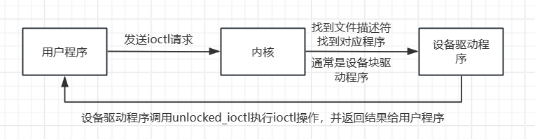
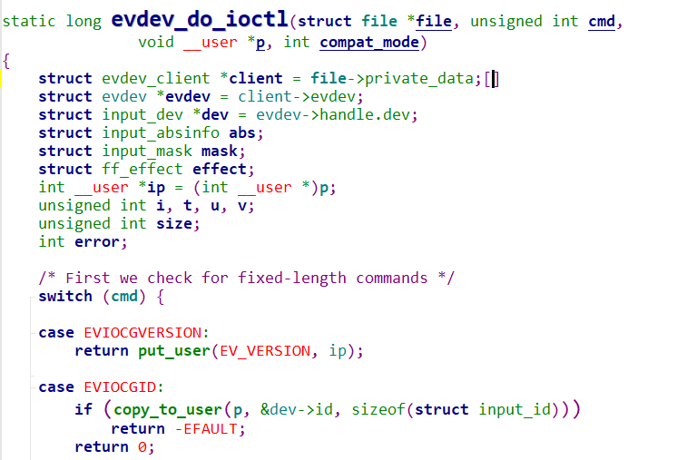
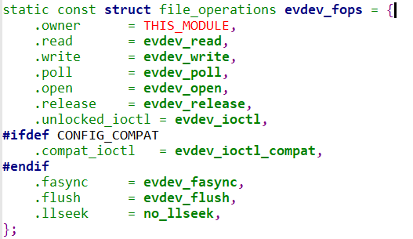
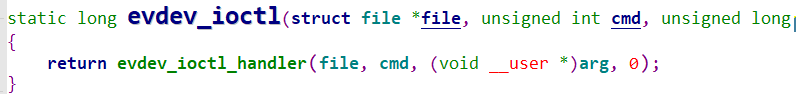
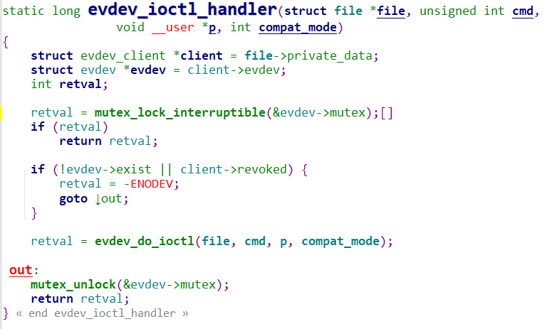
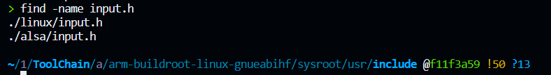
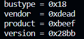

# 8.1 用ioctl获取设备信息

‍

# 1. 通过ioctl获取设备信息

#### 1.1 什么是ioctl

​`ioctl`​ 是 Linux 中的系统调用，用于控制设备、文件和套接字等内核支持的对象。它的名称代表 "input/output control"，它允许用户空间程序与内核进行通信以执行各种控制操作。

​`ioctl`​ 的一般形式如下：

```c
int ioctl(int fd, unsigned long request, ...);
```

* ​`fd`​：要执行 `ioctl`​ 操作的文件描述符。
* ​`request`​：表示要执行的具体操作的命令或请求，通常是一个无符号长整数。这个参数确定了要执行的操作。
* 可选参数：具体操作可能需要传递其他参数，这些参数的类型和数量取决于特定的 `ioctl`​ 命令。

​`ioctl`​ 的应用范围非常广泛，主要用于以下方面：

1. **设备控制**：`ioctl`​ 可以用于控制硬件设备，如输入设备、串口、网卡、显示器等。用户程序可以使用 `ioctl`​ 命令来获取设备信息、配置设备参数、发送命令以及执行其他与设备有关的操作。
2. **文件控制**：`ioctl`​ 也可用于对文件进行控制，例如设置文件属性、改变文件大小等。
3. **套接字控制**：套接字也是可以进行 `ioctl`​ 操作的对象，用于配置套接字的参数、获取套接字信息以及执行套接字相关的操作。
4. **网络控制**：`ioctl`​ 可以用于与网络相关的控制，如配置网络接口、获取网络统计信息等。
5. **字符设备控制**：`ioctl`​ 用于字符设备的控制，可以执行各种字符设备特定的操作。
6. **其他控制操作**：`ioctl`​ 还用于其他各种内核控制操作，如进程控制、文件系统控制等。

要正确使用 `ioctl`​，必须知道所要执行的具体操作的请求代码（`request`​），并根据请求代码提供适当的参数。请求代码通常是一个以 `IOCTL_`​ 开头的宏或是一个预定义的常数，表示特定的操作。内核会根据请求代码来执行相应的操作。

#### 1.2 如何实现ioctl

​`ioctl`​ 的实现涉及内核和用户空间之间的通信和控制。以下是 `ioctl`​ 的一般实现流程：

1. 用户程序调用 `ioctl`​：用户程序通过系统调用 `ioctl`​ 来发出请求，通常在打开的设备文件描述符上执行该操作。
2. 内核接收请求：内核接收到 `ioctl`​ 请求，包括请求的文件描述符、命令码 `cmd`​ 和与 `cmd`​ 相关的参数（如果有的话）。
3. 内核查找文件操作对象：内核根据文件描述符找到与请求相关的文件操作对象（通常是字符设备或块设备驱动程序）。
4. 调用 `unlocked_ioctl`​ 方法：内核通过文件操作对象中的 `unlocked_ioctl`​ 函数指针来执行 `ioctl`​ 操作。这是驱动程序中的处理函数，它接受请求并执行相应的操作。
5. 执行 `ioctl`​ 操作：`unlocked_ioctl`​ 函数根据 `cmd`​ 值执行请求的操作。它可能会访问设备寄存器、修改设备状态、传输数据等，具体操作取决于请求和设备类型。
6. 返回结果：`unlocked_ioctl`​ 函数执行完 `ioctl`​ 操作后，它可能返回结果或状态信息。内核将此信息传递回用户程序。
7. 用户程序收到结果：用户程序接收到 `ioctl`​ 操作的结果，并根据需要采取后续操作。这可能包括错误处理、继续执行其他操作或展示信息。

总的来说，`ioctl`​ 的实现涉及用户程序和内核之间的交互。内核中的设备驱动程序提供了实际的处理逻辑，它根据请求执行不同的操作。`ioctl`​ 是一种用于控制设备和执行与设备相关的操作的通用机制，允许用户程序与设备进行通信和控制。它提供了一种灵活的方式来配置和操作设备，以满足各种应用程序的需求。

​​

# 2. 拿输入子系统驱动程序evdev来介绍用户程序怎么调用ioctl这个函数的

对于输入系统，常用的就是evdev输入子系统驱动程序，这个驱动程序的ioctl的实现：

​​

evdev驱动程序的ioctl这个调用过程还是挺蜿蜒曲折的，简单说一下：

首先用户程序发起ioctl调用请求，然后又用户态进入内核态，内核通过设备文件描述符fd的参数，一个结构体：evdev_fops，这个结构体包含指针：`unlocked_ioctl`​函数指针，找到它指向的这个驱动程序的ioctl函数，也就是`evdev_ioctl`​

1. ​`evdev_ioctl`​ 函数接收到这个调用，将 `cmd`​ 和 `arg`​ 传递给 `evdev_ioctl_handler`​ 函数。
2. ​`evdev_ioctl_handler`​ 函数负责处理 `ioctl`​ 命令，它根据命令调用适当的处理函数。
3. 在特定情况下，`evdev_ioctl_handler`​ 函数会调用 `evdev_do_ioctl`​ 函数来执行实际的 `ioctl`​ 命令。
4. ​`evdev_do_ioctl`​ 函数根据命令执行相应的操作，可能会配置设备、读取事件数据、查询设备信息等，然后返回结果。
5. 结果从 `evdev_do_ioctl`​ 返回给 `evdev_ioctl_handler`​，然后再由 `evdev_ioctl`​ 返回给用户程序。

> 虽然不懂为什么这样设计，但是具体就是这么个调用方法。

​​​​

​​

> **但是对于应用编程，我们并不需要关心底层调用**

‍

# 3. 编程获取输入设备信息

由于是输入设备，肯定是由输入子系统的驱动程序来驱动的，需要调用ioctl来从设备中获取设备信息，获取什么信息由ioctl的第二个参数决定，一般都是已经定义好了的宏，我们需要用到的宏都包括在头文件`input.h`​里面，所以需要包含这个头文件，需要在编译器的系统目录下查找这个头文件的详细位置：

​​

所以包含头文件`#include <linux/input.h>`​

---

假如我们要获取设备的标识信息：​​

具体内容：

```c
struct input_id {
	__u16 bustype;	 /*总线类型*/
	__u16 vendor;	/*设备制造商的标识*/
	__u16 product;	/*设备产品的标识*/
	__u16 version;	/*设备的版本信息*/
};
```

> 我们使用这个命令宏：​`**EVIOCGID**`​

查看这个宏的定义：

```c
#define EVIOCGID		_IOR('E', 0x02, struct input_id)	/* get device ID */
//具体这个宏怎么定义在驱动学习的时候了解
```

```c
//具体使用
struct input_id id;
int err = ioctl(fd, EVIOCGID, &id);
if (err == 0) {
    printf("bustype: 0x%x\n", id.bustype);
    printf("vendor: 0x%x\n", id.vendor);
    printf("product: 0x%x\n", id.product);
    printf("version: 0x%x\n", id.version);
}
```

输出结果：​​

---

> 假如要查看输入设备支持哪些事件，使用宏：**EVIOCGBIT**

​​

```c
int evbit;
    int len = ioctl(fd, EVIOCGBIT(0, sizeof(evbit)), &evbit);
    if (len > 0 && len <= sizeof(evbit))
        // 将 ev_names 传递给 print_supported_events 函数
        print_supported_events(evbit, ev_names);
```

结果：​​
