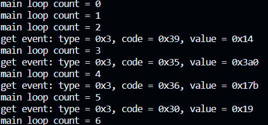

# 8.3 读取输入设备的数据

输入设备的数据前面介绍过了，主要就是

```c
struct input_event {
	struct timeval time;	/*事件发生的时间戳*/
	__u16 type;		/*事件的类型*/
	__u16 code;		/*事件的代码*/
	__s32 value;	/*事件的值*/
};
```

但是我们使用用户程序读取设备的数据时，也需要参考驱动程序的接口定义，所以从设备文件读取数据的时候，也需要用这样一个数据结构存放数据。

读取输入设备数据的方式有四种：

1. **查询方式**
2. **休眠**-**唤醒方式**
3. **POLL/SELECT 方式**​
4. **异步通知方式**

> 这四种方式就是应用程序跟驱动程序打交道的四种方式。

## 1. 查询和**休眠**-**唤醒方式**

这两种方式描述了在应用程序中如何处理输入设备数据的不同方式：

1. **查询方式**（非阻塞，O_NONBLOCK）：在这种方式下，应用程序打开输入设备文件时使用 `open`​ 函数，并传入 `O_NONBLOCK`​ 标志。这表示应用程序以非阻塞方式打开设备，如果没有可用的数据，`read`​ 函数会立即返回一个错误（EAGAIN），而不会等待数据到达。这使应用程序可以继续执行其他任务而不被阻塞。这种方式适用于需要在数据到达之前执行其他操作的场景。
2. **休眠-唤醒方式**（不使用O_NONBLOCK）：在这种方式下，应用程序在打开输入设备文件时不使用 `O_NONBLOCK`​ 标志。这表示应用程序以阻塞方式打开设备，并且在调用 `read`​ 函数时，如果没有可用的数据，应用程序将进入休眠状态等待数据到达。一旦数据到达，驱动程序将唤醒应用程序，`read`​ 函数将返回数据。这种方式适用于需要实时响应输入数据的场景，但可能会导致应用程序在等待数据时浪费一些系统资源。

选择使用哪种方式取决于应用程序的需求。如果应用程序需要立即响应输入数据并不断地轮询设备，查询方式（非阻塞）可能更合适。如果应用程序可以等待数据并且需要实时响应，休眠-唤醒方式可能更合适。每种方式都有其优势和劣势，根据具体情况选择最适合的方式。

> 程序：

```c
int main(int argc, char **argv)
{
	int fd;
	struct input_event event;

	if (argc < 2)
	{
		printf("Usage: %s <dev> [noblock]\n", argv[0]);
		return -1;
	}
	//查询方式
	if (argc == 3 && !strcmp(argv[2], "noblock"))
	{
		fd = open(argv[1], O_RDWR | O_NONBLOCK);
	}
	//休眠-唤醒方式
	else
	{
		fd = open(argv[1], O_RDWR);
	}
	if (fd < 0)
	{
		printf("open %s err\n", argv[1]);
		return -1;
	}

	char *type[] = {
		"同步事件",
		"按键事件",
		"相对事件",
		"绝对事件"};

	while (1)
	{
		len = read(fd, &event, sizeof(event));
		if (len == sizeof(event))
		{
			printf("get event: type = %s, code = 0x%x, value = 0x%x\n", type[event.type], event.code, event.value);
		}
		else
		{
			printf("read err %d\n", len);
		}
	}

	return 0;
}
```

> 就是直接打开输入设备文件，然后从里面读取数据。

运行结果，查询方式：

​​

休眠-唤醒方式：

​​

## 2. poll/select方式

#### 2.1 poll

​`poll`​是一个系统调用，用于多路复用I/O操作。允许应用程序同时监测多个文件描述符的状态，以确定文件是否可读、可写或者是发生异常。

提供非阻塞的方式监测，有效避免在处理多个I/O操作的忙等状态，提高系统资源利用率。

> 接口描述:

函数原型：

```c
 //包含头文件
#include <poll.h>

int poll(struct pollfd *fds, nfds_t nfds, int timeout);

/*参数解释
*fds: 一个指向struct pollfd结构体指针，也就是结构体数组，这里设计数组是为了能同时监测多个文件描述符
*nfds: 要监测文件描述符的数量，即fd数组的元素数量
*timeout：超时时间，单位是ms，
	-设置为-1，poll将一直等待监测事件的发生，也就是阻塞的方式等待
	-如果设置为正数，poll会在timeout时间内等待事件发生，超时会返回0
	-设置为0，poll会立即返回一个负数(-1)
```

返回正数代表poll监测的事件发生。

> struct pollfd结构体的原型：

```c
struct pollfd{
	int fd;			//要监测的文件描述符
	short events;	//监测的事件类型
	short revents;	//实际发生的事件类型
}
```

调用poll接口后，内核会监测文件描述符fd的事件events是否发生，如果发生了，内核会返回实际发生的事件给revents，我们比较events和revents的内容就可以得知事件是否发生。

> 事件类型：

```c
POLLIN:可读事件
POLLOUT:可写事件
POLLPRI:紧急或优先事件
POLLERR:错误事件
POLLHUP:挂起事件
POLLNVAL:无效事件
```

利用这个接口，同样可以对输入设备的文件进行监测，并读取输入设备的数据。

实例：

```c
for (i = 0; i < argc - 1; i++)
	{
		fd[i] = open(argv[i + 1], O_RDWR | O_NONBLOCK);	//打开多个设备文件
		if (fd[i] < 0)
		{
			printf("open %s err\n", argv[i + 1]);
			return -1;
		}
		get_input_info(fd[i], &id);	//获取设备信息，id、事件类型
		fds[nfds].fd = fd[i];
		fds[nfds].events = POLLIN;	//设置监测事件为：是否有数据可读
		nfds++;
	}

	while (1)
	{
		ret = poll(fds, nfds, 5000); // 一直等待事件发生
		if (ret < 0) //逻辑错误
		{
			printf("poll error\n");
			break;
		}
		else if(ret == 0)
		{
			printf("timeout\n");
		}
		for (i = 0; i < nfds; i++)
		{
			if (fds[i].revents & POLLIN)	//检测监测的事件是否发生
			{
				len = read(fd[i], &event, sizeof(event));
				if (len == sizeof(event))
				{
					// 处理事件
					printf("Device %d: type = %u, code = %u, value = %d\n", i, event.type, event.code, event.value);
				}
			}
		}
	}

	// 关闭设备
	for (i = 0; i < nfds; i++)
	{
		close(fd[i]);
	}
```

‍

#### 2.2 select

​`select`​和`poll`​的功能实现一样，也是多路复用I/O，但是实现方式稍有不同。

> 函数原型：

```c
//头文件包含
/* According to POSIX.1-2001, POSIX.1-2008 */
#include <sys/select.h>

/* According to earlier standards */
#include <sys/time.h>
#include <sys/types.h>
#include <unistd.h>

//函数原型
int select(int nfds, fd_set *readfds, fd_set *writefds,
			fd_set *exceptfds, struct timeval *timeout);
/*参数介绍
* nfds:待监视的文件描述符中的最大文件描述符加一
* *readfds:指向 fd_set 结构体的指针，用于指定待监视可读事件的文件描述符
* *writefds:指向 fd_set 结构体的指针，用于指定待监视可写事件的文件描述符
* *exceptfds:指向 fd_set 结构体的指针，用于指定待监视异常事件的文件描述符
* *timeout:指向 struct timeval 结构体的指针，用于指定超时时间。如果为 NULL，select 将一直阻塞等待事件；如果为指向 struct timeval 结构体的指针，可以设置等待的最大时间
*/

//一些操作宏
void FD_CLR(int fd, fd_set *set); 	//从文件描述符集合中清除特定的文件描述符
int  FD_ISSET(int fd, fd_set *set);	//检查文件描述符集合中是否设置了特定的文件描述符位
void FD_SET(int fd, fd_set *set);	//将特定的文件描述符设置到文件描述符集合中
void FD_ZERO(fd_set *set);			//将整个文件描述符集合清零，以便初始化一个新的空集合
```

> 示例：

```c
int main(int argc, char **argv)
{
	int fd[MAXDEVS];
	int err;
	int len;
	int ret;
	int i;
	int nfds;
	struct input_id id;
	struct input_event event;
	fd_set readfds;
	struct timeval timeout;
	if (argc < 2)
	{
		printf("Usage: %s <dev> <dev> ...\n", argv[0]);
		return -1;
	}

	for (i = 0; i < argc - 1; i++)
	{
		fd[i] = open(argv[i + 1], O_RDWR | O_NONBLOCK);
		if (fd[i] < 0)
		{
			printf("open %s err\n", argv[i + 1]);
			return -1;
		}
		get_input_info(fd[i], &id);
	}

	while (1)
	{
		timeout.tv_sec = 5;
		timeout.tv_usec = 0;

		FD_ZERO(&readfds);
		for (i = 0; i < argc - 1; i++)
		{
			FD_SET(fd[i], &readfds);
		}
		nfds = fd[argc - 1] + 1;
		ret = select(nfds, &readfds, NULL, NULL, &timeout); // 一直等待事件发生
		if (ret < 0)
		{
			printf("select error\n");
			break;
		}
		else if (ret == 0)
		{
			printf("timeout\n");
		}
		else
		{
			for (i = 0; i < argc - 1; i++)
			{
				if (FD_ISSET(fd[i], &readfds))
				{
					while (read(fd[i], &event, sizeof(event)) == sizeof(event))
					{
						printf("get event: type = 0x%x, code = 0x%x, value = 0x%x\n", event.type, event.code, event.value);
					}
				}
			}
		}
	}

	// 关闭设备
	for (i = 0; i < argc - 1; i++)
	{
		close(fd[i]);
	}

	return 0;
}
```

‍

## 3. 异步通知方式

> 主要步骤：

1. **注册信号处理函数**：使用函数`signal`​注册一个信号处理函数，用于处理异步通知。这个函数将被调用以处理从输入设备读取的事件数据。
2. **打开输入设备**：程序使用`open`​函数打开指定的输入设备文件（`/dev/input/event0`​）。如果打开失败，它会打印错误消息并退出。
3. **设置进程为文件描述符的所有者**：程序使用`fcntl`​函数设置当前进程为文件描述符的所有者，以便异步事件可以通知给该进程。
4. **启用异步通知**：程序使用`fcntl`​函数将文件描述符的标志设置为`FASYNC`​，以启用异步通知。这样，当设备上有事件发生时，内核将向进程发送`SIGIO`​信号。
5. **异步通知处理**：当输入设备上发生事件时，内核会发送`SIGIO`​信号给进程。这将触发注册的信号处理函数`my_sig_handler`​，该函数从设备读取事件数据并打印。

#### 3.1 注册信号处理函数

> signal函数：

```c
/*包含头文件*/
#include <signal.h>
/*参数类型定义*/
typedef void (*sighandler_t)(int);

sighandler_t signal(int signum, sighandler_t handler);
/*参数说明
* signum:表示要捕获的信号的编号，例如 SIGINT 表示中断信号，SIGTERM 表示终止信号等
* handler:是一个函数指针，指向一个用户定义的函数，该函数将在接收到指定信号时被调用
*/
```

> handler是一个用户定义函数，接受一个int类型的参数，代表接受的信号的编号，只有在信号处理函数注册了多个信号的时候，该参数可以用来判断是哪个信号触发了处理函数，以便做出相应处理，和STM32的中断的中断标志位有点像。

示例：

```c
#include <signal.h>
void signal_handler(int signum)
{
	if(signum == SIGIO)
	{
		//处理SIGIO信号相关的内容
	}
	if(signum == SIGINT)
	{
		//处理SIGINT相关的内容
	}
}

int main(int argc,char *argv[])
{
	signal(SIGIO, my_sig_handler);
	signal(SIGINT, my_sig_handler);
	.....
}
```

> SIGIO信号：

​`SIGIO`​ 是一种特殊的信号，也称为 "I/O信号" 或 "异步I/O信号"。它通常用于通知进程，某个文件描述符上的异步I/O操作已经完成，或者有数据可供读取。

主要用途包括：

1. 异步I/O通知：当进行异步I/O操作时，进程可以通过设置文件描述符的`FASYNC`​标志来请求内核在I/O操作完成时发送`SIGIO`​信号。这使得进程可以继续执行其他操作，而不必等待I/O操作完成。一旦I/O完成，内核会发送`SIGIO`​信号，进程可以捕获并处理这个信号，以读取或处理I/O结果。
2. 套接字（Socket）通知：对于网络套接字，`SIGIO`​信号也可以用于通知套接字上有新数据可供读取，或者套接字可写入。这对于非阻塞套接字的异步I/O操作非常有用。
3. 文件描述符状态改变通知：`SIGIO`​信号还可以用于通知文件描述符的状态发生了改变，如有新的数据可供读取或可写入。这对于非阻塞I/O操作以及事件驱动程序设计非常有用。

​`SIGIO`​通常是由`fcntl`​函数中的`F_SETOWN`​和`F_SETFL`​操作来设置并启用的。这允许进程在文件描述符上的I/O操作完成时接收`SIGIO`​信号，以便进行适当的处理。

总之，`SIGIO`​信号用于异步I/O操作的通知，帮助进程在不阻塞的情况下处理I/O事件。

‍

#### 3.2 设置进程为文件描述符的所有者

将进程设置为文件描述符的所有者是为了确保当文件描述符所关联的文件或设备上有异步事件（如输入设备事件）发生时，相应的 `SIGIO`​ 信号应该发送给特定的进程。

具体作用如下：

1. **异步事件通知**：当文件描述符的所有者被设置为某个进程时，如果文件描述符关联的文件或设备上发生了异步事件，内核将发送 `SIGIO`​ 信号给拥有该文件描述符的进程。这是一种异步通知机制，使得进程无需阻塞等待事件，而可以在事件发生时得到通知并执行相应的操作。
2. **事件处理**：进程可以在收到 `SIGIO`​ 信号时，通过注册信号处理函数来处理事件。这允许进程在事件发生时执行自定义的操作，例如读取输入设备的数据、处理网络套接字的数据、记录日志等。
3. **避免轮询**：相较于轮询检查文件描述符状态，设置进程为文件描述符的所有者可以减少 CPU 的消耗，因为进程无需持续轮询来检查事件状态，而可以等待异步通知。

> 理解为：关联文件描述符和进程，内核通过文件描述符的变化来通知这个进程

**fcntl函数：** 

```c
#include <unistd.h>
#include <fcntl.h>

int fcntl(int fd, int cmd, ... /* arg */ );
```

* ​`fd`​：是一个已打开文件的文件描述符，它用于指定要操作的文件或设备。
* ​`cmd`​：是一个整数值，表示要执行的操作类型。
* ​`arg`​：是一个可选参数，具体的类型和用途取决于 `cmd`​ 的值。根据不同的操作，`arg`​ 可以是整数、结构体或其他类型。

​`fcntl`​ 函数的返回值取决于执行的操作类型（`cmd`​）：

* 如果执行成功，根据 `cmd`​ 不同，返回值可能是一个整数值或特定操作的结果。
* 如果出错，返回值通常是 -1，并设置 `errno`​ 来指示错误的类型。

​`cmd`​ 参数可以采用不同的值，用于执行不同的操作。以下是一些常见的 `cmd`​ 值及其作用：

* ​`F_DUPFD`​：复制文件描述符。
* ​`F_GETFD`​：获取文件描述符标志。
* ​`F_SETFD`​：设置文件描述符标志。
* ​`F_GETFL`​：**获取文件状态标志。**
* ​`F_SETFL`​：**设置文件状态标志。**
* ​`F_GETOWN`​：获取文件描述符的所有者（进程ID）。
* ​`F_SETOWN`​：**设置文件描述符的所有者。**
* ​`F_GETLK`​：获取文件锁信息。
* ​`F_SETLK`​：设置文件锁。
* ​`F_SETLKW`​：设置文件锁，如果锁不可用则阻塞。
* ​`F_GETSIG`​：获取信号事件（用于异步I/O）。
* ​`F_SETSIG`​：设置信号事件（用于异步I/O）。

​`arg`​ 参数的具体类型和用途取决于 `cmd`​ 的值。根据不同的操作，`arg`​ 可以是整数、结构体或其他类型。例如，当 `cmd`​ 为 `F_DUPFD`​ 时，`arg`​ 是一个整数，表示新的文件描述符；当 `cmd`​ 为 `F_GETLK`​ 时，`arg`​ 是一个结构体，用于获取文件锁的信息。

​`fcntl`​ 函数提供了对文件描述符的广泛控制能力，可以用于执行多种文件描述符相关的操作，如设置非阻塞 I/O、管理文件锁、异步通知和调整文件描述符状态等。根据不同的 `cmd`​ 值，可以实现不同的操作。

---

> 如何设置文件描述符的所有者：

```c
fcntl(fd, F_SETOWN, getpid());
```

其中`gitpid()`​是获取当前进程号

‍

#### 3.3 启用异步通知

还是通过`fcntl`​函数来设置

```c
int flags;
flags = fcntl(fd, F_GETFL); 		//获取文件描述符当前标志
fcntl(fd, F_SETFL, flags | FASYNC);	//在文件描述符当前标志上添加FASYNC标志
```

> 解释：先要获取文件描述符当前的标志位，为了后面设置标志位的时候能在原来的基础上设置，达到不覆盖的效果，然后使用`flags | FASYNC`​，位与操作，添加`FASYNC`​标志位，使得文件描述符能接受异步通知。

‍

#### 3.4 完整代码

```c
#include <linux/input.h>
#include <sys/types.h>
#include <sys/stat.h>
#include <fcntl.h>
#include <stdio.h>
#include <string.h>
#include <unistd.h>
#include <signal.h>
#include <unistd.h>

int fd;

void my_sig_handler(int sig)
{
	if (sig == SIGIO)
	{
		struct input_event event;
		while (read(fd, &event, sizeof(event)) == sizeof(event))
		{
			printf("get event: type = 0x%x, code = 0x%x, value = 0x%x\n", event.type, event.code, event.value);
		}
		}
}

/* ./05_input_read_fasync /dev/input/event0 */
int main(int argc, char **argv)
{
	unsigned int flags;
	int count = 0;

	if (argc != 2)
	{
		printf("Usage: %s <dev>\n", argv[0]);
		return -1;
	}

	/* 注册信号处理函数 */
	signal(SIGIO, my_sig_handler);

	/* 打开驱动程序 */
	fd = open(argv[1], O_RDWR | O_NONBLOCK);
	if (fd < 0)
	{
		printf("open %s err\n", argv[1]);
		return -1;
	}

	/* 把APP的进程号告诉驱动程序 */
	fcntl(fd, F_SETOWN, getpid());

	/* 使能"异步通知" */
	flags = fcntl(fd, F_GETFL);
	fcntl(fd, F_SETFL, flags | FASYNC);

	while (1)
	{
		printf("main loop count = %d\n", count++);
		sleep(2);
	}

	return 0;
}

```

​​

‍

> 为什么在信号处理函数my_sig_handler中使用while来读取输入事件的数据？

在信号处理函数中，使用 `while`​ 循环和 `if`​ 来处理不同的情况会有不同的影响。让我们来考虑这两种情况：

1. 使用 `while`​ 循环：

    * 当信号处理函数收到 `SIGIO`​ 信号时，它将进入 `while`​ 循环并尝试读取尽可能多的输入事件，直到没有更多事件可读为止。这确保了尽可能多的事件被处理。
    * 如果存在多个输入事件在缓冲区等待读取，`while`​ 循环将确保它们都被读取和处理。
2. 使用 `if`​ 来判断：

    * 如果在信号处理函数中使用 `if`​ 语句而不是 `while`​ 循环，那么每次信号处理函数被调用时，它只会尝试读取一次输入事件。
    * 这意味着如果在同一时刻有多个事件在缓冲区等待，只有一个事件会被读取和处理，而其他事件将被忽略。

如果目标是尽可能多地处理输入事件，通常使用 `while`​ 循环是更合适的，因为它可以确保在同一时刻有多个事件等待时，它们都会被读取和处理。但是请注意，要小心处理事件的速度，以免陷入无限循环或阻塞。

如果更关注实时性，可能会选择使用 `if`​ 语句，以便及时处理一个事件并快速返回信号处理函数。但这意味着在多个事件连续发生时，只有第一个事件会被处理，其他事件可能会丢失。选择哪种方式取决于应用程序的要求和设计。

> 这是if的结果，确实会漏掉很多数据：

​​
