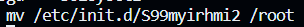

# 8.4 使用tslib读取电容屏的输入事件

## 1. 电容屏的输入数据解析

```c
| 序号  |    秒   |   微秒  |type|code|  value | 
//第一个触点按下
0000000 01c9 0000 68e7 0007 0003 0039 0005 0000 //ABS_MT_TRACKING_ID 5
0000010 01c9 0000 68e7 0007 0003 0035 03c4 0000	//ABS_MT_POSITION_X
0000020 01c9 0000 68e7 0007 0003 0036 00f2 0000	//ABS_MT_POSITION_Y
0000030 01c9 0000 68e7 0007 0003 0030 001b 0000	//ABS_MT_TOUCH_MAJOR
0000040 01c9 0000 68e7 0007 0003 003a 001b 0000	//ABS_MT_PRESSURE
0000050 01c9 0000 68e7 0007 0001 014a 0001 0000	//BTN_TOUCH
0000060 01c9 0000 68e7 0007 0000 0000 0000 0000	//
//第二个触点按下
0000070 01c9 0000 3ddc 000f 0003 002f 0001 0000	//ABS_MT_SLOT 1
0000080 01c9 0000 3ddc 000f 0003 0039 0006 0000	//ABS_MT_TRACKING_ID 6
0000090 01c9 0000 3ddc 000f 0003 0036 0153 0000
00000a0 01c9 0000 3ddc 000f 0003 0030 0014 0000
00000b0 01c9 0000 3ddc 000f 0003 003a 0014 0000
00000c0 01c9 0000 3ddc 000f 0000 0000 0000 0000
//第一个触点松开
00000d0 01ca 0000 7292 000b 0003 002f 0000 0000 //ABS_MT_SLOT 0
00000e0 01ca 0000 7292 000b 0003 0039 ffff ffff //ABS_MT_TRACKING_ID -1 表示松开了ID为5的触电
00000f0 01ca 0000 7292 000b 0000 0000 0000 0000
//第二个触点松开
0000100 01cb 0000 d744 0003 0003 002f 0001 0000 //ABS_MT_SLOT 1
0000110 01cb 0000 d744 0003 0003 0039 ffff ffff //ABS_MT_TRACKING_ID -1 表示松开了ID为6的触电
0000120 01cb 0000 d744 0003 0001 014a 0000 0000
0000130 01cb 0000 d744 0003 0000 0000 0000 0000
```

> 当有多个触点的时候，电容屏会上报这个点的ABS_MT_SLOT和ABS_MT_TRACKING_ID，此后用SLOT代表这个触电的ID

关闭开发板默认的QT程序：

​​

‍

## 2. 编译安tslib库

‍
