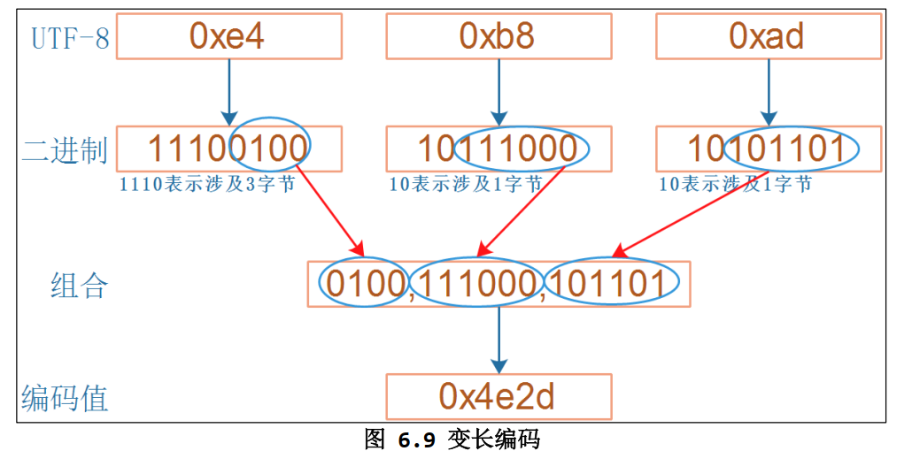

# 6.1、字符的编码方式

## 1. ASCII码

ASCII 码（American Standard Code for Information Interchange）是一种用于表示文本字符的字符编码标准，最初由美国国家标准协会（ANSI）于1963年发布，后来进行了多次修改和扩展。

以下是关于 ASCII 码的一些重要信息：

1. **字符表示：**  ASCII 码将基本的字符集（包括大写字母、小写字母、数字、标点符号和一些控制字符）分配给了 7 位二进制编码。每个字符都与一个唯一的 7 位二进制值相对应，这使得计算机可以存储和交换文本信息。
2. **扩展字符集：**  初始的 ASCII 码标准只包含了 128 个字符，它们对应于 7 位的二进制值。随着计算机的发展，许多国家和语言引入了扩展字符集，其中包括特定于语言的字符，如重音符号、货币符号等。这些扩展字符集通常使用 8 位编码来表示更多的字符。
3. **控制字符：**  ASCII 码还定义了一些控制字符，用于控制文本的格式和通信。例如，回车（Carriage Return，CR）和换行（Line Feed，LF）字符用于控制文本的换行和排列。
4. **标准化：**  ASCII 码是一个国际标准，它为计算机和通信设备提供了一种通用的字符编码方式，使得不同系统之间能够正确解释和显示文本。

> ASCII码八位，但是所表示的字符只有127个，所以只用到了7位，最高位一般都是0
>
> 但是在今天，只有英文编码显然是不够用的，于是**ANSI编码**诞生了

‍

## 2. ANSI编码

ANSI（美国国家标准协会，American National Standards Institute）编码是一种字符编码标准，用于表示文本字符。通常，ANSI 编码是指使用 8 位编码（通常是扩展的 ASCII 编码）来表示字符，包括标准的 ASCII 字符集和额外的字符，如扩展字符、特殊符号和国际字符。

以下是关于 ANSI 编码的一些重要信息：

1. **扩展的 ASCII 编码：**  ANSI 编码扩展了标准的 ASCII 编码，使用了 8 位来表示字符。这意味着它可以表示更多的字符，包括扩展字符集、特殊符号和一些国际字符。
2. **国际化支持：**  ANSI 编码不仅包括英文字符，还支持其他语言的字符，例如西欧语言、希腊语、俄语等。这使得 ANSI 编码在不同国家和地区的计算机系统中得到广泛使用。
3. **ANSI 转义序列：**  ANSI 编码还包括了一些转义序列，用于控制文本的格式和颜色。这些转义序列允许你在终端或控制台上创建文本界面，包括文本颜色、背景颜色、光标位置等方面的控制。
4. **局限性：**  ANSI 编码虽然支持多种字符和语言，但它仍然存在一些局限性，特别是对于非拉丁字母语言和复杂文本排版的支持。随着国际化需求的增加，Unicode 编码逐渐取代了 ANSI 编码，因为 Unicode 能够更全面地支持各种字符和语言。

需要注意的是，"ANSI 编码" 这个术语有时会因上下文而有不同的含义，因为它可以用来指代不同的字符编码标准，包括 Windows 中的不同代码页和字符集。在不同情况下，"ANSI 编码" 可能指的是不同的字符编码方案。因此，具体的 ANSI 编码可能取决于你所指的上下文和环境。

‍

## 3. Unicode编码

Unicode 编码是一种用于表示文本字符的标准字符编码体系，旨在支持世界上几乎所有书写系统中的字符。Unicode 提供了每个字符（包括字母、数字、标点符号、符号、控制字符等）与唯一的数字值（码位）之间的映射，以便不同的计算机和操作系统能够一致地处理和显示文本。

以下是关于 Unicode 编码的一些重要信息：

1. **统一字符集：**  Unicode 的目标是提供一个统一的字符集，包括几乎所有已知书写系统的字符。这使得人们能够使用一个标准来表示多种语言和字符，而不必依赖于特定的字符编码。
2. **多字符集支持：**  Unicode 包含多种字符集，其中最常见的是 UTF-8、UTF-16 和 UTF-32。这些编码方案使用不同的位数来表示字符，以适应不同的应用需求。
3. **码位：**  Unicode 字符用一个唯一的数字值（称为码位）来表示，这个值可以是十进制或十六进制。例如，拉丁字母 "A" 的码位是 U+0041。
4. **字符平面：**  Unicode 字符被组织为不同的字符平面（planes），每个平面包含数千或数万个字符。最常用的字符位于基本多文本平面（BMP）中，而其他字符则分布在其他平面中，包括辅助多文本平面（SMP）和辅助私用使用平面（SIP）等。
5. **国际化和标准化：**  Unicode 是一项国际化的工作，由 Unicode 联合会负责管理和维护。Unicode 标准定期更新，以包括新的字符和符号，以及适应不同语言和文化的需求。
6. **UTF 编码：**  Unicode 转换格式（UTF，Unicode Transformation Format）是用于在计算机中编码和存储 Unicode 字符的方法。UTF-8、UTF-16 和 UTF-32 是最常见的 UTF 编码方案，它们允许以不同的方式表示和处理 Unicode 字符。

Unicode 编码解决了字符集的多样性和国际化问题，使得不同计算机和操作系统能够正确地显示多种语言和字符。它在跨文化和多语言应用程序中得到广泛使用，以确保文本可以被正确表示和处理。如果你编写跨语言或跨平台的软件，使用 Unicode 编码通常是一个良好的选择，因为它提供了广泛的字符支持，同时减少了字符编码的混淆和兼容性问题。

‍

‍

## 4. UTF-8

UTF-8（Unicode Transformation Format - 8-bit）是一种用于表示 Unicode 字符的字符编码方式。它是一种可变长度编码，可以表示 Unicode 字符集中的任何字符，从基本多文本平面（BMP）中的常用字符到其他字符平面中的字符，都可以使用 UTF-8 表示。

以下是有关 UTF-8 编码的关键信息：

1. **可变长度编码：**  UTF-8 是一种可变长度编码，它使用不同数量的字节来表示不同的字符。常用的字符（如英文字母、数字和常见符号）通常使用一个字节来表示，而不常用的字符可能需要更多的字节。
2. **向后兼容：**  UTF-8 是 Unicode 的一种标准编码方式，因此它是向后兼容的。这意味着它可以表示 Unicode 字符集中的任何字符，包括已定义和未来定义的字符。
3. **ASCII 兼容：**  UTF-8 编码的一个重要特性是与 ASCII 编码的兼容性。即使在 UTF-8 编码中，英文字母和标准 ASCII 字符仍然使用一个字节来表示，这使得现有的 ASCII 文本可以无需修改在 UTF-8 编码下正常工作。
4. **多字节字符表示：**  对于需要多个字节来表示的字符，UTF-8 使用一定的规则来确定每个字节的作用，以便正确解释字符。这使得 UTF-8 编码非常灵活，适合在各种环境中使用。
5. **宽字符支持：**  UTF-8 可以表示各种宽字符，包括 emoji、特殊符号和不同语言的字符，因此它在支持多语言和国际化的应用程序中得到广泛应用。
6. **编码示例：**  以下是一些 UTF-8 编码示例：

    * 字母 "A" 编码为 `0x41`​。
    * 中文汉字 "你" 编码为 `0xE4 0xBD 0xA0`​。
    * 符号 "€"（欧元符号）编码为 `0xE2 0x82 0xAC`​。

UTF-8 是一种广泛使用的字符编码方式，用于表示文本数据，尤其是在互联网和跨语言应用程序中。它的灵活性和向后兼容性使得它成为一种理想的字符编码方式，能够支持多种语言和字符集，而不引入复杂的转换和兼容性问题。

​​

‍

## 5. UTF-16

UTF-16（Unicode Transformation Format - 16-bit）是一种 Unicode 字符编码方式，用于表示 Unicode 字符集中的字符。与 UTF-8 不同，UTF-16 使用固定长度的 16 位编码单元来表示字符，每个字符通常使用一个或两个 16 位编码单元。

以下是有关 UTF-16 编码的关键信息：

1. **固定长度编码单元：**  UTF-16 使用固定长度的 16 位编码单元来表示字符。每个编码单元被称为 "代码单元"（code unit），通常是 16 位（2 字节）长。
2. **基本多文本平面（BMP）字符：**  基本多文本平面（BMP）中的字符，也就是 Unicode 范围 U+0000 到 U+FFFF 的字符，通常使用一个 16 位编码单元来表示。
3. **辅助平面字符：**  一些 Unicode 字符不适合使用一个 16 位编码单元表示，因此它们需要使用一对 16 位编码单元（合计 32 位）来表示。这些字符通常被称为 "辅助平面字符"，并分布在 Unicode 中的不同平面中。
4. **字节序：**  与 UTF-8 不同，UTF-16 编码涉及到字节序（byte order）。UTF-16 可以采用大字节序（Big Endian）或小字节序（Little Endian）的方式来存储编码单元。字节序影响了多字节字符的排列顺序。
5. **编码示例：**  以下是一些 UTF-16 编码示例：

    * 字母 "A" 编码为 `0x0041`​。
    * 中文汉字 "你" 编码为 `0x4F60`​。
    * 符号 "€"（欧元符号）编码为 `0x20AC`​。

UTF-16 在很多计算机系统中被广泛支持，尤其是 Windows 操作系统，它在内存中通常使用 UTF-16 编码来表示文本数据。不过，由于 UTF-16 编码需要考虑字节序的问题，跨平台和跨系统的数据交换时需要格外小心。 Unicode 编码标准和 UTF-16 编码都提供了字符与编码单元之间的清晰映射，这使得正确处理和转换文本数据变得可行。

‍

> **什么是字节序？**

大字节序（Big Endian）和小字节序（Little Endian）是两种不同的计算机内存存储方式，用于表示多字节数据类型（如整数和浮点数）的字节顺序。它们影响了数据在内存中的排列顺序，尤其是对于多字节数据类型的字节排列顺序。

1. **大字节序 (Big Endian)** ：

    * 在大字节序中，最高有效字节（Most Significant Byte，MSB）存储在最低内存地址处，而最低有效字节（Least Significant Byte，LSB）存储在最高内存地址处。
    * 大字节序模式通常与网络通信和一些大端架构的计算机体系结构兼容。
2. **小字节序 (Little Endian)** ：

    * 在小字节序中，最低有效字节（LSB）存储在最低内存地址处，而最高有效字节（MSB）存储在最高内存地址处。
    * 小字节序模式通常与 x86 架构的计算机体系结构兼容。

为了更好地理解大字节序和小字节序，以下是一个示例：

假设你有一个 4 字节整数 `0x12345678`​，在大字节序中存储如下：

```
0x12 0x34 0x56 0x78
```

而在小字节序中存储如下：

```
0x78 0x56 0x34 0x12
```

不同计算机体系结构和处理器可能使用不同的字节序，这可能会导致数据在不同系统之间的解释不一致。因此，在进行数据交换或处理多字节数据时，需要考虑字节序的问题，确保数据正确传输和解释。有一些标准和约定可用于处理这种问题，例如网络字节序（Network Byte Order）通常采用大字节序。

> **就是所说的大端对齐和小端对齐**
