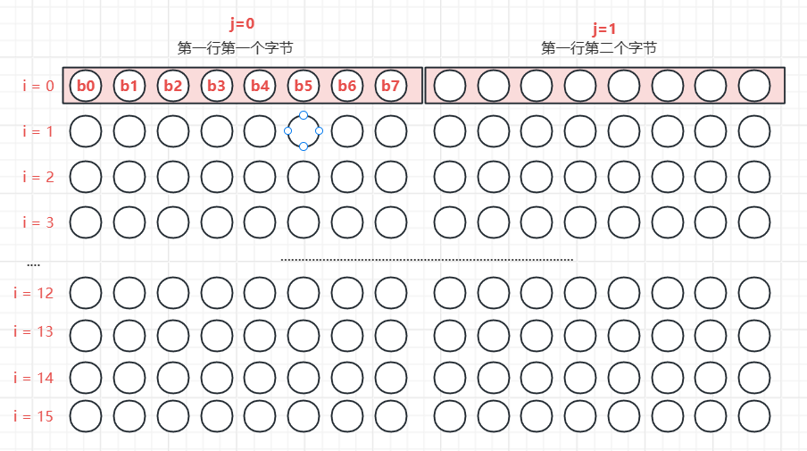

# 6.2、点阵字符的显示

# 1. ASCII点阵字符

Linux里内置了ASCII编码的点阵显示，有多种规格的，比如常用的8x16:

​​​​

‍

一般字符点阵数组（也称字库），是把一个字符分成多个字节来显示，一个字节可以显示一行的像素点或者一列的像素点，然后多个字节绘制一个字符的像素，这个数组可以是一维数组，也可以是二维数组，看具体的映射处理方式。

> ASCII点阵数组的映射：

```c
static const unsigned char fontdata_8x16[FONTDATAMAX] = {

	/* 0 0x00 '^@' */
	0x00, /* 00000000 */
	0x00, /* 00000000 */
	0x00, /* 00000000 */
	0x00, /* 00000000 */
	0x00, /* 00000000 */
	0x00, /* 00000000 */
	0x00, /* 00000000 */
	0x00, /* 00000000 */
	0x00, /* 00000000 */
	0x00, /* 00000000 */
	0x00, /* 00000000 */
	0x00, /* 00000000 */
	0x00, /* 00000000 */
	0x00, /* 00000000 */
	0x00, /* 00000000 */
	0x00, /* 00000000 */

	/* 1 0x01 '^A' */
	0x00, /* 00000000 */
	0x00, /* 00000000 */
	0x7e, /* 01111110 */
	0x81, /* 10000001 */
	0xa5, /* 10100101 */
	0x81, /* 10000001 */
	0x81, /* 10000001 */
	0xbd, /* 10111101 */
	0x99, /* 10011001 */
	0x81, /* 10000001 */
	0x81, /* 10000001 */
	0x7e, /* 01111110 */
	0x00, /* 00000000 */
	0x00, /* 00000000 */
	0x00, /* 00000000 */
	0x00, /* 00000000 */

	.......
}
```

在这样的一个点阵数组里，按ASCII码的顺序，排列每个字符，然后每个字符占16个字节，到时候需要引用哪个具体的字符点阵的时候，字节用ASCII码乘16，就是这个字符的字符点阵，例如：

```c
unsigned char *dots = (unsigned char *)&fontdata_8x16[c * 16];
```

然后绘制字符，就需要用到Farmebuffer编程的描点函数，用这个函数来绘制点阵数组的每一个像素点，思路是如果是1，就绘制，如果是0，可以选择作为背景色：

```c
/**********************************************************************
 * 函数名称： lcd_put_ascii
 * 功能描述： 在LCD指定位置上显示一个8*16的字符
 * 输入参数： x坐标，y坐标，ascii码，字符颜色，背景颜色（0就是不需要背景）
 * 输出参数： 无
 * 返 回 值： 无
 * 修改日期        版本号     修改人	      修改内容
 * -----------------------------------------------
 * 2020/05/12	     V1.0	  zh(angenao)	      创建
 ***********************************************************************/
void lcd_put_ascii(int x, int y, unsigned char c, int color, int background)
{
	unsigned char *dots = (unsigned char *)&fontdata_8x16[c * 16]; //获取字符c在点阵数组的起始地址
	int i, b;
	unsigned char byte;

	for (i = 0; i < 16; i++)//16个字节
	{
		byte = dots[i];
		for (b = 7; b >= 0; b--)//每个字节8位
		{
			// 从最高位开始解析（从左到右，从上到下）
			if (byte & (1 << b))
			{
				/* show */
				lcd_put_pixel(x + 7 - b, y + i, color); /* 字符 */
			}
			else
			{
				if (background != 0)
				{
					/* hide */
					lcd_put_pixel(x + 7 - b, y + i, background); /* 背景 */
				}
			}
		}
	}
}
```

​​

> 有了字符显示函数，字符串显示函数不就简单了：

```c
/**********************************************************************
 * 函数名称： lcd_put_string
 * 功能描述： 在LCD指定位置上显示一个8*16的字符串
 * 输入参数： x坐标，y坐标，字符串，字符串颜色，背景颜色（0就是不需要背景）
 * 输出参数： 无
 * 返 回 值： 无
 * 修改日期        版本号     修改人	      修改内容
 * -----------------------------------------------
 * 2020/05/12	     V1.0	  zh(angenao)	      创建
 ***********************************************************************/
void lcd_put_string(int x, int y, char *str, int color, int background)
{
	int len = strlen(str); // 获取字符串的长度

	for (int i = 0; i < len; i++)
	{
		char character = str[i]; // 通过下标索引取出字符
		lcd_put_ascii(x + 8 * i, y, character, color, background);
	}
}
```

‍

# 2. 中文点阵字符

> 提到非ASCII字符，就得谈起编码了，不同的编码的源文件所编译的可执行程序的结果也不一样，有没有办法指定编码呢？

在 GCC 编译器中，你可以使用 `-finput-charset`​ 和 `-fexec-charset`​ 选项来指定源文件的输入字符集和可执行文件的字符集。这可以在处理不同字符集的源文件和确保正确编译输出时非常有用。

* ​`-finput-charset=charset`​：用于指定源文件的字符集，其中 `charset`​ 是字符集的名称或编码。这告诉编译器如何解释源文件中的字符。例如，如果你的源文件是 GB2312 编码，你可以使用 `-finput-charset=GB2312`​ 来告诉编译器。
* ​`-fexec-charset=charset`​：用于指定生成的可执行文件的字符集。这告诉编译器如何编码可执行文件中的字符文本。通常，你可以将其设置为你期望的可执行文件的字符集，例如 UTF-8。

这两个选项可以帮助编译器正确地处理源文件中的字符，并确保生成的可执行文件在不同字符集之间正确工作。

示例编译命令：

```sh
gcc -o myprogram myprogram.c -finput-charset=GB2312 -fexec-charset=UTF-8
```

这个命令会编译 `myprogram.c`​，并告诉编译器源文件的字符集是 GB2312，生成的可执行文件的字符集是 UTF-8。这对于确保正确的字符编码处理非常有用，特别是当你需要处理不同字符集的源文件时。

> ASCII字符的点阵数组（字库）是由ASCII码索引，那中文字符由什么索引？

拿常用的HZK16举例，HZK16是一个又GB2312编码索引的汉字库，每个汉字由16x16个，也就是256个像素点组成，每个汉字需要32个字节表示，具体的寻址方法：

​​

在GB2312编码中，每个汉字字符由两个字节组成，通常将这两个字节分为**区码**和**位码**。

* **区码**：位于GB2312编码的高位字节，用于表示汉字字符所属的区域或区域组。区码通常范围从0xA1到0xF7。
* **位码**：位于GB2312编码的低位字节，用于表示汉字字符在特定区域内的具体位置。位码通常范围从0xA1到0xFE。

> 有了区位码的范围，就可以通过计算得到汉字的点阵地址了：

1. **使用内存映射的程序：**

```c
unsigned char *dots = hzkmem + ((area - 0xA1) * 94 + (where - 0xA1))*32;
/*
*hzkmem:HZK16映射到内存的基地址
*area：汉字字符的GB2312的区码
*where：汉字字符的GB2312的位码
*/
```

将区码和位码分开并将它们减去0xA1是因为GB2312编码的区码和位码都是从0xA1开始的，所以通过减去0xA1，可以将这两个字节的取值范围映射到0-93之间（0xFE - 0xA1 + 1 = 94），这对于查找HZK字库中的字符索引非常方便。例如，0xA1表示区码的起始值，所以将0xA1减去0xA1后，得到区码的索引为0；同理，0xFE表示位码的最大值，所以将0xFE减去0xA1后，得到位码的索引为93。

这个减法操作用于将GB2312编码中的区码和位码映射为HZK字库中的相应索引，以便查找和获取点阵数据。这是一种常见的做法，用于在汉字点阵字库中查找具体汉字的点阵数据。

‍

2. **使用读取文件的方式**

```c
unsigned int area = str[0] - 0xA1;
unsigned int where = str[1] - 0xA1;
unsigned char buf[32];
unsigned char byte;
lseek(HZK16_fd, (area * 94 + where) * 32, SEEK_SET);
read(HZK16_fd, buf, 32);
/*
*HZK16_fd：HZK16的文件描述符
*area：汉字字符的GB2312编码的区码
*where：汉字字符的GB2312编码的位码
*/
```

就是拿计算的汉字偏移量作为文件指针的偏移量，从而读取到汉字的点阵数据到缓存buf，然后绘制每个像素点。

> 绘制像素点的原理大同小异，三个嵌套for循环即可完成绘制：

```c
void lcd_put_chinese(int x, int y, unsigned char *str)
{
	unsigned int area  = str[0] - 0xA1;
	unsigned int where = str[1] - 0xA1;
	unsigned char *dots = hzkmem + (area * 94 + where)*32;
	unsigned char byte;

	int i, j, b;
	for (i = 0; i < 16; i++)
		for (j = 0; j < 2; j++)
		{
			byte = dots[i*2 + j];
			for (b = 7; b >=0; b--)
			{
				if (byte & (1<<b))
				{
					/* show */
					lcd_put_pixel(x+j*8+7-b, y+i, 0xffffff); /* 白 */
				}
				else
				{
					/* hide */
					lcd_put_pixel(x+j*8+7-b, y+i, 0); /* 黑 */
				}
			}
		}
}
```

​​

> 使用GB2312编码索引的HZK16，就需要注意，在编译程序的时候保证程序的编码是GB2312

**程序参考6.1 Framebuffer编程**

‍
