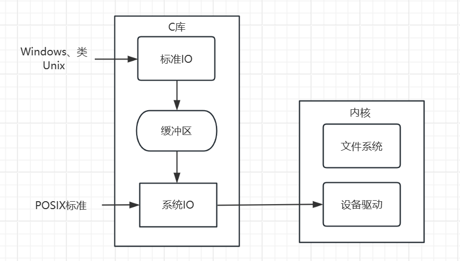

# 4.1 文件IO分类

在Linux中，文件IO分为`系统调用IO`​和`标准IO`

首先介绍`系统调用IO`​，先说明一下POSIX标准，POSIX（Portable Operating System Interface for Unix，可移植操作系统接口）是一组操作系统标准，主要用于类Unix操作系统，如Linux。POSIX定义了一组API（Application Programming Interface），用于处理文件 I/O 和其他系统级操作。POSIX I/O 系统调用是与文件 I/O 相关的一部分，提供了一种标准的方式来进行文件读取和写入操作。

然后是`标准IO`​，其实标准IO就是在`系统调用IO`​上进行封装的。

> 两者的区别在哪？

​`系统调用IO`​的读写是直接访问内核进行操作的，`标准IO`​在此基础上定义了一个缓冲区，为了解决频繁访问内核而导致效率低。

比如有这样一个场景，在程序中需要循环读取或者写入，而且每次只写一个字节，那系统IO就会每次访问内核，并且只写入一个字节，但是标准IO的做法就是，先把内容读/写到缓冲区，当满足一定条件的时候，一次性访问内核。

​​

> **标准IO不仅适用于类Unix系统，还使用Windows，因为Windows也在自己的系统调用上封装了一模一样的标准IO，虽然底层实现不一样，但是顶层实现是一样的，所以标准IO基本通用于Windows、MacOS、Linux**

‍
