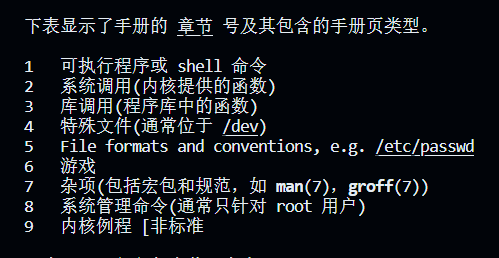

# 4.2 系统调用接口

## 1. 接口简介

1. ​**`open`**​

    * 函数原型：`int open(const char *pathname, int flags, mode_t mode);`​
    * 函数描述：打开或创建文件。
    * 参数列表：

      * ​`pathname`​：要打开或创建的文件的路径。
      * ​`flags`​：标志，包括选项 `O_RDONLY`​（只读）、`O_WRONLY`​（只写）、`O_RDWR`​（读写）、`O_CREAT`​（创建文件）等。
      * ​`mode`​：创建文件时的权限。
    * 返回值：成功时返回非负整数的文件描述符，失败时返回 -1。
2. ​**`read`**​

    * 函数原型：`ssize_t read(int fd, void *buf, size_t count);`​
    * 函数描述：从文件中读取数据。
    * 参数列表：

      * ​`fd`​：文件描述符，表示要读取的文件。
      * ​`buf`​：数据缓冲区。
      * ​`count`​：要读取的字节数。
    * 返回值：成功时返回已读取的字节数，失败时返回 -1。
3. ​**`write`**​

    * 函数原型：`ssize_t write(int fd, const void *buf, size_t count);`​
    * 函数描述：向文件中写入数据。
    * 参数列表：

      * ​`fd`​：文件描述符，表示要写入的文件。
      * ​`buf`​：包含要写入的数据的缓冲区。
      * ​`count`​：要写入的字节数。
    * 返回值：成功时返回已写入的字节数，失败时返回 -1。
4. ​**`close`**​

    * 函数原型：`int close(int fd);`​
    * 函数描述：关闭文件。
    * 参数列表：

      * ​`fd`​：要关闭的文件描述符。
    * 返回值：成功时返回0，失败时返回 -1。
5. ​**`lseek`**​

    * 函数原型：`off_t lseek(int fd, off_t offset, int whence);`​
    * 函数描述：在文件中定位文件指针的位置。
    * 参数列表：

      * ​`fd`​：文件描述符。
      * ​`offset`​：相对于 `whence`​ 的偏移量。
      * ​`whence`​：指定偏移量的参考点，如 `SEEK_SET`​（文件开头）、`SEEK_CUR`​（当前位置）、`SEEK_END`​（文件末尾）。
    * 返回值：返回文件指针的新位置，失败时返回 -1。
6. ​**`fcntl`**​

    * 函数原型：`int fcntl(int fd, int cmd, ...);`​
    * 函数描述：控制文件描述符的属性。
    * 参数列表：

      * ​`fd`​：文件描述符。
      * ​`cmd`​：要执行的命令，如 `F_GETFL`​（获取文件状态标志）或 `F_SETFL`​（设置文件状态标志）。
    * 返回值：根据命令不同，返回不同的值，失败时返回 -1。
7. ​**`stat`**​

    * 函数原型：`int stat(const char *pathname, struct stat *buf);`​
    * 函数描述：获取文件的状态信息。
    * 参数列表：

      * ​`pathname`​：文件路径。
      * ​`buf`​：用于存储文件状态信息的结构体指针。
    * 返回值：成功时返回0，失败时返回 -1。
8. ​**`fstat`**​

    * 函数原型：`int fstat(int fd, struct stat *buf);`​
    * 函数描述：获取文件描述符相关的文件状态信息。
    * 参数列表：

      * ​`fd`​：文件描述符。
      * ​`buf`​：用于存储文件状态信息的结构体指针。
    * 返回值：成功时返回0，失败时返回 -1。

## 2. 如何使用man手册

首先使用命令`man man`​可以查看man手册的概览，比如哪些内容在man手册的哪页。

​​

比如我要查系统调用的`open`​，就用命令`man 2 open`​，结果：

​​

有open的详细说明。

## 3. 接口详细介绍

#### 3.1 open

**open的用法：**

```c
    fd = open(argv[2], O_RDWR | O_CREAT, 0666);
    if (fd < 0)
    {
        perror("open");
        return -1;
    }
```

open打开文件成功后会返回这个文件的文件描述符，比如返回3，代表这个文件描述符是`3`​。

> **文件描述符为什么是3呢**

我们打开一个文件的时候可以进入这个进程的文件描述符目录：

```makefile
cd /proc/<PID>/fd 
#PID是进程ID
```

然后查看这个目录下的内容：

```makefile
总用量 0
lrwx------ 1 hqyj hqyj 64 Oct 24 16:17 0 -> /dev/pts/1
lrwx------ 1 hqyj hqyj 64 Oct 24 16:17 1 -> /dev/pts/1
lrwx------ 1 hqyj hqyj 64 Oct 24 16:17 2 -> /dev/pts/1
lrwx------ 1 hqyj hqyj 64 Oct 24 16:17 3 -> /home/hqyj/git/01_all_series_quickstart/04_嵌入式Linux应用开发基础知识/source/06_fileio/01_open/1.txt
```

其中文件描述符0是标准输入（比如scanf）、文件描述符1是标准输出（比如printf）、文件描述符2是标准错误（比如perror）、文件描述符3是我们所打开的文件

也就是说文件描述符 0、1、2 是在进程启动时自动分配的，并且通常与标准输入、标准输出和标准错误相关联。这些文件描述符的分配是由操作系统决定的，而不是由程序员指定的。

> **权限问题**

打开文件的时候可选择 只读 只写 读写...，需要注意的是，被打开的文件要有相应的权限才能被打开。

在使用`O_CREAT`​创建文件的时候，可以指定新文件的权限，直接使用`0777`​使用数值表示权限。如果文件不是新文件，原有的权限不会被更改。

‍

还有就是无法指定其他用户的写权限，因为系统保护的原因：

在Linux系统中，用户的文件权限受到 `umask`​ 设置的影响。`umask`​ 是一种掩码，用于确定新文件或目录的默认权限。具体来说，`umask`​ 会从文件或目录的默认权限中去除一些权限位，以限制对其他用户的访问。

比如当前系统的umask掩码为002，代表去除其他用户的读权限，也就是说，open新建的文件的权限受系统的umask影响。

再比如说root用户的umask为，确定新的文件和目录的权限里，同组用户和其他用户不能有写权限。在root用户下新建一个权限777的文件，结果是：​

‍

---

#### 3.2 write

**用法：**

```c
 if (write(fd, argv[i], strlen(argv[i])) == -1)
            {
                perror("write");
                return 1;
            }
```

记忆：从$(2)往$(1)里写入$(3)个字节,$$代表第几个参数。

返回读取的字节数，错误返回-1

‍

#### 3.3 read

**用法：**

```c
char buf[100];
    if (read(fd, buf, 100) < 0)
    {
        perror("read");
        return 1;
    }
```

记忆：从$(1)读取$​$(3)个字节，存放到$$(2)中

返回读取的字节数。

> 读写是具体怎么实现的

通过一个指针指（pos）向当前读写的位置，假如读写了N个字节，那pos也向后移动N个字节，再读写M个字节，pos再向后移动M个字节，系统会记录当前的文件位置指针，下次读写的时候，会从上次的位置继续读写，除非人为的修改这个指针的位置。

‍

## 4. 系统调用的内部机制

​​

​​

‍

在Linux中，要打开一个文件，通常使用系统调用 `open()`​ 来实现。当你打开一个文件时，内核会为该文件分配一个文件描述符，并创建一个**文件结构体**（也称为文件控制块，File Control Block，FCB），以记录与该文件相关的信息。这个文件结构体包含文件的状态信息、当前文件位置、访问权限等等。

‍

> 对于多次打开同一个文件，如果读取了fd1的文件，然后fd1的2文件指针会偏移，是否会影响到fd2的文件指针？

当多次打开同一个文件时，每次打开会为文件分配一个新的文件描述符和一个独立的文件结构体（文件控制块）。这些文件描述符和文件结构体是相互独立的，它们互不影响。这意味着如果在一个程序中多次打开同一个文件，每个文件描述符都会有自己的文件位置指针、文件状态信息等。修改一个文件描述符的文件位置指针不会影响其他文件描述符的位置指针，因为它们各自有自己的状态。

这种独立性对于多个部分需要同时访问同一个文件的情况非常有用，因为它允许这些部分独立地读取和写入文件，而不会相互干扰。

需要注意的是，当你在不同的进程中打开同一个文件时，也会得到不同的文件描述符和文件结构体，这些进程之间的文件描述符也是相互独立的。因此，每个进程可以独立地操作文件，而不会影响其他进程对同一文件的操作。

‍

> 那如果有这样的一个场景，就是需要多个文件描述符指向同一个文件控制块，应该如何实现？

引入系统调用`dup`​

#### dup

​`dup`​ 是一个系统调用，用于复制文件描述符。具体来说，`dup`​ 将复制一个**已有的文件描述符**，创建一个新的文件描述符，新旧文件描述符都指向相同的文件或资源。这意味着你可以使用 `dup`​ 来创建多个文件描述符，这些文件描述符都可以用于独立地访问同一个文件或资源。

以下是 `dup`​ 函数的原型：

```c
int dup(int oldfd);
```

参数：

* ​`oldfd`​：要复制的现有文件描述符。

返回值：

* 如果成功，返回新的文件描述符。
* 如果出错，返回 -1，并设置 `errno`​ 来指示错误类型。

​

> dup会指定一个未使用的文件描述符。

‍

#### dup2

​`dup2`​ 是一个系统调用，它与 `dup`​ 类似，但允许你显式指定新的文件描述符，而不是由系统自动分配一个。这个系统调用的目的是将一个已有的文件描述符复制到指定的新文件描述符，如果新文件描述符已经打开，它会首先关闭新文件描述符，然后再复制。

以下是 `dup2`​ 函数的原型：

```c
int dup2(int oldfd, int newfd);
```

参数：

* ​`oldfd`​：要复制的现有文件描述符。
* ​`newfd`​：要分配给新文件描述符的文件描述符号。

返回值：

* 如果成功，返回新的文件描述符（即 `newfd`​）。
* 如果出错，返回 -1，并设置 `errno`​ 来指示错误类型。

例如：

```c
dup2(fd2,1);
//将文件描述符 fd2 复制到标准输出文件描述符 1，通常用于重定向程序的标准输出。在这种情况下，它将使标准输出指向与 fd2 相同的文件。
```

​​

> **总结来说。**​`**dup2**`​ ** 的主要目的是将新文件描述符指向旧文件描述符所指向的文件或资源，如果指定的新描述符已经存在，就关闭旧描述符，然后在指向旧描述符的文件或者资源。**

‍

#### dup3

待补充
