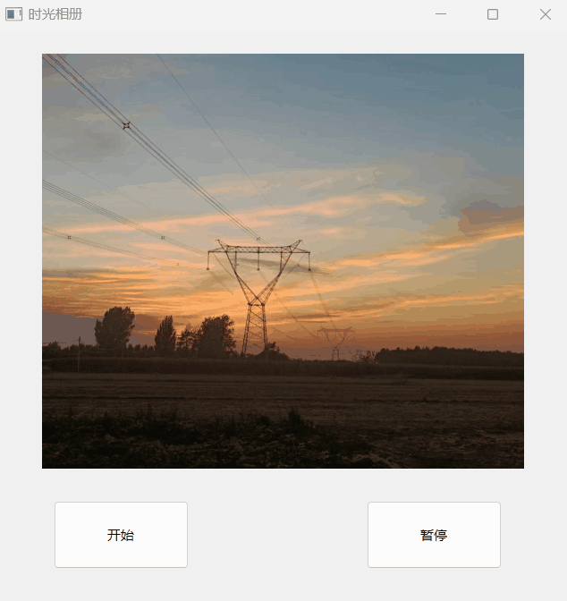

# [4] QT的定时器

Qt中定时器用于间隔一段时间执行一次操作，循环执行，直至定时器停止或被杀死。有两种使用方法，**QObject类**与**QTimer类**。个人比较习惯使用QTimer类，信号与槽方式比较简洁灵活。

## 1. 使用QObject类的定时器

### 1.1 `startTimer`​方法

​`QObject`​类提供了一个`startTimer`​方法，可以用来启动定时器。这个方法接受一个参数，即定时器的时间间隔（以毫秒为单位），并返回一个定时器的ID。这个定时器将以指定的时间间隔周期性地触发一个事件。

```cpp
int QObject::startTimer(int interval);
```

### 1.2 重写`timeEvent`​函数

要处理定时器事件，你需要在你的`QObject`​子类中重写`timeEvent`​函数。这个函数会在定时器超时时被调用，你可以在其中执行你想要的操作。

```cpp
void QObject::timerEvent(QTimerEvent *event);
```

在`timeEvent`​函数中，你可以使用`event->timerId()`​来确定当前执行的是哪个定时器。每个定时器都有一个唯一的ID，你可以根据这个ID来区分不同的定时器。

### 1.3 停止定时器

你可以使用`killTimer`​方法来停止一个特定ID的定时器。

```cpp
void QObject::killTimer(int id);
```

‍

## 2. 使用QTimer类

​`QTimer`​类是Qt提供的一个更高级和更易于使用的定时器类。它使用了信号和槽机制，允许你更灵活地控制定时器的行为。

### 2.1 创建QTimer对象

首先，你需要创建一个`QTimer`​对象：

```cpp
QTimer *timer = new QTimer(this);
```

### 2.2 连接信号和槽

然后，你可以连接`QTimer`​的`timeout`​信号到一个槽函数，这个槽函数将在定时器超时时被调用。

```cpp
connect(timer, SIGNAL(timeout()), this, SLOT(handleTimer()));
```

### 2.3 启动和停止定时器

你可以使用`start`​方法来启动定时器，并指定时间间隔（以毫秒为单位）：

```cpp
timer->start(interval);
```

使用`stop`​方法来停止定时器：

```cpp
timer->stop();
```

### 2.4 处理定时器超时

在槽函数`handleTimer`​中，你可以执行你想要的操作。这个槽函数将在定时器超时时被自动调用。

```cpp
void YourClass::handleTimer()
{
    // 处理定时器超时的操作
}
```

总的来说，使用`QTimer`​​类更加方便和灵活，因为它使用了信号和槽机制，使得定时器的管理和处理更加清晰和易于理解。而使用`QObject`​​类的定时器需要手动管理定时器的ID，相对较为底层，在一些情况下可能更加灵活。你可以根据具体的需求选择使用哪种方式。

‍

# 3. 几种设置图片的方法

在Qt中，你可以使用多种方式来设置`QLabel`​的图片，以下是一些常见的方法：

1. 使用`QPixmap`​：

    ```cpp
    QPixmap pixmap("image.png");
    ui->label->setPixmap(pixmap);
    ```

    这种方法使用`QPixmap`​加载图片并将其设置为`QLabel`​的背景图像。
2. 使用`QImage`​：

    ```cpp
    QImage image("image.png");
    ui->label->setPixmap(QPixmap::fromImage(image));
    ```

    这里我们首先加载图像到`QImage`​对象，然后使用`QPixmap::fromImage()`​将其转换为`QPixmap`​并设置为`QLabel`​的背景图像。
3. 使用资源文件中的图片：

    如果你在Qt中使用了资源文件（`.qrc`​），你可以使用以下方式设置`QLabel`​的图片：

    ```cpp
    ui->label->setPixmap(QPixmap(":/images/image.png"));
    ```

    这里`:/images/image.png`​是资源文件中的路径。
4. 使用网络图片：

    如果你要从网络加载图片，你可以使用`QNetworkAccessManager`​来下载图片，并将其设置为`QLabel`​的背景图像。

    ```cpp
    QNetworkAccessManager *manager = new QNetworkAccessManager(this);
    QNetworkReply *reply = manager->get(QNetworkRequest(QUrl("https://example.com/image.jpg")));

    connect(reply, &QNetworkReply::finished, [=]() {
        if (reply->error() == QNetworkReply::NoError) {
            QByteArray imageData = reply->readAll();
            QPixmap pixmap;
            pixmap.loadFromData(imageData);
            ui->label->setPixmap(pixmap);
        } else {
            // 处理网络请求错误
        }
        reply->deleteLater();
    });
    ```

    这里我们使用`QNetworkAccessManager`​从网络请求图片数据，然后将其加载到`QPixmap`​中并设置为`QLabel`​的背景图像。

这些方法可以根据你的需求选择使用，用于加载不同来源的图片。

‍

# 4. 示例

#### 1. QObject示例

```cpp
#include "widget.h"
#include "ui_widget.h"

Widget::Widget(QWidget *parent)
    : QWidget(parent)
    , ui(new Ui::Widget)
{
    ui->setupUi(this);
    PicID = 2;
    QPixmap pix("D:\\Desktop\\QT\\QTonline\\objectTimer\\1.jpg");
    ui->label->setPixmap(pix);
    this->setWindowTitle("时光相册");
}

Widget::~Widget()
{
    delete ui;
}


void Widget::on_startButton_clicked()
{
    //继承关系：Widget<-QObject,可调用QObject的方法startTimer,这个方法返回值是定时器编号
    myTimerID = this->startTimer(TIMEOUT);
    //timer超时会触发一个函数（定时器事件）,也是QObject的一个虚函数，继承过来需要重写虚函数
}


void Widget::on_stopButton_clicked()
{
    this->killTimer(myTimerID);
}

void Widget::timerEvent(QTimerEvent *event){
    //过滤是不是myTimerID，因为有很多定时器
    if(event->timerId() == myTimerID)
    {
        QString Picpath = "D:\\Desktop\\QT\\QTonline\\objectTimer\\" ;
        Picpath += QString::number(PicID);
        Picpath += ".jpg";
        ui->label->setPixmap(Picpath);
        PicID ++;
        if(PicID >3)
            PicID = 1;
    }
}
```

‍

#### 2. Timer示例

```cpp
#include "widget.h"
#include "ui_widget.h"

Widget::Widget(QWidget *parent)
    : QWidget(parent)
    , ui(new Ui::Widget)
{
    ui->setupUi(this);
    Timer = new QTimer;
    ImgID = 2;
    QImage img;
    img.load("D:\\Desktop\\QT\\QTonline\\objectTimer\\1.jpg");
    ui->label->setPixmap(QPixmap::fromImage(img));

    //连接Timer发出的timeout信号与timeoutSlot的槽
    connect(Timer,&QTimer::timeout,this,&Widget::timeoutSlot);
}

Widget::~Widget()
{
    delete ui;
}


void Widget::on_startButton_clicked()
{
    //开启定时器
    Timer->start(TIMEOUT);
}


void Widget::on_stopButton_clicked()
{
    //暂停定时器
    Timer->stop();
}

void  Widget::timeoutSlot(){
    QString Imgpath = "D:\\Desktop\\QT\\QTonline\\objectTimer\\";
    Imgpath += QString::number(ImgID);
    Imgpath += ".jpg";

    QImage img;
    img.load(Imgpath);
    ui->label->setPixmap(QPixmap::fromImage(img));

    ImgID++;
    if(ImgID>3)
        ImgID = 1;
}
```

‍

​​

‍
