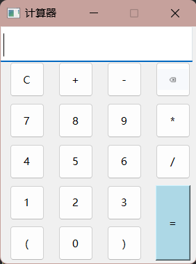

# Qt项目1--四则运算计算器

# 1. QT交互窗口

利用多个PushButton实现，建立了一个网格布局，每个Button都需要一个槽函数用于用户输入并显示：

```cpp
void Widget::on_oneButton_clicked()
{
    //点击1，追加1，QString类重载了+=
    expression += "1";
    ui->mainLineEdit->setText(expression);
}
```

​​

包含设置了一些样式表：

```cpp
	//设置窗口大小固定
    this->setMaximumSize(225,272);
    this->setMinimumSize(225,272);

    //设置LineEdit的字体和大小
    QFont f("微软雅黑",14);
    ui->mainLineEdit->setFont(f);

    //设置按钮图标
    QIcon DeleteButton("D:\\Desktop\\QT\\QTonline\\calcula\\del.png");
    ui->deleteButton->setIcon(DeleteButton);

    // 设置按钮的样式表
    ui->equalButton->setStyleSheet("background-color: lightblue;");
```

要设置字体样式、图标样式和样式表，通常使用以下类和方法：

1. **字体样式（**​**`QFont`**​**类）：**

    * 使用 `QFont`​ 类创建字体对象，并设置字体的各种属性，如字体类型、字体大小、加粗、斜体等。
    * 使用 `setFont`​ 方法将字体对象应用到相应的 UI 控件上，例如标签、按钮、文本框等。

    ```cpp
    QFont font("微软雅黑", 14); // 创建字体对象
    ui->label->setFont(font); // 应用字体到标签上
    ```
2. **图标样式（**​**`QIcon`**​**类）：**

    * 使用 `QIcon`​ 类创建图标对象，可以加载图像文件或使用内置图标。
    * 使用 `setIcon`​ 方法将图标对象应用到按钮、工具栏按钮等控件上。

    ```cpp
    QIcon icon("path/to/icon.png"); // 创建图标对象
    ui->pushButton->setIcon(icon); // 应用图标到按钮上
    ```
3. **样式表（**​**`setStyleSheet`**​**方法）：**

    * 使用样式表可以自定义控件的外观和布局，使用 CSS 风格的语法来描述样式。
    * 使用 `setStyleSheet`​ 方法将样式表应用到单个控件或整个窗口上，可以改变控件的颜色、边框、背景等。

    ```cpp
    ui->pushButton->setStyleSheet("background-color: lightblue;"); // 设置按钮的背景颜色
    ```

这些方法和类使得你能够轻松地自定义 Qt 应用程序的外观和样式，以满足你的需求和设计要求。

‍

# 2. 算法

界面构造容易，主要是算法实现计算器的效果，利用**堆栈**和**字符数组**来实现中缀表达式的计算：

1. **堆栈（Stack）** ：这个算法使用两个堆栈，一个用于存储操作数（s_num），另一个用于存储操作符（s_opt）。堆栈是一种后进先出（LIFO）的数据结构，适用于处理表达式中的操作数和操作符。通过堆栈，可以方便地对操作数和操作符进行推入和弹出操作，以实现中缀表达式的计算。
2. **字符数组（char array）** ：这个算法将输入的中缀表达式转换为字符数组，以便逐字符处理。它使用`QByteArray`​来存储字符数组，并使用`QString`​的方法将输入的表达式转换为`const char*`​ 类型，以便在代码中访问每个字符。

**代码：**

```cpp
void Widget::on_equalButton_clicked()
{
    QStack<int> s_num, s_opt; // 创建两个堆栈，一个用于操作数，一个用于操作符
    int i = 0, tmp = 0, num1, num2; // 初始化变量

    // 将表达式从QString转换为const char*
    QByteArray ba;
    ba.append(expression.toUtf8().constData()); // 将QString转换为const char*
    const char* opt = ba.data();

    // 开始处理表达式字符
    while (opt[i] != '\0' || !s_opt.empty())
    {
        if (opt[i] >= '0' && opt[i] <= '9') // 如果字符是数字
        {
            tmp = tmp * 10 + opt[i] - '0'; // 构建多位数
            i++;
            if (opt[i] < '0' || opt[i] > '9') // 如果不是数字，将操作数推入操作数栈
            {
                s_num.push(tmp);
                tmp = 0;
            }
        }
        else
        {
            if (s_opt.empty() || Priority(opt[i]) > Priority(s_opt.top()) || (s_opt.top() == '(' && opt[i] != ')')) // 如果操作符栈为空，或者当前操作符的优先级高于栈顶操作符，或者栈顶操作符是左括号，当前字符不是右括号
            {
                s_opt.push(opt[i]); // 将操作符入栈
                i++;
                continue;
            }
            if (s_opt.top() == '(' && opt[i] == ')') // 如果栈顶操作符是左括号，当前字符是右括号
            {
                s_opt.pop(); // 弹出左括号
                i++;
                continue;
            }
			// 如果当前操作符的优先级小于等于栈顶操作符，或者当前字符是右括号且栈顶也是右括号，或者当前字符是结束符且操作符栈不为空
            if (Priority(opt[i]) <= Priority(s_opt.top()) || (opt[i] == ')' && s_opt.top() == ')') || 
				(opt[i] == '\0' && !s_opt.empty())) 
            {
                char ch = s_opt.top();
                s_opt.pop();
                switch (ch) {
                case '+':
                    num1 = s_num.top();
                    s_num.pop();
                    num2 = s_num.top();
                    s_num.pop();
                    s_num.push(num1 + num2); // 计算并将结果推入操作数栈
                    break;
                case '-':
                    num1 = s_num.top();
                    s_num.pop();
                    num2 = s_num.top();
                    s_num.pop();
                    s_num.push(num1 - num2);
                    break;
                case '*':
                    num1 = s_num.top();
                    s_num.pop();
                    num2 = s_num.top();
                    s_num.pop();
                    s_num.push(num1 * num2);
                    break;
                case '/':
                    num1 = s_num.top();
                    s_num.pop();
                    num2 = s_num.top();
                    s_num.pop();
                    s_num.push(num1 / num2);
                    break;
                }
            }
        }
    }
    if (!s_num.empty()) // 如果操作数栈不为空
    {
        ui->mainLineEdit->setText(QString::number(s_num.top())); // 在界面上显示结果
    }
    else
    {
        ui->mainLineEdit->setText("Error"); // 如果栈为空，显示错误
    }
    expression.clear(); // 清空表达式
}

int Widget::Priority(char ch)
{
    switch (ch)
    {
    case '(':
        return 3;
    case '*':
    case '/':
        return 2;
    case '+':
    case '-':
        return 1;
    default:
        return 0;
    }
}
```

**代码解析：**

1. ​`on_equalButton_clicked`​ 函数是在用户点击"="按钮时触发的槽函数。
2. ​`QStack`​ 是一个用于存储数据的栈结构，这里使用了两个栈 `s_num`​ 和 `s_opt`​。`s_num`​ 用于存储操作数（数字），`s_opt`​ 用于存储操作符（运算符）。
3. 代码中使用了一个循环来遍历表达式字符串 `opt`​，这个字符串是通过将 `expression`​ 转换为 UTF-8 编码的 `const char*`​ 得到的。
* 当遇到数字时，将数字压入 `s_num`​ 栈。
* 当遇到操作符时，会与 `s_opt`​ 栈顶的操作符进行比较，按照优先级规则执行以下操作：

  * 如果当前操作符的优先级高于 `s_opt`​ 栈顶操作符，将当前操作符压入 `s_opt`​ 栈。
  * 如果当前操作符的优先级低于或等于 `s_opt`​ 栈顶操作符，需要从 `s_opt`​ 栈中弹出操作符，并从 `s_num`​ 栈中弹出相应数量的操作数，执行计算，并将结果压回 `s_num`​ 栈。这一步可能会进行多次，直到 `s_opt`​ 栈顶操作符的优先级不再高于当前操作符。
  * 如果遇到 `(`​ 括号，直接将 `(`​ 入栈。
  * 如果遇到 `)`​ 括号，需要从 `s_opt`​ 栈中弹出操作符，执行计算，直到遇到与 `(`​ 匹配的左括号。

4. 最后，如果 `s_num`​ 不为空，将栈顶的结果取出并显示在文本框中。如果 `s_num`​ 为空，表示表达式不合法，文本框显示"Error"。
5. ​`Priority`​ 函数用于返回运算符的优先级，数字越大表示优先级越高。

‍

# 3. QStack类

​`QStack`​ 是 Qt 框架中的一个类，它是一个栈（Stack）数据结构的实现，用于存储一组元素，并且遵循后进先出（LIFO）的原则，即最后压入栈的元素最先弹出。以下是关于 `QStack`​ 类的一些重要信息和用法：

1. **包含头文件：**  要使用 `QStack`​，需要包含头文件 `<QStack>`​。
2. **创建 QStack 对象：**  可以通过以下方式创建一个 `QStack`​ 对象：

    ```cpp
    QStack<int> stack; // 创建一个整数类型的栈
    ```

    这里创建了一个整数类型的栈，但你可以根据需要创建不同类型的栈，例如 `QStack<QString>`​ 来存储字符串。
3. **压入元素：**  使用 `push`​ 函数将元素压入栈顶：

    ```cpp
    stack.push(42); // 压入整数 42 到栈顶
    ```
4. **弹出元素：**  使用 `pop`​ 函数从栈顶弹出元素，并返回该元素的值：

    ```cpp
    int value = stack.pop(); // 从栈顶弹出元素并存储在 value 变量中
    ```

    请注意，如果在弹出元素之前没有检查栈是否为空，可能会导致运行时错误。因此，在弹出之前通常需要使用 `isEmpty`​ 函数来检查栈是否为空。
5. **访问栈顶元素：**  使用 `top`​ 函数可以访问栈顶元素的值，但不会将其从栈中弹出：

    ```cpp
    int topValue = stack.top(); // 获取栈顶元素的值
    ```
6. **检查栈是否为空：**  使用 `isEmpty`​ 函数可以检查栈是否为空：

    ```cpp
    if (stack.isEmpty()) {
        // 栈为空
    }
    ```
7. **获取栈的大小：**  使用 `size`​ 函数可以获取栈中元素的数量：

    ```cpp
    int count = stack.size(); // 获取栈中元素的数量
    ```
8. **清空栈：**  使用 `clear`​ 函数可以清空栈，将栈中的所有元素移除：

    ```cpp
    stack.clear(); // 清空栈
    ```

​`QStack`​ 类提供了一种方便的方式来管理栈数据结构，通常在需要进行后进先出操作的场景中使用，例如在算法实现、表达式求值等方面。它是 Qt 框架中众多容器类之一，用于简化数据结构的使用和管理。
