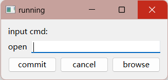

# [1] QT编译过程

# 1. main函数框架

```cpp
#include <QApplication>

int main(int argc, char *argv[])
{
    QApplication app(argc, argv);

    // 在这里添加你的应用程序的主要逻辑

    return app.exec(); // 进入事件循环
}
```

Qt应用程序需要这样的主要框架，因为它提供了一种组织和管理应用程序的标准方式，让Qt能够有效地处理用户交互、事件处理和应用程序生命周期。

具体来说，这个主要框架的各个部分的作用如下：

1. ​`#include <QApplication>`​：这是包含Qt应用程序所需的头文件之一。它包含了`QApplication`​类的定义，该类是Qt应用程序的核心，负责管理应用程序的运行。
2. ​`QApplication app(argc, argv);`​：这一行代码创建了一个`QApplication`​对象，`argc`​和`argv`​参数通常用于处理命令行参数。`QApplication`​对象是整个应用程序的管理者，它处理事件分发、应用程序的设置、窗口管理等任务。
3. ​`return app.exec();`​：这一行代码启动了Qt的事件循环。Qt的事件循环允许应用程序等待和处理各种事件，包括用户输入、定时器事件等。一旦调用了`app.exec()`​，应用程序会进入事件循环并保持运行，直到用户关闭应用程序窗口或显式地终止应用程序。

通过使用这个框架，你可以方便地编写具有图形用户界面的应用程序，而不必自己处理复杂的事件处理和窗口管理逻辑。Qt提供了丰富的库和工具，使开发GUI应用程序变得更加容易和高效。如果你不使用这个框架，你将不得不自己编写大量的底层代码来处理事件、窗口管理等，这会显著增加应用程序的复杂性和开发工作量。

‍

# 2. 第一个QT程序 -- 运行

```cpp
#include <QApplication>
//控件类
#include <QLabel>
#include <QLineEdit>
#include <QPushButton>
//布局类
#include <QHBoxLayout>  	//水平布局
#include <QVBoxLayout>	//垂直布局
				//网格布局.....

//窗口类
#include <QWidget>

int main(int argc,char *argv[])
{
	QApplication app(argc,argv);

	//创建控件对象
	QLabel *infoLabel = new QLabel;
	QLabel *openLabel = new QLabel;
	QLineEdit * cmdLineEdit = new QLineEdit;
	QPushButton *commitButton = new QPushButton;
	QPushButton *cancelButton = new QPushButton;
	QPushButton *browseButton = new QPushButton;

	//利用控件对象的setText方法设置文本
	infoLabel->setText("input cmd:");
	openLabel->setText("open");
	commitButton->setText("commit");
	cancelButton->setText("cancel");
	browseButton->setText("browse");

	//利用布局类进行控件布局--先把元素加入水平布局，在将元素和水平布局加入垂直布局
	QHBoxLayout *cmdLayout = new QHBoxLayout;
	cmdLayout->addWidget(openLabel);
	cmdLayout->addWidget(cmdLineEdit);

	QHBoxLayout *buttonLayout = new QHBoxLayout;
	buttonLayout->addWidget(commitButton);
	buttonLayout->addWidget(cancelButton);
	buttonLayout->addWidget(browseButton);

	QVBoxLayout *mainLayout = new QVBoxLayout;
	mainLayout->addWidget(infoLabel);
	mainLayout->addLayout(cmdLayout);
	mainLayout->addLayout(buttonLayout);

	//实例化窗口对象
	QWidget w;
	w.setLayout(mainLayout);	//设置窗口布局
	w.show();					//显示窗口
	w.setWindowTitle("running");//设置窗口标题

	return app.exec();//程序进入死循环
}
```

效果：

​​

‍

# 3. 编译过程（Windows命令行）

#### 3.1 qmake -project

用qmake -project生成工程配置文件，一个`.pro`​后缀的文件，在该文件加入一行：`QT += widgets gui`​

这个配置文件是Qt工程的描述文件，其中包含有关项目的信息，包括使用的Qt模块。添加了一行 `QT += widgets gui`​，这告诉Qt工程使用了Qt Widgets和Qt GUI模块。

#### 3.2 qmake

生成与你的操作系统和编译器兼容的Makefile文件。这个Makefile文件将根据你的项目配置生成编译指令。

#### 3.3 mingw32-make

这一步执行Makefile文件，通过编译和链接源代码文件来构建你的Qt应用程序。mingw32-make 是用于Windows平台上的GNU Make的命令。在执行此命令后，它将根据Makefile中的规则来编译项目，并生成可执行文件（.exe文件）。

‍

# 4. 总结

以上仅作为一个了解，因为具体工程开发，肯定会使用专门的IDE进行开发，所以只是了解一下大概得一个编译过程就可以了。

‍
