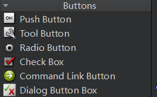

# [2] 认识QTCreator

## 1. 创建工程

在Qt Creator中创建一个桌面项目时，通常会有三个常见的选项，分别是 `QMainWindow`​、`QWidget`​ 和 `QDialog`​，它们分别代表不同类型的主窗口或对话框。以下是每个选项的简要说明：

1. **QMainWindow**：

    * 如果你的应用程序需要一个典型的主窗口，通常有菜单栏、工具栏、状态栏和中央工作区等，那么选择 `QMainWindow`​ 是合适的。
    * 这种选项适用于创建传统的桌面应用程序，例如文本编辑器、绘图应用程序等。
2. **QWidget**：

    * 如果你的应用程序只需要一个基本的窗口，并且没有特定的主窗口结构（如菜单栏等），那么选择 `QWidget`​ 是合适的。
    * 这种选项适用于创建自定义的窗口，你可以在其中添加各种控件和自定义界面元素。
3. **QDialog**：

    * 如果你的应用程序需要一个对话框，通常用于短期交互或信息提示，那么选择 `QDialog`​ 是合适的。
    * 对话框通常用于获取用户输入、显示警告或提示信息等。

​​

‍

## 2. 工程项目结构

​`工程名.pro`​是工程配置文件，一般不需要手动配置    `xxx.h`​头文件    `xxx.cpp`​源文件     `xxx.ui`​界面文件

​

**详细介绍：**

1. **工程名.pro**：

    * ​`.pro`​ 文件是Qt项目的配置文件，其中包含有关项目的元信息，编译选项，依赖关系等信息。
    * 通常，你可以在 `.pro`​ 文件中配置所需的Qt模块、库以及其他编译和构建设置。
2. **xxx.h 头文件**：

    * ​`.h`​ 文件通常包含类的声明，包括类的成员变量和函数原型。
    * 头文件用于描述类的接口，以便其他代码可以访问和使用类的功能。
3. **xxx.cpp 源文件**：

    * ​`.cpp`​ 文件通常包含与头文件中声明的类相关的实现代码。
    * 这些文件包含了类的方法和函数的具体实现，以及其他辅助函数。
4. **xxx.ui 界面文件**：

    * ​`.ui`​ 文件是Qt的用户界面文件，通常由Qt Designer或Qt Creator中的界面设计器创建。
    * 这些文件包含了窗口、对话框或部件的布局、控件和信号槽等界面元素的描述。
    * 在编译时，Qt会将 `.ui`​ 文件转换为相应的C++代码，以便在程序中使用。

‍

## 3. 设计界面

### 3.1 Layouts 布局

​

​

1. **水平布局（Horizontal Layout）** ：

    * 水平布局将控件水平排列，从左到右。
    * 适合需要将控件横向排列的情况，如工具栏、按钮组、输入字段等。
    * 使用QHBoxLayout或在Qt Designer中选择"水平布局"工具来创建水平布局。
2. **垂直布局（Vertical Layout）** ：

    * 垂直布局将控件垂直排列，从上到下。
    * 适合需要将控件纵向排列的情况，如窗口的主要布局、表单、选项卡等。
    * 使用QVBoxLayout或在Qt Designer中选择"垂直布局"工具来创建垂直布局。
3. **网格布局（Grid Layout）** ：

    * 网格布局将控件排列成一个网格，每个控件占据一个单元格。
    * 适合需要将控件以表格形式排列的情况，如表格、网格按钮、图形界面编辑器等。
    * 使用QGridLayout或在Qt Designer中选择"网格布局"工具来创建网格布局。
4. **表单布局（Form Layout）** ：

    * 表单布局用于创建表单式的布局，通常用于输入表单等。
    * 控件对齐在两列中，左侧是标签，右侧是输入字段。
    * 使用QFormLayout或在Qt Designer中选择"表单布局"工具来创建表单布局。

‍

‍

### 3.2 Spacers 间隔

​​

Qt Creator提供了两种常见的间隔（Spacer）类型，用于在Qt应用程序的用户界面中管理和控制布局。这些间隔可以帮助你调整控件之间的间距和位置，以确保用户界面在不同大小的窗口和屏幕分辨率下都能够正常工作。

1. **水平间隔（Horizontal Spacer）** ：

    * 水平间隔是一个水平方向上的占位符，通常用于水平布局中。
    * 它可以在水平布局中用于增加或调整控件之间的水平间距。
    * 在Qt Designer中，你可以将水平间隔添加到水平布局中，然后通过拖动它来调整水平间距。
2. **垂直间隔（Vertical Spacer）** ：

    * 垂直间隔是一个垂直方向上的占位符，通常用于垂直布局中。
    * 它可以在垂直布局中用于增加或调整控件之间的垂直间距。
    * 在Qt Designer中，你可以将垂直间隔添加到垂直布局中，然后通过拖动它来调整垂直间距。

‍

‍

### 3.3 Buttons 按钮

​​

1. **QPushButton（Push Button）** ：

    * ​`QPushButton`​ 是用于触发点击事件的标准按钮。
    * 它通常用于执行操作，例如提交表单、启动功能或执行特定任务。
2. **QToolButton（Tool Button）** ：

    * ​`QToolButton`​ 是一种特殊的按钮，通常用于工具栏中。
    * 它可以显示图标、文本或两者结合，用于快速访问应用程序的功能。
3. **QRadioButton（Radio Button）** ：

    * ​`QRadioButton`​ 是用于单选框组的按钮。
    * 它们通常用于选项卡或选项列表，用户只能选择其中一个选项。
4. **QCheckBox（Check Box）** ：

    * ​`QCheckBox`​ 是用于复选框的按钮。
    * 它们通常用于允许用户选择多个选项，可以选择或取消选择。
5. **QCommandLinkButton（Command Link Button）** ：

    * ​`QCommandLinkButton`​ 是用于表示重要操作的按钮。
    * 它们通常用于提供更详细的描述和说明，并可用于启动相关操作。
6. **QAbstractButton（Abstract Button）** ：

    * ​`QAbstractButton`​ 是一个抽象的按钮类，通常用于创建自定义按钮。
    * 它是其他按钮控件的基类，可以用于自定义按钮的外观和行为。

‍

‍

### 3.4 Input Widgets 输入控件

​​

输入控件（Input Widgets）是Qt中的一组用于接受用户输入的用户界面元素。它们允许用户输入文本、数字、日期、选择选项等，并提供了丰富的交互性和验证功能。以下是一些常见的Qt输入控件：

1. **QLineEdit**：

    * ​`QLineEdit`​ 是一个单行文本输入框，用于接受用户输入的短文本。
    * 它支持文本输入、剪切、复制和粘贴，还可以设置输入验证和掩码。
2. **QTextEdit**：

    * ​`QTextEdit`​ 是一个多行文本输入框，用于接受用户输入的长文本或富文本。
    * 它支持多行文本输入、格式化文本、插入图片和链接等。
3. **QPlainTextEdit**：

    * ​`QPlainTextEdit`​ 是用于接受纯文本输入的多行文本框，不支持富文本。
    * 它适用于显示和编辑普通文本，如代码或日志。
4. **QSpinBox** 和 **QDoubleSpinBox**：

    * ​`QSpinBox`​ 用于接受整数输入，用户可以通过上下箭头或手动输入来调整数值。
    * ​`QDoubleSpinBox`​ 用于接受浮点数输入，类似于 `QSpinBox`​，但支持浮点数。
5. **QSlider**：

    * ​`QSlider`​ 是一个滑块控件，用于选择在一定范围内的整数值。
    * 它允许用户通过拖动滑块来选择值。
6. **QComboBox**：

    * ​`QComboBox`​ 是一个组合框，用户可以从下拉列表中选择一个选项。
    * 它通常用于选择一个选项，例如选择国家、城市或其他列表中的项目。
7. **QCheckBox** 和 **QRadioButton**：

    * ​`QCheckBox`​ 用于选择或取消选择一个或多个选项。
    * ​`QRadioButton`​ 用于单选按钮组，用户只能选择一个选项。
8. **QDateEdit** 和 **QTimeEdit**：

    * ​`QDateEdit`​ 用于选择日期。
    * ​`QTimeEdit`​ 用于选择时间。
    * 它们可以用于日期和时间的输入和选择。
9. **QCalendarWidget**：

    * ​`QCalendarWidget`​ 是一个日历控件，允许用户选择日期。
    * 它显示一个月份的日历，用户可以选择日期并进行导航。

‍

### 3.5 Display Widgets 显示控件

​​

显示控件（Display Widgets）是Qt中的一组用于显示信息或数据的用户界面元素。它们通常用于向用户呈现静态或动态的文本、图像、图表、进度条等内容。以下是一些常见的Qt显示控件：

1. **QLabel**：

    * ​`QLabel`​ 是用于显示文本或图像的标签控件。
    * 它可以显示纯文本、富文本、图像或者同时显示文本和图像。
2. **QPlainTextEdit**：

    * ​`QPlainTextEdit`​ 可以不可编辑地显示多行文本内容。
    * 它通常用于显示代码、日志或其他大段文本。
3. **QTextBrowser**：

    * ​`QTextBrowser`​ 是一个富文本文本查看器，允许显示和导航富文本内容。
    * 用户可以点击链接并查看HTML内容。
4. **QTextEdit**：

    * ​`QTextEdit`​ 不仅可以用于文本输入，还可以用于显示富文本内容。
    * 它支持显示、编辑和格式化富文本，包括字体、颜色、图像等。
5. **QProgressBar**：

    * ​`QProgressBar`​ 是一个进度条控件，用于表示任务的进度。
    * 它通常用于显示任务的完成百分比。
6. **QScrollBar**：

    * ​`QScrollBar`​ 是一个滚动条控件，用于滚动显示内容。
    * 它通常用于显示大量内容的部分视图，如文本、图像或图表。
7. **QDial**：

    * ​`QDial`​ 是一个旋转式的拨号控件，通常用于选择数值。
    * 用户可以旋转拨号来选择数值。
8. **QLCDNumber**：

    * ​`QLCDNumber`​ 是用于显示数字的液晶数字显示控件。
    * 它通常用于显示数值、计数器或计时器的值。
9. **QFrame**：

    * ​`QFrame`​ 是一个通用的框架控件，可用于容纳其他控件或将其用作容器。
    * 它可以用来创建自定义的显示区域。
10. **QGraphicsView**：

     * ​`QGraphicsView`​ 是一个用于显示图形项（Graphics Items）的视图控件。
     * 它通常用于创建自定义的图形和绘图应用程序。

‍

### 3.6 其他控件

在Qt中，"Item Views" 和 "Item Widgets" 是两种用于显示和处理数据的重要机制。它们通常用于创建各种复杂的用户界面，如表格、列表、树形视图等。

1. **Item Views**：  
    "Item Views" 是Qt中一组用于显示和编辑数据的视图控件的集合，包括但不限于以下几种：

    * **QListView**：用于显示项目的列表视图，可以用于创建类似文件浏览器的界面。
    * **QTableView**：用于以表格形式显示数据的表格视图，支持多列和多行，类似于电子表格。
    * **QTreeView**：用于显示层次结构数据的树形视图，支持展开和折叠节点，常用于文件系统导航和树形数据显示。
    * **QColumnView**：用于以列的形式显示数据的列视图，通常用于显示多列数据。

    这些视图提供了用于显示和交互的丰富功能，如排序、过滤、编辑、选择、拖放等。你可以使用模型/视图框架（Model-View Framework）来将数据与视图分离，从而实现数据的可视化表示。
2. **Item Widgets**：  
    "Item Widgets" 是在Qt中用于自定义项（item）的机制，通常与"Item Views"结合使用。它允许你在视图中显示自定义的QWidget，而不仅仅是文本或图像。这对于创建复杂的自定义项非常有用，每个项可以包含多个控件，例如按钮、文本框、复选框等。  
    "Item Widgets" 通常在 "QAbstractItemView" 的子类中使用，例如 "QListView" 或 "QTableView"。你可以使用 "setItemWidget" 或 "setIndexWidget" 方法将自定义QWidget分配给特定的项。

‍

### 3.7 修改控件属性

​​

‍
