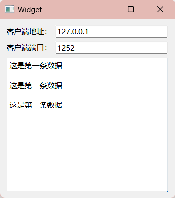

# [7] QT-TCP编程（一）基本了解

* 🍻 [QT-TCP编程（二）多线程实现并发服务器](siyuan://blocks/20231006235555-md4ml8w)
* 📰 [QT-TCP编程（三）通过TCP服务器发送文件](siyuan://blocks/20231006235555-2tdftee)

## 1. 客户端

以下是使用Qt编写的基本TCP客户端的流程：

1. **包含必要的头文件**：首先，在你的Qt应用程序中包含必要的头文件，以便能够使用TCP相关的类和函数。通常，你需要包含QtNetwork模块的头文件。

    ```cpp
    #include <QtNetwork>
    ```
2. **创建QTcpSocket对象**：创建一个QTcpSocket对象，它将用于与服务器建立连接和进行数据通信。

    ```cpp
    QTcpSocket *socket = new QTcpSocket(this);
    ```
3. **连接到服务器**：使用`connectToHost`​方法连接到服务器。指定服务器的IP地址和端口号。

    ```cpp
    socket->connectToHost(QHostAddress("服务器IP地址"), 端口号);
    ```

    例如：

    ```cpp
    socket->connectToHost(QHostAddress("127.0.0.1"), 12345);
    ```
4. **处理连接成功信号**：连接成功后，可以使用连接的信号和槽机制来处理连接成功事件。

    ```cpp
    connect(socket, &QTcpSocket::connected, [](){
        qDebug() << "Connected to the server!";
    });
    ```
5. **处理数据接收**：使用`readyRead`​信号来检测是否有数据可供接收，并使用相应的槽函数来处理接收到的数据。

    ```cpp
    connect(socket, &QTcpSocket::readyRead, [=](){
        QByteArray data = socket->readAll();
        qDebug() << "Received data: " << data;
    });
    ```
6. **发送数据到服务器**：使用`write`​方法将数据发送到服务器。

    ```cpp
    QByteArray dataToSend = "Hello, Server!";
    socket->write(dataToSend);
    ```
7. **关闭连接**：当不再需要与服务器通信时，可以关闭连接。

    ```cpp
    socket->close();
    ```
8. **处理错误和异常**：确保处理连接过程中可能出现的错误和异常情况，以提高应用程序的健壮性。

这是一个简单的TCP客户端的基本流程示例。你可以根据你的应用程序需求扩展和优化这个基本框架。请注意，Qt的信号和槽机制是用于异步处理事件的强大工具，可以帮助你更有效地管理与服务器的通信。

‍

## 2. 服务器

在Qt中实现一个基本的TCP服务器的流程如下：

1. **包含必要的头文件**：首先，在你的Qt应用程序中包含必要的头文件，以便能够使用TCP服务器相关的类和函数。通常，你需要包含QtNetwork模块的头文件。

    ```cpp
    #include <QtNetwork>
    ```
2. **创建QTcpServer对象**：创建一个QTcpServer对象，它将用于监听客户端连接请求并处理连接。

    ```cpp
    QTcpServer *server = new QTcpServer(this);
    ```
3. **监听连接**：使用`listen`​方法开始监听指定的IP地址和端口号，等待客户端连接。

    ```cpp
    if (!server->listen(QHostAddress::Any, 端口号)) {
        qDebug() << "Server could not start. Error: " << server->errorString();
    } else {
        qDebug() << "Server listening on port " << 端口号;
    }
    ```

    请替换`端口号`​为你想要使用的端口号。
4. **处理新连接**：使用`newConnection`​信号连接一个槽函数，以便在新客户端连接时进行处理。

    ```cpp
    connect(server, &QTcpServer::newConnection, [=](){
        QTcpSocket *clientSocket = server->nextPendingConnection();
        // 在这里可以与客户端进行数据通信
    });
    ```

    在上述示例中，当有新的客户端连接时，将创建一个新的`QTcpSocket`​对象（`clientSocket`​）来处理该客户端的数据通信。
5. **与客户端通信**：使用`QTcpSocket`​对象与连接的客户端进行数据通信。你可以使用`write`​方法向客户端发送数据，使用`readyRead`​信号来处理接收到的数据。

    ```cpp
    connect(clientSocket, &QTcpSocket::readyRead, [=](){
        QByteArray data = clientSocket->readAll();
        qDebug() << "Received data from client: " << data;
    });

    QByteArray dataToSend = "Hello, Client!";
    clientSocket->write(dataToSend);
    ```
6. **关闭连接**：当与客户端的通信结束时，可以使用`close`​方法关闭连接。

    ```cpp
    clientSocket->close();
    ```
7. **处理错误和异常**：确保处理可能出现的连接和通信过程中的错误和异常情况，以提高服务器的健壮性。

这是一个简单的TCP服务器的基本流程示例。你可以根据你的应用程序需求扩展和优化这个基本框架，例如，可以考虑如何处理多个客户端连接、线程安全性等问题。请注意，Qt的信号和槽机制是用于异步处理事件的强大工具，可以帮助你更有效地管理与客户端的通信。

‍

## 3.示例

#### 1. 客户端


```cpp
#include "widget.h"
#include "ui_widget.h"

Widget::Widget(QWidget *parent)
    : QWidget(parent)
    , ui(new Ui::Widget)
{
    ui->setupUi(this);
    this->setWindowTitle("客户端");
    //实例化
    socket = new QTcpSocket;
    //读取
    connect(socket,&QTcpSocket::readyRead,this,&Widget::ReadSlot);
}

Widget::~Widget()
{
    delete ui;
}

//处理数据
void Widget::ReadSlot()
{
    QByteArray data = socket->readAll();
    ui->textEdit->append(data + "\n");
}

void Widget::on_connectButton_clicked()
{
    QString IP = ui->IPLineEdit->text();
    QString Port = ui->PortLineEdit->text();

    socket->connectToHost(QHostAddress(IP),Port.toShort());

    connect(socket,&QTcpSocket::connected,[this]()
    {
        QMessageBox::information(this,"连接提示","服务器连接成功");
    });

    connect(socket,&QTcpSocket::disconnected,[this]()
    {
        QMessageBox::warning(this,"连接提示","服务器连接断开");
    });
}


void Widget::on_pushButton_2_clicked()
{
    this->close();
}


void Widget::on_sendButton_clicked()
{
    QString sendDate = ui->sendLineEdit->text();
    socket->write(sendDate.toUtf8());
}
```

**解析：**

1. ​`ReadSlot()`​ 函数：当 `QTcpSocket`​ 接收到数据时，这个槽函数会被触发，它将接收到的数据显示在 `textEdit`​ 控件中。
2. ​`on_connectButton_clicked()`​ 函数：这个函数处理用户点击连接按钮的事件。它从用户输入的 IP 地址和端口号创建一个连接到服务器的 `QTcpSocket`​ 连接。连接成功和断开连接时，会显示消息框提示用户。
3. ​`on_pushButton_2_clicked()`​ 函数：当用户点击关闭按钮时，这个函数关闭客户端应用程序。
4. ​`on_sendButton_clicked()`​ 函数：这个函数处理用户点击发送按钮的事件。它从 `sendLineEdit`​ 控件获取用户输入的文本，并将文本以 UTF-8 编码发送到服务器

‍

#### 2. 服务器



```cpp
#include "widget.h"
#include "ui_widget.h"

Widget::Widget(QWidget *parent)
    : QWidget(parent)
    , ui(new Ui::Widget)
{
    ui->setupUi(this);

    server = new QTcpServer;
    server->listen(QHostAddress::AnyIPv4,PORT);

    connect(server,&QTcpServer::newConnection,this,&Widget::newconnect);
}

Widget::~Widget()
{
    delete ui;
}

void Widget::newconnect()
{
    //建立TCP连接
    QTcpSocket *socket = server->nextPendingConnection();
    //获取客户端地址
    socket->peerAddress();
    socket->peerPort();

    ui->IPLineEdit->setText(socket->peerAddress().toString());
    ui->PortLineEdit->setText(QString::number(socket->peerPort()));

    //接受客户端信息并返回接受的信息
    connect(socket, &QTcpSocket::readyRead, [=](){
        QByteArray data = socket->readAll();
        ui->textEdit->append(data + "\n");
        socket->write(data);
    });
}
```

**解析：**

1. ​`server->listen(QHostAddress::AnyIPv4, PORT);`​：这一行代码启动了TCP服务器并开始监听指定的IP地址（`QHostAddress::AnyIPv4`​表示监听所有可用的IPv4地址）和端口号（`PORT`​是你的端口号变量）以接受客户端连接请求。
2. ​`connect(server, &QTcpServer::newConnection, this, &Widget::newconnect);`​：当有新的客户端连接请求时，将调用 `newconnect`​ 槽函数来处理新连接。
3. ​`newconnect()`​ 函数：这个函数被调用以处理新连接。它首先使用 `server->nextPendingConnection()`​ 获取与客户端的连接，并获取客户端的IP地址和端口号。
4. ​`connect(socket, &QTcpSocket::readyRead, [=]() { ... });`​：这个代码段连接了客户端的 `readyRead`​ 信号，以便在客户端发送数据时进行处理。当数据准备好时，它会读取客户端发送的数据，然后追加到 `textEdit`​ 控件中并发送回客户端。
