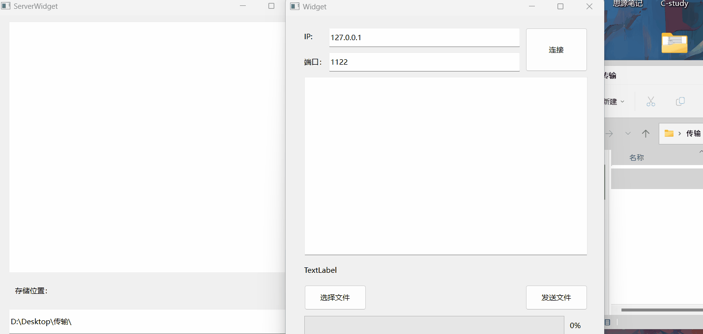

# QT-TCP编程（三）通过TCP服务器发送文件

> 有了前面发送数据的基础，发送文件就很简单了，因为文件也是数据，我们只需要把文件内容读出来，发送给服务器，服务器在写进文件，就可以了。

# 1. 发送文件的思路（客户端）

在Qt中使用QTcpSocket发送文件的基本思路如下：

1. 创建一个QTcpSocket对象，用于与服务器建立连接。

```cpp
QString ip = ui->IPLineEdit->text();//获取ip
int port = ui->PortLineEdit->text().toInt();//获取端口数据
socket->connectToHost(ip, port);//连接服务器
```

2. 在连接建立后，打开待发送的文件，以便读取文件内容。

```cpp
QFile file = (ui->FilenameLabel->text());
if (!file.open(QIODevice::ReadWrite))
	{
		//读取文件失败
		return;
	}
 
```

3. 读取文件内容并使用`write`​方法将数据发送给服务器。您可以选择一次发送一部分数据，直到文件全部发送完毕。

```cpp
qint64 currentlen = 0;//当前已经发送的大小
qint64 allLength = file.size();//总文件大小
do
{
    char data[1024];
    qint64 msize = file.read(data, 1024);//读文件放入打他数组中，返回读取到的大小
    socket->write(data, msize);//把读取到的data数据发送给服务器
    currentlen += msize;//实时获取当前发送的文件大小
    ui->progressBar->setValue(currentlen *100 / allLength);//更新界面进度条
} while (currentlen < allLength);//当发送文件等于文件大小时，发送完毕，循环结束
```

4. 如果需要，可以在发送数据之前定义自定义的文件头，以便服务器能够正确地识别文件的属性（例如文件名和文件大小）。

```cpp
void Widget::on_sendFileButton_clicked()
{
    QFileInfo info(ui->FilenameLabel->text());
    //用QFileInfo：：fileName，size获取文件名和大小 格式：文件名&大小
    //服务器用该格式解析文件名和大小
    QString head = QString("%1&%2").arg(info.fileName()).arg(info.size());
    //将该格式发送给服务器 toUtf8：QString转QByteArray或char类型
    socket->write(head.toUtf8());
}
```

5. 通过QTcpSocket的信号和槽机制来处理连接状态和数据传输的事件。特别是，您可以使用`bytesWritten`​信号来追踪已发送的字节数，并使用`readyRead`​信号来处理服务器的响应。

```cpp
//如果服务器发送信息到客户端，触发匿名函数
connect(socket, &QTcpSocket::readyRead, [=]() {
	//读取服务器发送的信息（即缓冲区信息）
	QByteArray buf = socket->readAll();
	if (buf=="ok")
	{
		//发送文件操作...
	}
}
```

‍

## 2. 接收文件的思路（服务器）

1. 创建一个QTcpServer对象，用于监听客户端的连接请求。

```cpp
server = new QTcpServer(this);
//监听1122端口的ip
server->listen(QHostAddress::Any, 1122);
```

2. 使用`newConnection`​信号来接受客户端的连接。一旦有客户端连接，创建一个QTcpSocket对象，用于与客户端通信。

```cpp
//如果有用户连接触发槽函数
connect(server, &QTcpServer::newConnection, this, &ServerWidget::hasConnect);
```

3. 服务器需要解析客户端发来的头部信息以了解接下来将接收的文件属性。一旦知道文件的属性，服务器可以开始接收文件数据。使用`read`​方法从客户端读取数据，并将其写入服务器端的文件。

```cpp
//如果客户端发送信息过来了，触发匿名函数
connect(socket, &QTcpSocket::readyRead, [=]() {
QByteArray buf = socket->readAll();
//用一个标志位ishead判断是头还是数据位
if (ishead)
{
    //如果是头，解析头（文件名，文件大小）
    QString str = QString(buf);
    ui->textEdit->append(str);
    QStringList strlist = str.split("&");
    fileName = strlist.at(0);//解析帧头文件名
    fileSize = strlist.at(1).toInt();//解析帧头文件大小
    ishead = false;//下次接收到的文件就是我们的数据
    recvSize = 0;
    filebuf.clear();
    socket->write("ok");
}
else
{
    //根据文件名和文件大小接收和保存文件
    filebuf.append(buf);
    recvSize += buf.size();//每接收一次文件，当前文件大小+1
    //当接收文件大小等于总文件大小，即文件数据接收完毕
    if (recvSize>=fileSize)
    {
        //保存文件
        QString fileDir = ui->lineEdit->text();
        fileDir += fileName;
        qDebug() << fileDir;
        QFile file(ui->lineEdit->text() + fileName);
        file.open(QIODevice::WriteOnly);
        file.write(filebuf);
        file.close();
        ishead = true;
    }
}
});
```

# 3.完整代码

#### **TcpFileClient.h:**

```cpp
#ifndef TCPFILECLIENT_H
#define TCPFILECLIENT_H

#include <QWidget>
#include <QTcpSocket>
#include <QFile>
#include <QFileDialog>

QT_BEGIN_NAMESPACE
namespace Ui { class TcpFileClient; }
QT_END_NAMESPACE

class TcpFileClient : public QWidget
{
    Q_OBJECT

public:
    TcpFileClient(QWidget *parent = nullptr);
    ~TcpFileClient();

private slots:
    void on_connectButton_clicked();

    void on_choseFileButton_clicked();

    void on_sendFileButton_clicked();

private:
    Ui::TcpFileClient*ui;
    QTcpSocket* socket;
};
#endif // TCPFILECLIENT_H
```

#### **TcpFileClient.cpp:**

```cpp
#include "TcpFileClient.h"
#include "ui_widget.h"

TcpFileClient::TcpFileClient(QWidget *parent)
    : QWidget(parent)
    , ui(new Ui::Widget)
{
    ui->setupUi(this);
    socket = new QTcpSocket(this);
}

TcpFileClient::~Widget()
{
    delete ui;
}


void TcpFileClient::on_connectButton_clicked()
{
    QString ip = ui->IPLineEdit->text();//获取ip
    int port = ui->PortLineEdit->text().toInt();//获取端口数据
    socket->connectToHost(ip, port);//连接服务器
    //等待连接成功
    if (socket->waitForConnected())
    {
        ui->textEdit->append("<font color='green'>连接服务器成功！</font>");
        ui->connectButton->setEnabled(true);

        //如果服务器发送信息到客户端，触发匿名函数
        connect(socket, &QTcpSocket::readyRead, [=]() {
            //读取服务器发送的信息（即缓冲区信息）
            QByteArray buf = socket->readAll();
            if (buf=="ok")
            {
                QFile file = (ui->FilenameLabel->text());
                if (!file.open(QIODevice::ReadWrite))
                {
                    //读取文件失败
                    return;
                }
                qint64 currentlen = 0;//当前已经发送的大小
                qint64 allLength = file.size();//总文件大小
                do
                {
                    char data[1024];
                    qint64 msize = file.read(data, 1024);//读文件放入打他数组中，返回读取到的大小
                    socket->write(data, msize);//把读取到的data数据发送给服务器
                    currentlen += msize;//实时获取当前发送的文件大小
                    ui->progressBar->setValue(currentlen *100 / allLength);//更新界面进度条
                } while (currentlen < allLength);//当发送文件等于文件大小时，发送完毕，循环结束
            }
        });

    }
    else
    {
        ui->textEdit->append("<font color='red'>连接服务器失败！</font>");
    }
}


void TcpFileClient::on_choseFileButton_clicked()
{
    QString path = QFileDialog::getOpenFileName(this, "打开文件", "", "(*.*)");
    ui->FilenameLabel->setText(path);
}


void TcpFileClient::on_sendFileButton_clicked()
{
    QFileInfo info(ui->FilenameLabel->text());
    //用QFileInfo：：fileName，size获取文件名和大小 格式：文件名&大小
    //服务器用该格式解析文件名和大小
    QString head = QString("%1&%2").arg(info.fileName()).arg(info.size());
    //将该格式发送给服务器 toUtf8：QString转QByteArray或char类型
    socket->write(head.toUtf8());
}


```

#### **TcpFileServer.h**

```cpp
#ifndef SERVERWIDGET_H
#define SERVERWIDGET_H

#include <QWidget>
#include <QtNetwork/QTcpServer>
#include <QtNetwork/QTcpSocket>
#include <QFile>
#include <QDebug>

QT_BEGIN_NAMESPACE
namespace Ui { class ServerWidget; }
QT_END_NAMESPACE

class ServerWidget : public QWidget
{
    Q_OBJECT

public:
    ServerWidget(QWidget *parent = nullptr);
    ~ServerWidget();
    void hasConnect();

private:
    Ui::ServerWidget *ui;
    QTcpServer* server;
    QTcpSocket* socket;
    bool ishead;
    QString fileName;
    int fileSize;//接收文件的总大小
    int recvSize;//当前接收文件的大小
    QByteArray filebuf;//当前接收的文件数据
};
#endif // SERVERWIDGET_H
```

#### **TcpFileServer.cpp:**

```cpp
#include "serverwidget.h"
#include "ui_serverwidget.h"

ServerWidget::ServerWidget(QWidget *parent)
    : QWidget(parent)
    , ui(new Ui::ServerWidget)
{
    ui->setupUi(this);
    ishead = true;
    server = new QTcpServer(this);
    //监听1122端口的ip
    server->listen(QHostAddress::Any, 1122);
    //如果有用户连接触发槽函数
    connect(server, &QTcpServer::newConnection, this, &ServerWidget::hasConnect);
}

ServerWidget::~ServerWidget()
{
    delete ui;
}

void ServerWidget::hasConnect()
{
    while (server->hasPendingConnections()>0)//判断当前连接了多少人
    {
        //用socket和我们的客户端连接，一个客户端对应一个套接字socket
        socket = server->nextPendingConnection();
        //服务器界面上输出客户端信息
        ui->textEdit->append(QString("%1：新用户连接").arg(socket->peerPort()));
            //如果客户端发送信息过来了，触发匿名函数
            connect(socket, &QTcpSocket::readyRead, [=]() {
            QByteArray buf = socket->readAll();
            //用一个标志位ishead判断是头还是数据位
            if (ishead)
            {
                //如果是头，解析头（文件名，文件大小）
                QString str = QString(buf);
                ui->textEdit->append(str);
                QStringList strlist = str.split("&");
                fileName = strlist.at(0);//解析帧头文件名
                fileSize = strlist.at(1).toInt();//解析帧头文件大小
                ishead = false;//下次接收到的文件就是我们的数据
                recvSize = 0;
                filebuf.clear();
                socket->write("ok");
            }
            else
            {
                //根据文件名和文件大小接收和保存文件
                filebuf.append(buf);
                recvSize += buf.size();//每接收一次文件，当前文件大小+1
                //当接收文件大小等于总文件大小，即文件数据接收完毕
                if (recvSize>=fileSize)
                {
                    //保存文件
                    QString fileDir = ui->lineEdit->text();
                    fileDir += fileName;
                    qDebug() << fileDir;
                    QFile file(ui->lineEdit->text() + fileName);
                    file.open(QIODevice::WriteOnly);
                    file.write(filebuf);
                    file.close();
                    ishead = true;
                }
            }
            });
    }
}

```

#### 演示：

​​​​​​
