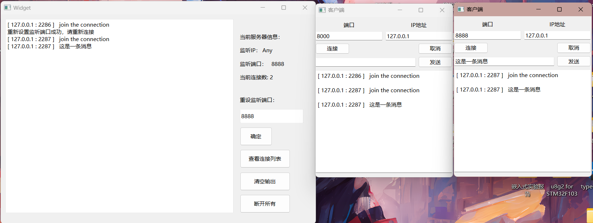

# QT-TCP编程（二）多线程实现并发服务器

并发服务器和普通服务器逻辑类似，但是需要满足并发要求，就需要引入多线程处理每一个连接。

## 1. QT多线程

#### 1.1 **QThread类**：

* ​`QThread`​​ 是Qt中用于创建和管理线程的基本类。你可以继承自 `QThread`​​ 类并重写 `run()`​​ 函数，将需要在新线程中执行的代码放在 `run()`​​ 函数中。

> ​`QThread`​ 中的 `run()`​ 函数是一个虚函数。你可以在继承自 `QThread`​ 的子类中重写这个函数，将需要在新线程中执行的代码放在其中。当你调用 `start()`​ 来启动线程时，`run()`​ 函数将在新线程中执行。run()就是一个线程的入口。

* 创建一个 `QThread`​​ 子类的实例，然后调用 `start()`​​ 函数来启动新线程。

```cpp
class MyThread : public QThread {
public:
	//重写run函数
    void run() override {
        // 在这里编写线程的执行代码
    }
};

// 创建线程并启动
MyThread *thread = new MyThread;
thread->start();
//start后会执行该对象的run函数
```

**对于多线程的理解：**

* 对于功能相同的多个线程，使用一个 `QThread`​ 子类的多个实例。
* 对于需要执行不同功能的多个线程，通常需要创建多个不同的 `QThread`​ 子类的实例，每个实例用于创建一个线程。

> 因为一个`QThread`​ 子类只有一个线程入口。

‍

#### 1.2 多线程的安全和通信

**多线程的安全性：**

1. **竞态条件（Race Condition）：**  竞态条件发生在多个线程尝试同时访问和修改共享数据时，可能导致不确定的行为。为了避免竞态条件，需要使用互斥锁（`QMutex`​​、`QMutexLocker`​​）来保护临界区域的访问，确保一次只有一个线程可以访问共享数据。
2. **死锁（Deadlock）：**  死锁发生在多个线程相互等待对方释放资源时，导致所有线程无法继续执行。要避免死锁，需要小心设计锁的获取顺序，以及使用超时机制。
3. **条件变量（Condition Variable）：**  条件变量用于在线程之间发信号和等待信号，以实现线程的同步。Qt 中提供了 `QWaitCondition`​​ 用于实现条件变量。

**多线程的通信：**

1. **信号和槽机制：**  Qt 中的信号和槽机制是多线程通信的强大工具，允许不同对象之间在不同线程中进行异步通信。通过 `QObject`​​ 派生类的信号和槽，可以实现线程间的消息传递。
2. **共享数据：**  如果多个线程需要共享数据，确保数据的访问是线程安全的，通常需要使用互斥锁。另外，使用 Qt 的容器类（如 `QList`​​、`QMap`​​）时要注意线程安全。
3. **线程间的同步：**  使用 Qt 提供的同步机制，如 `QMutex`​​、`QSemaphore`​​、`QReadWriteLock`​​ 等，来协调不同线程的操作。
4. **线程池（QThreadPool）：**  Qt 提供了线程池机制，可以管理多个线程，有效地控制线程的数量，适用于需要大量并发处理的情况。

‍

## 2. 互斥锁

#### 2.1 什么是互斥锁

互斥锁（Mutex）是一种同步机制，它基于共享资源的互斥访问原则，确保在同一时间只有一个线程可以访问被保护的资源。具体来说，互斥锁的工作原理如下：

1. 当一个线程尝试获取互斥锁时，如果锁是可用的（没有被其他线程占用），那么该线程将获得锁，并且可以访问共享资源。
2. 如果另一个线程已经持有了互斥锁，那么其他线程尝试获取锁时会被阻塞，直到锁被释放。
3. 一旦一个线程完成了对共享资源的操作，它会释放互斥锁，这样其他被阻塞的线程就有机会获取锁并继续执行。

这种机制确保了在任何给定时刻只有一个线程能够修改共享资源，从而避免了多个线程同时访问、修改共享资源可能导致的数据竞态和不一致性问题。

在你的代码中，当一个线程进入 `clientDisconnected`​ 函数时，它会尝试获取 `mutex`​ 互斥锁，如果该锁已经被其他线程持有（比如在 `newconnect`​ 函数中），那么该线程将被阻塞，直到其他线程释放了该锁。这确保了在 `clientDisconnected`​ 函数中的操作不会被多个线程同时执行，从而保护了 `clientSockets`​ 的访问。当函数执行完成并退出时，`QMutexLocker`​ 的析构函数会自动释放 `mutex`​ 互斥锁，允许其他线程再次获取锁并继续执行。

```cpp
void myThread::clientDisconnected()
{
    QMutexLocker locker(&mutex); // 使用互斥锁
    QString user ="[ "+ socket->peerAddress().toString() + " : " + QString::number(socket->peerPort()) + " ]   " + "disconnect";
    for (QTcpSocket *clientSocket : clientSockets) {
        clientSocket->write(user.toUtf8());
    }
    emit disconnectTOclient(user);
    delete this; // 删除当前线程
}
```

‍

#### 2.2 互斥锁的生命周期和作用范围

互斥锁（Mutex）的作用范围和生命周期通常取决于具体的应用场景和需求，但一般来说，互斥锁的作用范围和生命周期可以分为以下几种情况：

1. 局部作用范围和生命周期：互斥锁仅在某个特定函数或代码块内部创建和使用，用于保护一小段临界区域，一旦离开这个函数或代码块，互斥锁就会被销毁。这种情况下，互斥锁的作用范围和生命周期是局部的，仅在需要时创建和销毁。

    ```cpp
    void someFunction() {
        QMutex mutex; // 互斥锁在函数内创建
        mutex.lock();
        // 临界区域代码
        mutex.unlock();
    }
    ```
2. 成员变量作用范围和生命周期：互斥锁作为一个类的成员变量存在，可以在类的多个方法中使用，其生命周期与包含它的对象一致。这种情况下，互斥锁通常在对象构造函数中创建，在对象析构函数中销毁。

    ```cpp
    class MyObject {
    public:
        MyObject() {
            // 在构造函数中创建互斥锁
            mutex = new QMutex;
        }
        ~MyObject() {
            // 在析构函数中销毁互斥锁
            delete mutex;
        }
        void someMethod() {
            mutex->lock();
            // 临界区域代码
            mutex->unlock();
        }
    private:
        QMutex* mutex; // 互斥锁作为成员变量
    };
    ```
3. 全局作用范围和生命周期：互斥锁可以在整个应用程序范围内使用，通常作为全局变量或单例对象存在，用于保护多个线程访问的共享资源。这种情况下，互斥锁的生命周期与应用程序的生命周期一致，在应用程序启动时创建，在应用程序退出时销毁。

    ```cpp
    QMutex globalMutex; // 全局互斥锁
    ```
4. 动态创建和销毁：有时候，互斥锁的生命周期可能是动态的，根据需要在运行时创建和销毁。这种情况下，互斥锁可以使用动态内存分配来创建，然后在不再需要时手动释放。

    ```cpp
    void dynamicMutexExample() {
        QMutex* mutex = new QMutex; // 动态创建互斥锁
        mutex->lock();
        // 临界区域代码
        mutex->unlock();
        delete mutex; // 手动销毁互斥锁
    }
    ```

选择互斥锁的作用范围和生命周期取决于应用程序的设计和需求。需要注意的是，确保在不再需要互斥锁时及时销毁它们，以避免资源泄漏。同时，合理管理互斥锁的生命周期有助于提高多线程应用程序的性能和稳定性。

‍

## 3. 并发服务器（多线程聊天室）

> 思路：通过记录每个线程的socket（一个socket代表服务器和一个客户端之间的连接），可以用一个`QList<QTcpsocket*>`​容器来存储，每次有一个线程（即一个连接）接受到客户端发来的信息，该线程就通过容器向所有socket发送信息（广播）。

1. 在服务器端创建一个`QTcpServer`​来监听客户端连接。

```cpp
//全局QList<QTcpSocket*>容器
extern QList<QTcpSocket*> clientSockets;

Widget::Widget(QWidget *parent)
    : QWidget(parent)
    , ui(new Ui::Widget)
{
    ui->setupUi(this);
    //实例化QTcpServer
    server = new QTcpServer;
    //默认监听端口
    server->listen(QHostAddress::AnyIPv4,PORT);
    ui->portlabel->setText("8000");
    //处理新的连接
    connect(server,&QTcpServer::newConnection,this,&Widget::newconnect);
}
 
```

2. 当有客户端连接到服务器时，创建一个新的线程（继承自`QThread`​）来处理该客户端的消息，并将客户端的`QTcpSocket`​添加到你的`QList<QTcpSocket*>`​容器中。

```cpp
//处理新的连接
void Widget::newconnect()
{
    //建立TCP连接
    QTcpSocket *socket = server->nextPendingConnection();
    // 将客户端连接添加到列表中
    clientSockets.append(socket);  
    //启动线程
    myThread *t = new myThread(socket,this);
    t->start();        //开始线程
}
```

3. 每个线程都有一个独立的`QTcpSocket`​用于与客户端通信，当线程接收到客户端发来的消息时，可以将消息广播给容器中的所有其他客户端。

```cpp
//线程入口
void myThread::run()
{
    connect(socket,&QTcpSocket::readyRead,this,&myThread::clientInfoSlot);
}
//广播
void myThread::clientInfoSlot()
{
    QByteArray data = socket->readAll();    //读数据
    //显示用户（ip+port）
    QString user ="[ "+ socket->peerAddress().toString() + " : " + QString::number(socket->peerPort()) + " ]   " + data;
    //发送信号
    emit clientMessage(user);
    // 广播消息给所有客户端
    for (QTcpSocket *clientSocket : clientSockets) {
            clientSocket->write(user.toUtf8());
    }
}
```

4. 当客户端断开连接时，线程应该从容器中移除相应的`QTcpSocket`​。

```cpp
//Widget处理断开连接（比如更新数据）
void Widget::Disconnect(QString s){
    // 移除已断开连接的客户端套接字
    for (QTcpSocket *socket : clientSockets) {
        if (socket->state() == QAbstractSocket::UnconnectedState) {
            clientSockets.removeOne(socket);
        }
    }
}
```

5. 考虑线程安全问题，你可能需要使用互斥锁来保护容器的读写操作，以防止多个线程同时修改容器。

```cpp
extern QMutex mutex;

void myThread::clientInfoSlot()
{
    QMutexLocker locker(&mutex); // 使用互斥锁
    QByteArray data = socket->readAll();
    QString user ="[ "+ socket->peerAddress().toString() + " : " + QString::number(socket->peerPort()) + " ]   " + data;
    emit clientMessage(user);
    for (QTcpSocket *clientSocket : clientSockets) {
            clientSocket->write(user.toUtf8());
    }
}
```

6. 在服务器端，你也可以提供一些控制选项，比如关闭服务器、清除聊天记录等。

```cpp
//清屏
void Widget::on_clearButton_clicked()
{
    ui->textEdit->clear();
}

//断开所有连接
void Widget::on_stopAllButton_clicked()
{
    for (QTcpSocket *clientSocket : clientSockets) {
        // 关闭客户端套接字
        clientSocket->close();
        // 可选：如果需要，你也可以从列表中移除客户端套接字
        clientSockets.removeOne(clientSocket);
    }
}
```

‍

## 4. **完整代码（谨慎观看）:**

#### 4.1 代码部分：

```cpp
#ifndef WIDGET_H
#define WIDGET_H

#include <QWidget>
#include <QTcpServer>
#include <QTcpSocket>
#include <mythread.h>
#include <QThread>
#include "widget.h"

#define PORT 8000

QT_BEGIN_NAMESPACE
namespace Ui { class Widget; }
QT_END_NAMESPACE

class Widget : public QWidget
{
    Q_OBJECT

public:
    Widget(QWidget *parent = nullptr);
    ~Widget();

signals:
    void UpdataclientSockets(QList<QTcpSocket*> list);

private slots:
    void newconnect();
    void Disconnect(QString s);
    void on_pushButton_clicked();
    void on_pushButton_2_clicked();
    void on_clearButton_clicked();
    void on_stopAllButton_clicked();

private:
    void displayConnectionCount();

private:
    Ui::Widget *ui;
    QTcpServer *server;


};
#endif // WIDGET_H

 
```

```cpp
#include "widget.h"
#include "ui_widget.h"

extern QList<QTcpSocket*> clientSockets;

Widget::Widget(QWidget *parent)
    : QWidget(parent)
    , ui(new Ui::Widget)
{
    ui->setupUi(this);
    //实例化QTcpServer
    server = new QTcpServer;
    //默认监听端口
    server->listen(QHostAddress::AnyIPv4,PORT);
    ui->portlabel->setText("8000");
    //处理新的连接
    connect(server,&QTcpServer::newConnection,this,&Widget::newconnect);
    // 在 Widget 类中添加一个成员变量来保存连接到服务器的客户端列表
    displayConnectionCount();
}

Widget::~Widget()
{
    delete ui;
}

//处理新的连接
void Widget::newconnect()
{
    //建立TCP连接
    QTcpSocket *socket = server->nextPendingConnection();
    //处理新连接加入字符串
    QString message = "[ " + socket->peerAddress().toString() +" : " + QString::number(socket->peerPort()) + " ]   " + "join the connection";
    ui->textEdit->append(message);
  
    // 将客户端连接添加到列表中
    clientSockets.append(socket);
    displayConnectionCount(); //更新连接数量
    //广播客户端加入信息
    for (QTcpSocket *clientSocket : clientSockets) {
        clientSocket->write(message.toUtf8());
    }

    //启动线程
    myThread *t = new myThread(socket,this);
    t->start();        //开始线程

    //Widget处理断开连接（比如更新数据）
    connect(t,&myThread::disconnectTOclient,this,&Widget::Disconnect);
    //处理客户端发送的信息
    connect(t,&myThread::clientMessage,[this](QString s)
            {
                ui->textEdit->append(s);
            });
}

//Widget处理断开连接（比如更新数据）
void Widget::Disconnect(QString s){
    ui->textEdit->append(s);
    // 移除已断开连接的客户端套接字
    for (QTcpSocket *socket : clientSockets) {
        if (socket->state() == QAbstractSocket::UnconnectedState) {
            clientSockets.removeOne(socket);
        }
    }
    displayConnectionCount();
}

//重设置监听端口 先关闭监听再重启监听
void Widget::on_pushButton_clicked()
{
    QString Port = ui->PortLineEdit->text();
    server->close();
    server->listen(QHostAddress::AnyIPv4,Port.toShort());
    ui->textEdit->append("重新设置监听端口成功，请重新连接");
    ui->portlabel->setText(Port);
}

//打印连接列表
void Widget::on_pushButton_2_clicked()
{
    ui->textEdit->append("------------------");
    ui->textEdit->append("当前连接列表：");
    QString clientInfo;
    for (QTcpSocket *clientSocket : clientSockets) {
        QString user = "[" + clientSocket->peerAddress().toString() + ':' + QString::number(clientSocket->peerPort()) + "]\n";
        clientInfo += user;
    }

    // 将客户端信息追加到 ui->TextEdit 中
    ui->textEdit->append(clientInfo);
    ui->textEdit->append("------------------");
}

//清屏
void Widget::on_clearButton_clicked()
{
    ui->textEdit->clear();
}

void Widget::displayConnectionCount()
{
    int connectionCount = clientSockets.size();
    QString countText = "当前连接数: " + QString::number(connectionCount);
    ui->connectCounterlabel->setText(countText);
}

//断开所有连接
void Widget::on_stopAllButton_clicked()
{
    for (QTcpSocket *clientSocket : clientSockets) {
        // 关闭客户端套接字
        clientSocket->close();
        // 可选：如果需要，你也可以从列表中移除客户端套接字
        clientSockets.removeOne(clientSocket);
    }
    displayConnectionCount();
}
```

```cpp
#ifndef MYTHREAD_H
#define MYTHREAD_H

#include <QObject>
#include <QThread>
#include <QTcpSocket>
#include <QDebug>

class Widget;

class myThread : public QThread
{
    Q_OBJECT
public:
    explicit myThread(QTcpSocket *s);
    explicit myThread(QTcpSocket *s,Widget *father);
    void run();

signals:
    //给Widget发送有客户端退出连接信号
    void disconnectTOclient(QString s);
    //给widget发送客户端发送的信号
    void clientMessage(QString s);


public slots:
    void clientInfoSlot();
    void clientDisconnected();


private:
    QTcpSocket *socket;
    Widget *w;
};

#endif // MYTHREAD_H
```

```cpp
#include "mythread.h"
#include "widget.h"
#include <QMutex>

extern QList<QTcpSocket*> clientSockets;
extern QMutex mutex;

myThread::myThread(QTcpSocket *s)
{
    socket = s;
}

myThread::myThread(QTcpSocket *s,Widget *father)
{
    socket = s;
    w = father;
}

void myThread::run()
{
    connect(socket,&QTcpSocket::readyRead,this,&myThread::clientInfoSlot);
    // 连接客户端断开信号
    connect(socket, &QTcpSocket::disconnected, this, &myThread::clientDisconnected);
}

void myThread::clientDisconnected()
{
    QMutexLocker locker(&mutex); // 使用互斥锁
    QString user ="[ "+ socket->peerAddress().toString() + " : " + QString::number(socket->peerPort()) + " ]   " + "disconnect";
    for (QTcpSocket *clientSocket : clientSockets) {
        clientSocket->write(user.toUtf8());
    }
    emit disconnectTOclient(user);
    delete this; // 删除当前线程
}

void myThread::clientInfoSlot()
{
    QMutexLocker locker(&mutex); // 使用互斥锁
    QByteArray data = socket->readAll();    //读数据
    //显示用户（ip+port）
    QString user ="[ "+ socket->peerAddress().toString() + " : " + QString::number(socket->peerPort()) + " ]   " + data;
    //发送信号
    emit clientMessage(user);
    // 广播消息给所有客户端
    for (QTcpSocket *clientSocket : clientSockets) {
            clientSocket->write(user.toUtf8());
    }
}
```

```cpp
#include "widget.h"

#include <QApplication>
#include <QMutex>

QList<QTcpSocket*> clientSockets;
QMutex mutex;

int main(int argc, char *argv[])
{
    QApplication a(argc, argv);
    Widget w;
    w.show();
    return a.exec();
}
```

#### 4.2 实现效果

​​
