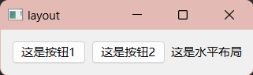
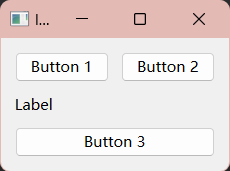
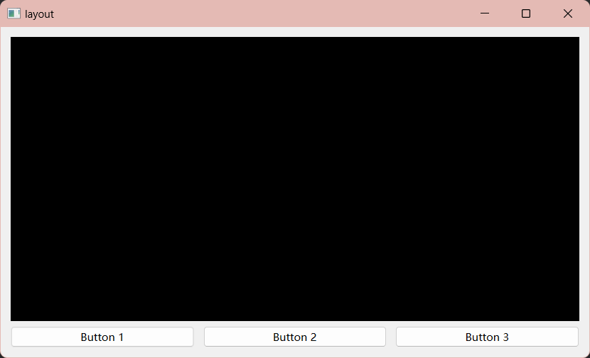

# [8] Layout -- 布局管理器

## 1. 概述

Qt 提供了多种布局管理器，用于帮助你在窗口中排列和组织 QWidget 对象。以下是一些常用的布局管理器：

1. **QHBoxLayout**（水平布局）：

    * ​`QHBoxLayout`​​ 水平布局将 QWidget 水平排列在一行中，从左到右。
    * 适用于工具栏、按钮栏等水平排列的情况。
2. **QVBoxLayout**（垂直布局）：

    * ​`QVBoxLayout`​​ 垂直布局将 QWidget 垂直排列在一列中，从上到下。
    * 适用于垂直列表、表单等垂直排列的情况。
3. **QGridLayout**（网格布局）：

    * ​`QGridLayout`​​ 允许你在一个网格中放置 QWidget，每个 QWidget 占用一个网格单元。
    * 适用于需要在行和列中组织控件的情况，如表格、网格视图等。
4. **QFormLayout**（表单布局）：

    * ​`QFormLayout`​​ 用于创建简单的表单，将标签和输入字段垂直排列在一列中。
    * 适用于输入表单、设置对话框等场景。
5. **QStackedLayout**（堆叠布局）：

    * ​`QStackedLayout`​​ 允许你在同一位置上叠放多个 QWidget，但只显示一个 QWidget，可以通过切换索引来显示不同的 QWidget。
    * 适用于需要在同一位置切换显示不同页面或视图的情况。
6. **QSplitter**（分割器布局）：

    * ​`QSplitter`​​ 允许你创建一个分割窗口，用户可以拖动分隔条来调整子部件的大小。
    * 适用于需要可调整大小的窗格或面板的情况。

---

 

## 2. 水平布局 -- ​`QHBoxLayout `​

控件处于一条水平线上，就是水平布局，比如：

​

---

**接下来是如何使用水平布局的基本方法：**

1. 首先得创建一个窗口，创建一个 QWidget 作为窗口的主部件

2. 然后加入其他部件（记得包含对应的头文件）

```cpp
#include <QPushButton>
#include <QLabel>
QPushButton *button1 = new QPushButton("这是按钮1");
QPushButton *button2 = new QPushButton("这是按钮2");
QLabel *label = new QLabel("这是水平布局");
```

3. 创建一个水平布局对象（也要包含头文件）：

```cpp
#include <QHBoxLayout>
QHBoxLayout *horizontalLayout = new QHBoxLayout;
```

4. 把控件加入水平布局：

```cpp
horizontalLayout->addWidget(button1,1);
horizontalLayout->addWidget(button2,2);
horizontalLayout->addWidget(label,2);
```

5. 设置主窗口的布局：

```cpp
this->setLayout(horizontalLayout);
```

---

> 介绍一下addWidget方法：

​`addWidget`​ 方法是 Qt 布局管理器类中的一个常用方法，用于将一个 QWidget（或其他可布局的对象）添加到布局中。该方法通常用于设置布局中的子部件，并控制它们的排列和布局方式。

下面是关于 `addWidget`​ 方法的基本信息和用法：

```cpp
void QLayout::addWidget(QWidget *widget, int stretch = 0, Qt::Alignment alignment = Qt::Alignment())
```

* ​`widget`​：要添加到布局中的 QWidget 或其他可布局的对象。
* ​`stretch`​：控制子部件在布局中的拉伸因子。它是一个整数值，通常用于设置子部件的占比。默认值为0，表示不拉伸。
* ​`alignment`​：控制子部件在布局中的对齐方式，默认情况下为 Qt::Alignment()，表示无特殊对齐。

使用 `addWidget`​ 方法时，你可以将一个或多个子部件添加到布局中，并可选地为每个子部件指定拉伸因子和对齐方式。

> 还有其他方法：

​`setSpacing`​：设置所有控件之间的间距 -->`setSpacing(int 间距)`​

​`setContentsMargins`​ ：设置布局的边距，以控制布局与窗口边缘的距离-->`setContentsMargins(int left, int top, int right, int bottom)`​

​`insertWidget`​ ：可以在指定位置插入一个控件，和`addWidget`​类似，只是多了一个指定位置参数。

​`removeWidget`​ ：可以从布局中移除一个控件-->`removeWidget(QWidget *widget)`​

​`addStretch`​：向布局中添加一个可伸展的空白区域，它通常用于控制布局中子部件的位置和对齐，一个参数：拉伸因子​`stretch`​

---

‍

 

## 3.水平布局和垂直布局嵌套

垂直布局和水平布局一样，只是在垂直方向上进行布局，方法也是水平布局的方法。这里记录一下水平布局和垂直布局嵌套使用实现复杂布局：

​​

```cpp
// 创建一个垂直布局
    QVBoxLayout *verticalLayout = new QVBoxLayout;

    // 在垂直布局内添加一个水平布局
    QHBoxLayout *horizontalLayout = new QHBoxLayout;
    QPushButton *button1 = new QPushButton("Button 1");
    QPushButton *button2 = new QPushButton("Button 2");
    horizontalLayout->addWidget(button1);
    horizontalLayout->addWidget(button2);
    horizontalLayout->setSpacing(10);
    // 添加水平布局到垂直布局
    verticalLayout->addLayout(horizontalLayout);

    // 创建其他控件并添加到垂直布局
    QLabel *label = new QLabel("Label");
    QPushButton *button3 = new QPushButton("Button 3");
    verticalLayout->addWidget(label);
    verticalLayout->addWidget(button3);
    verticalLayout->setSpacing(10);

    this->setLayout(verticalLayout);
```

> 嵌套的思路就是把一个布局当做一个控件添加到另一个布局。

---

 

## 4. 一个例子--从视频播放器那看到的

```cpp
//实例化另一个子窗口
chiledwidget = new ChildWidget(this);
//创建布局
QVBoxLayout *display= new QVBoxLayout(this);
QHBoxLayout *buttons = new QHBoxLayout(this);

QPushButton *button1 = new QPushButton("Button 1");
QPushButton *button2 = new QPushButton("Button 2");
QPushButton *button3 = new QPushButton("Button 3");

buttons->addWidget(button1);
buttons->addWidget(button2);
buttons->addWidget(button3);
buttons->setSpacing(10);

display->addWidget(chiledwidget);
display->addLayout(buttons);

this->setLayout(display);
```

​

---

‍

 

## 5. 其他布局

#### 网格布局：

```cpp
	QGridLayout *gridLayout = new QGridLayout;
    QPushButton *button1 = new QPushButton("Button 1");
    QPushButton *button2 = new QPushButton("Button 2");
    QPushButton *button3 = new QPushButton("Button 3");

    gridLayout->addWidget(button1, 0, 0); // 将 button1 放在第一行第一列
    gridLayout->addWidget(button2, 0, 1); // 将 button2 放在第一行第二列
    gridLayout->addWidget(button3, 1, 0, 1, 2); // 将 button3 放在第二行第一列，并跨越两列

    gridLayout->setRowStretch(0, 1); // 第一行伸展性为1
    gridLayout->setColumnStretch(1, 2); // 第二列伸展性为2

    gridLayout->setSpacing(10); // 设置控件之间的间距为10像素

    this->setLayout(gridLayout);
```
