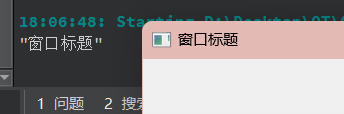
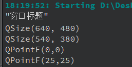

# [9] QWidget类

​`QWidget`​ 是 Qt 中的一个基础类，用于表示用户界面的可视化窗口或部件。它是所有可视化窗口、部件和控件的基类，是构建 Qt 用户界面的核心之一。`QWidget`​ 提供了一些基本的属性和方法，使得创建和管理用户界面变得更加容易，本文记录该类的一些常用方法。

## 1. 窗口属性

#### 1.1 窗口标题

* ​`QString windowTitle() const`​：获取窗口标题。
* ​`void setWindowTitle(const QString &title)`​：设置窗口标题。

```cpp
this->setWindowTitle("窗口标题");
QString WindowTitle = windowTitle();
qDebug() << WindowTitle;
```

​

---

 

#### 1.2 **窗口位置和大小**

* ​`QPoint pos() const`​：获取窗口左上角的坐标。
* ​`QSize size() const`​：获取窗口的大小。
* ​`int width() const`​：获取窗口的宽度。
* ​`int height() const`​：获取窗口的高度。
* ​`void move(const QPoint &point)`​：将窗口移动到指定坐标。
* ​`void resize(const QSize &size)`​：设置窗口的大小。
* ​`void setGeometry(int x, int y, int width, int height)`​：设置窗口的位置和大小。

```cpp
 	//获取窗口大小
    QSize windowsize;
    windowsize = size();
    qDebug() << windowsize;

    //重新设置窗口大小（高度宽度均减100）
    windowsize.setHeight(windowsize.height() - 100);
    windowsize.setWidth(windowsize.width() - 100);
    qDebug() << windowsize;
    this->resize(windowsize);

    //获取窗口的左上角坐标
    QPoint windowpoint = this->pos();
    qDebug() << windowpoint.toPointF();

	//重新设置窗口位置
    this->move(windowpoint.x() + 25,windowpoint.y() + 25);
    qDebug() << this->pos().toPointF();
```

​

---

> 介绍上面出现的​`QSize`​ 和 `QPoint`​

​`QSize`​ 和 `QPoint`​ 都是 Qt 中用于处理尺寸和坐标的类，它们常常用于图形界面的开发和布局管理。

1. **QSize**：

    * ​`QSize`​ 用于表示二维对象的尺寸，通常用来表示宽度和高度。
    * 构造函数：`QSize(int width, int height)`​，通过指定宽度和高度创建一个 `QSize`​ 对象。
    * 常用方法：

      * ​`int width() const`​：获取尺寸的宽度。
      * ​`int height() const`​：获取尺寸的高度。
      * ​`bool isEmpty() const`​：检查尺寸是否为空（宽度或高度为零）。
      * ​`void setWidth(int width)`​ 和 `void setHeight(int height)`​：设置宽度和高度。
      * ​`bool isValid() const`​：检查尺寸是否有效（宽度和高度都大于等于零）。
    * ​`QSize`​ 对象通常用于指定部件或窗口的大小。

2. **QPoint**：

    * ​`QPoint`​ 用于表示二维平面上的坐标，通常用来表示 x 和 y 坐标。
    * 构造函数：`QPoint(int x, int y)`​，通过指定 x 和 y 坐标创建一个 `QPoint`​ 对象。
    * 常用方法：

      * ​`int x() const`​：获取 x 坐标。
      * ​`int y() const`​：获取 y 坐标。
      * ​`void setX(int x)`​ 和 `void setY(int y)`​：设置 x 和 y 坐标。
      * ​`bool isNull() const`​：检查坐标是否为零（x 和 y 坐标都为零）。
    * ​`QPoint`​ 对象通常用于指定部件或图形对象的位置。

---

 

#### 1.3 **窗口可见性和窗口状态**

* ​`bool isVisible() const`​：检查窗口是否可见。
* ​`void setVisible(bool visible)`​：设置窗口的可见性。

* ​`Qt::WindowStates windowState() const`​：获取窗口的状态，如最大化、最小化等。
* ​`void setWindowState(Qt::WindowStates state)`​：设置窗口的状态。
* ​`show()`​：显示窗口
* ​`hide()`​：隐藏窗口
* ​`close()`​: 关闭窗口

 

#### 1.4 **窗口最小化和最大化**

* ​`void showMinimized()`​：最小化窗口。
* ​`void showMaximized()`​：最大化窗口。
* ​`void showFullScreen()`​：全屏显示窗口。
* ​`void showNormal()`​：恢复正常窗口大小和位置。

 

#### 1.5 设置窗口的最大尺寸和最小尺寸

1. **设置最小尺寸**：

    * ​`void setMinimumSize(int minw, int minh)`​：设置窗口的最小宽度和最小高度。
    * ​`void setMinimumSize(const QSize &size)`​：设置窗口的最小尺寸为指定的 `QSize`​ 对象。
2. **设置最大尺寸**：

    * ​`void setMaximumSize(int maxw, int maxh)`​：设置窗口的最大宽度和最大高度。
    * ​`void setMaximumSize(const QSize &size)`​：设置窗口的最大尺寸为指定的 `QSize`​ 对象。

```cpp
//固定窗口大小为当前大小
this->setMinimumSize(size());
this->setMaximumSize(size());
```

‍

‍

## 2. 绘制和渲染

​`QWidget`​ 的绘制和渲染是指如何将图形元素或自定义图形绘制到窗口上，以实现自定义绘制效果。在 Qt 中，你可以通过以下方法来进行窗口的绘制和渲染：

#### 2.1 **重写 **​**`paintEvent`**​ ** 函数**：

* 你可以在自定义的 `QWidget`​ 子类中重写 `paintEvent`​ 函数，然后在该函数内进行绘制操作。
* ​`paintEvent`​ 函数会在窗口需要重新绘制时自动调用，如窗口首次显示、窗口被遮挡后再次显示、窗口大小改变等情况。
* 在 `paintEvent`​ 函数中，你可以使用 `QPainter`​ 对象来进行绘制操作，包括绘制图形、文本、图像等。

```cpp
void MyWidget::paintEvent(QPaintEvent *event)
{
    QPainter painter(this);
    // 绘制操作
    painter.drawLine(0, 0, width(), height());
    painter.drawText(QRect(10, 10, 100, 30), "Hello, Qt!");
}
```

 

#### 2.2 **使用 **​**`QPainter`**​ ** 绘图工具**：

* ​`QPainter`​ 类提供了丰富的绘图功能，可用于在窗口或部件上绘制图形。
* 你可以使用 `QPainter`​ 绘制直线、矩形、椭圆、多边形、文本等。
* 使用 `drawImage`​ 绘制图像，或 `fillRect`​ 填充矩形区域。

```cpp
void MyWidget::paintEvent(QPaintEvent *event)
{
    QPainter painter(this);
    QPen pen(Qt::blue);
    painter.setPen(pen);
  
    // 绘制直线
    painter.drawLine(0, 0, width(), height());
  
    // 绘制矩形
    painter.drawRect(20, 20, 100, 50);
  
    // 绘制文本
    painter.drawText(QRect(10, 10, 100, 30), "Hello, Qt!");
  
    // 绘制图像
    QImage image("image.png");
    painter.drawImage(QPoint(150, 150), image);
}
```

 

#### 2.3 **使用 **​**`QPixmap`**​ ** 进行离屏渲染**：

* 有时候，你可能希望先在一个 `QPixmap`​ 对象上进行绘制，然后再将其渲染到窗口上，以避免闪烁和绘制效率问题。
* ​`QPixmap`​ 可以用于离屏渲染，然后使用 `QPainter::drawPixmap`​ 渲染到窗口上。

```cpp
void MyWidget::paintEvent(QPaintEvent *event)
{
    QPixmap pixmap(size());
    pixmap.fill(Qt::white); // 填充白色背景
  
    QPainter painter(&pixmap);
    // 在 QPixmap 上绘制
  
    // 渲染到窗口
    QPainter windowPainter(this);
    windowPainter.drawPixmap(0, 0, pixmap);
}
```

 

#### 2.4 **修改背景色**

1. 其实方法还是很多的，第一个用调色板设置：

```cpp
// 设置调色板
    setAutoFillBackground(true);
    QPalette p = palette();
    p.setColor(QPalette::Window, Qt::black); // 黑色
    setPalette(p);
```

2. 通过样式表：

```cpp
QString styleSheet = "background-color: black;";
this->setStyleSheet(styleSheet);
```

通过上述方法，你可以自定义窗口的绘制和渲染，实现各种自定义的图形效果和界面元素。要记住，在绘制过程中，你可以设置画笔颜色、线条宽度、填充模式等，以获得所需的绘制效果。

---

 

待补充。。。
