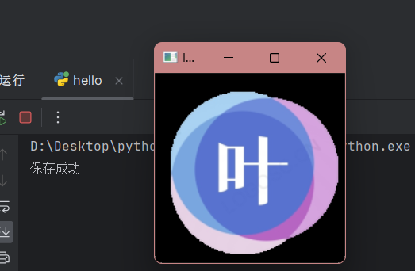

# 一、图片处理

## 1.读入图像

读入图像使用的函数是`cv2.imread`​:

```python
retval = cv2.imread(filename[, flags])
```

其中，`filename`​ 是要读取的图像文件的路径，而 `flags`​ 是可选参数，用于指定图像的读取方式。以下是一些常用的 `flags`​：

* ​`cv2.IMREAD_COLOR`​: 默认值，加载彩色图像。如果图像是灰度图像，则会自动转换为彩色图像。
* ​`cv2.IMREAD_GRAYSCALE`​: 加载灰度图像。
* ​`cv2.IMREAD_UNCHANGED`​: 加载包含 alpha 通道的图像，保持图像的原始通道数。
* 其他参数可以查官网

​`cv2.imread()`​ 返回一个代表加载的图像的NumPy数组。如果无法读取图像，返回值为 `None`​。

> ​`filename`​是文件的绝对路径，如果路径中使用`\`​注意一些转义字符，所以推荐使用`\\`​

举一个例子：

```python
import cv2

# 图像文件路径
image_path = 'path/to/your/image.jpg'

# 使用cv2.imread()加载图像
img = cv2.imread(image_path)
```

---

## 2.显示图像

###### 2.1 显示图像使用的是`cv2.imshow`​函数：

```python
cv2.imshow(winname, mat)
```

* ​`winname`​ 是窗口的名称，是一个字符串。
* ​`mat`​ 是要显示的图像，通常是一个NumPy数组。

###### 2.2 一般显示图像还需要用到一个函数就是`cv2.waitKey`​，不调用此函数图片显示会一闪而过：

```python
k = cv2.waitKey(delay)
```

* ​`delay`​ 是等待时间，单位是毫秒。如果设置为0，表示无限等待用户的按键输入。如果设置为正整数，表示等待指定的时间（毫秒）。

​`cv2.waitKey()`​ 返回一个整数，表示用户按下的键盘键的 ASCII 值。如果没有键被按下，返回值为 -1。

###### 2.3 最后不需要这个窗口后，调用`cv2.destroyAllWindows`​销毁窗口：

```python
# 关闭窗口
cv2.destroyAllWindows()
```

###### 2.4 示例：

```python
import cv2

# 图像文件路径
image_path = 'path/to/your/image.jpg'

# 使用cv2.imread()加载图像
img = cv2.imread(image_path)

# 检查图像是否成功加载
if img is None:
    print(f"无法加载图像，请检查文件路径: {image_path}")
else:
    # 在窗口中显示图像
    cv2.imshow('Image', img)

    # 等待用户按下任意键
    cv2.waitKey(0)

    # 关闭窗口
    cv2.destroyAllWindows()

```

---

## 3.保存图像

保存图像要用到`cv2.imwrite`​函数：

```python
retval = cv2.imwrite(filename, img[, params])
```

其中：

* ​`filename`​ 是保存图像的文件路径。
* ​`img`​ 是要保存的图像，通常是一个NumPy数组。
* ​`params`​ 是可选参数，用于指定保存图像的参数。通常，可以传递一个包含压缩参数的元组，例如 `(cv2.IMWRITE_JPEG_QUALITY, 95)`​

​`cv2.imwrite()`​ 返回一个布尔值，表示保存是否成功。如果成功，返回 `True`​；如果失败，返回 `False`​。

示例：

```python
import cv2

image_path = "D:/Desktop/ICP/cropped-result_57c3c6ff-d7da-4488-ae34-5cce2d4cb92a-192x192.png"
write_path = "D:/Desktop/1.png"
# 使用cv2.imread()加载图像
img = cv2.imread(image_path)

# 检查图像是否成功加载
if img is None:
    print(f"无法加载图像，请检查文件路径: {image_path}")
else:
    #保存图像：
    write_info = cv2.imwrite(write_path,img)
    if write_info:
        print("保存成功")
    # 在窗口中显示图像
    cv2.imshow('Image', img)

    # 等待用户按下任意键
    key = cv2.waitKey(0)

    # 关闭窗口
    cv2.destroyAllWindows()

print(key)
```

结果：  
​​  

‍
