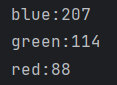
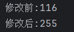

# 三、使用numpy进行像素处理

## 1.读取像素

语法和直接处理相似，但是通过调用成员方法`img.item(位置)`​来读取像素。

对于灰度图像`img.item(y,x)`​：

```python
import cv2

image_path = "D:\\Desktop\\1.png"

# 使用cv2.imread()加载RGB图像
bgr_img = cv2.imread(image_path,cv2.IMREAD_GRAYSCALE)

# 检查图像是否成功加载
if bgr_img is None:
    print(f"无法加载图像，请检查文件路径: {image_path}")
else:
    print(bgr_img.item(100,100))
```

对于BGR图像，`img.item(y,x,cannel)`​:

```python
import cv2

image_path = "D:\\Desktop\\1.png"

# 使用cv2.imread()加载RGB图像
bgr_img = cv2.imread(image_path)

# 检查图像是否成功加载
if bgr_img is None:
    print(f"无法加载图像，请检查文件路径: {image_path}")
else:
    blue = bgr_img.item(100,100,0)
    print(f"blue:{blue}")
    green = bgr_img.item(100, 100, 1)
    print(f"green:{green}")
    red = bgr_img.item(100,100,2)
    print(f"red:{red}")
```

​​

---

## 2.修改像素的值

使用成员方法`img.itemset(位置，新值)`​进行修改。

对于灰度图像，`img.itemset((y,x),newpixel)`​:

```python
import cv2

image_path = "D:\\Desktop\\1.png"

# 使用cv2.imread()加载RGB图像
bgr_img = cv2.imread(image_path,cv2.IMREAD_GRAYSCALE)

# 检查图像是否成功加载
if bgr_img is None:
    print(f"无法加载图像，请检查文件路径: {image_path}")
else:
    print(f"修改前:{bgr_img.item(100,100)}")
    bgr_img.itemset((100,100),255)
    print(f"修改后:{bgr_img.item(100,100)}")
```

​​

对于灰度图像，`img.itemset((y,x,cannel),newpixel)`​:

```python
import cv2

image_path = "D:\\Desktop\\1.png"

# 使用cv2.imread()加载RGB图像
bgr_img = cv2.imread(image_path)

# 检查图像是否成功加载
if bgr_img is None:
    print(f"无法加载图像，请检查文件路径: {image_path}")
else:
    bgr = [0,0,0]
    bgr[0] = bgr_img.item(100,100,0)
    bgr[1] = bgr_img.item(100, 100, 1)
    bgr[2] = bgr_img.item(100, 100, 2)
    print(f"修改前:{bgr}")
    bgr_img.itemset((100,100,0),255)
    bgr_img.itemset((100, 100, 1), 255)
    bgr_img.itemset((100, 100, 2), 255)
    bgr[0] = bgr_img.item(100, 100, 0)
    bgr[1] = bgr_img.item(100, 100, 1)
    bgr[2] = bgr_img.item(100, 100, 2)
    print(f"修改前:{bgr}")
```

> 使用`item`​和`itemset`​会比直接读取和修改更繁琐，因为只能单通道读取和修改。
