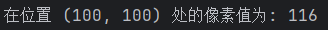
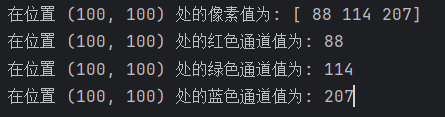
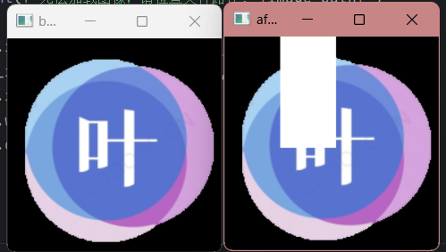

# 二、直接处理像素

在OpenCV中，图像的通道顺序是BGR（蓝色、绿色、红色），而不是通常使用的RGB（红色、绿色、蓝色）。这是因为OpenCV最初是为BGR颜色格式而设计的，而在其他一些图像处理库和标准中，通常使用RGB格式。

所以，当你使用 `cv2.imread()`​ 读取图像时，得到的图像数据是按照BGR通道顺序排列的。在处理图像时，如果需要使用RGB顺序，你可以使用NumPy的切片操作来交换通道的顺序。

例如：

```python
import cv2

# RGB图像文件路径
image_path = 'path/to/your/rgb_image.jpg'

# 使用cv2.imread()加载RGB图像
bgr_img = cv2.imread(image_path)

# 检查图像是否成功加载
if bgr_img is None:
    print(f"无法加载图像，请检查文件路径: {image_path}")
else:
    # 将BGR格式转换为RGB格式
    rgb_img = cv2.cvtColor(bgr_img, cv2.COLOR_BGR2RGB)
```

## 1.读取像素

在OpenCV中，读取像素值的方式取决于图像的类型，分为灰度图像和RGB图像。下面分别介绍如何在这两种类型的图像中读取像素值：

###### 1.1 灰度图像，返回灰度值

在灰度图像中，每个像素只有一个灰度值，通常表示亮度。你可以使用 `img[y, x]`​ 读取像素值，其中 `(x, y)`​ 是像素在图像上的坐标。

以下是一个例子，演示如何在灰度图像中读取像素值：

```python
import cv2

image_path = "D:\\Desktop\\2.jpg"

# 使用cv2.imread()加载灰度图像
gray_img = cv2.imread(image_path, cv2.IMREAD_GRAYSCALE)

# 检查图像是否成功加载
if gray_img is None:
    print(f"无法加载图像，请检查文件路径: {image_path}")
else:
    # 读取像素值（假设坐标为 (100, 200)）
    x, y = 100, 100
    pixel_value = gray_img[y, x]

    print(f"在位置 ({x}, {y}) 处的像素值为: {pixel_value}")
```

​​

###### 1.2 RGB图像

在RGB图像中，每个像素有三个通道，分别表示红色（R）、绿色（G）和蓝色（B）的亮度。你可以使用 `img[y, x]`​ 读取每个通道的值，或者使用 `img[y, x, c]`​ 直接读取特定通道的值（其中 `c`​ 是通道索引，0 表示红色，1 表示绿色，2 表示蓝色）。

以下是一个例子，演示如何在RGB图像中读取像素值：

```python
import cv2

image_path = "D:\\Desktop\\1.png"

# 使用cv2.imread()加载RGB图像
rgb_img = cv2.imread(image_path)

# 检查图像是否成功加载
if rgb_img is None:
    print(f"无法加载图像，请检查文件路径: {image_path}")
else:
	# 将BGR格式转换为RGB格式
    rgb_img = cv2.cvtColor(bgr_img, cv2.COLOR_BGR2RGB)
    # 读取像素值（假设坐标为 (100, 200)）
    x, y = 100, 100

    # 读取整个像素值（包含三个通道的值）
    pixel_value_rgb = rgb_img[y, x]
    print(f"在位置 ({x}, {y}) 处的像素值为: {pixel_value_rgb}")

    # 分别读取红、绿、蓝通道的值
    red_value = rgb_img[y, x, 0]
    green_value = rgb_img[y, x, 1]
    blue_value = rgb_img[y, x, 2]

    print(f"在位置 ({x}, {y}) 处的红色通道值为: {red_value}")
    print(f"在位置 ({x}, {y}) 处的绿色通道值为: {green_value}")
    print(f"在位置 ({x}, {y}) 处的蓝色通道值为: {blue_value}")
```

​​​​

这个例子演示了如何在RGB图像中分别读取整个像素值和单个通道的值。希望这能帮助你在不同类型的图像中读取像素值。

> 对于RGB图片，使用 `img[y, x]`​ 将返回一个包含三个通道值的NumPy数组，即一个长度为3的元组。每个通道对应于红色（R）、绿色（G）和蓝色（B）的亮度。
>
> 如果你使用 `img[y, x, c]`​，其中 `c`​ 是通道索引，将返回指定通道的值。

---

## 2.修改像素值

有上面读取像素的经验，修改像素的方式也很直接，使用`img[y,x] = newpixel`​

对于灰度图像，直接使用该方式，例如

```python
#假如gray_img是我读取的灰度图像
#修改该图像的(100,100)处的像素为255
gray_img[100,100] = 255
```

对于BGR图像：

可以修改其中一个通道，比如：

```python
bgr_img[100,100,0] = 255
bgr_img[100,100,1] = 255
bgr_img[100,100,2] = 255
```

也可以同时修改三个通道：

```python
bgr_img[100,100] = [255,255,255]
```

同时修改多个像素：

```python
#0到100行的50到100列的像素都改为白色
bgr_img[0:100,50:100] = [255,255,255]
```

示例：

```python
import cv2

image_path = "D:\\Desktop\\1.png"

# 使用cv2.imread()加载RGB图像
bgr_img = cv2.imread(image_path)

# 检查图像是否成功加载
if bgr_img is None:
    print(f"无法加载图像，请检查文件路径: {image_path}")
else:
    cv2.imshow("before",bgr_img)
    bgr_img[0:100,50:100] = [255,255,255]
    cv2.imshow("after", bgr_img)
    cv2.waitKey(0)
    cv2.destroyAllWindows()
```

​​​​
