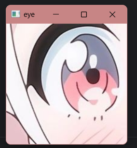

# 五、图像ROI

ROI（Region of Interest，感兴趣区域）是图像中一个你感兴趣的区域。在OpenCV中，你可以使用切片操作来提取图像的ROI：

```python
#假如img是我打开的图像
roi = img[y1:y2,x1:x2]
```

> 以上方法取得的就是img的y1行到y2行的x1列到x2列的图像

例如：

```python
import cv2

image_path = "D:\\Desktop\\test.jpg"
img = cv2.imread(image_path,cv2.IMREAD_UNCHANGED)
eye = img[400:600,250:450]
cv2.imshow("eye",eye)
cv2.waitKey(0)
cv2.destroyAllWindows()
```

​​

还可以进行复制操作，将这个ROI复制到另一个ROI区域：

```python
import cv2

image_path = "D:\\Desktop\\test.jpg"
img = cv2.imread(image_path,cv2.IMREAD_UNCHANGED)
eye = img[400:600,250:450]
img[350:550,570:770] = eye
cv2.imshow("img",img)
cv2.waitKey(0)
cv2.destroyAllWindows()
```

​​

> 当然还可以跨图像复制

‍
