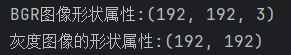
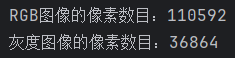
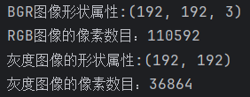

# 四、获取图像的属性

## 1.形状属性

使用 OpenCV 中的 `shape`​ 属性来获取图像的形状属性。对于灰度图像，形状属性是一个包含两个元素的元组 `(rows, cols)`​，其中 `rows`​ 表示图像的高度，`cols`​ 表示图像的宽度。对于彩色图像，`shape`​ 属性还会包含通道数，形状属性是一个包含三个元素的元组 `(rows, cols, channels)`​。

示例：

```python
import cv2

image_path = "D:\\Desktop\\1.png"

# 使用cv2.imread()加载RGB图像
bgr_img = cv2.imread(image_path)
# 使用cv2.imread()加载灰度图像
gar_img = cv2.imread(image_path,cv2.IMREAD_GRAYSCALE)
# 检查图像是否成功加载
if bgr_img is None:
    print(f"无法加载图像，请检查文件路径: {image_path}")
else:
    #BGR图像
    rgb_shape = bgr_img.shape
    print(f"BGR图像形状属性:{rgb_shape}")
    #灰度图像
    gar_shape = gar_img.shape
    print(f"灰度图像的形状属性:{gar_shape}")
```

​​

---

## 2.像素数目

OpenCV 中的图像对象有一个 `size`​ 方法，可以直接用来获取图像的像素数目。这个方法返回一个表示图像总像素数目的整数值。

```python
import cv2

image_path = "D:\\Desktop\\1.png"

# 使用cv2.imread()加载RGB图像
bgr_img = cv2.imread(image_path)
gar_img = cv2.imread(image_path,cv2.IMREAD_GRAYSCALE)
# 检查图像是否成功加载
if bgr_img is None:
    print(f"无法加载图像，请检查文件路径: {image_path}")
else:
    #BGR图像
    rgb_pixel = bgr_img.size
    print(f"RGB图像的像素数目：{rgb_pixel}")
    #灰度图像
    gar_pixel = gar_img.size
    print(f"灰度图像的像素数目：{gar_pixel}")
```

​​

或者通过图像对象的`shape`​方法的返回值求算得到像素数量，也就是`高度*宽度(*通道数)`​:

```python
import cv2

image_path = "D:\\Desktop\\1.png"

# 使用cv2.imread()加载RGB图像
bgr_img = cv2.imread(image_path)
gar_img = cv2.imread(image_path,cv2.IMREAD_GRAYSCALE)
# 检查图像是否成功加载
if bgr_img is None:
    print(f"无法加载图像，请检查文件路径: {image_path}")
else:
    #BGR图像
    rgb_shape = bgr_img.shape
    print(f"BGR图像形状属性:{rgb_shape}")
    rgb_pixel = rgb_shape[0] * rgb_shape[1] * rgb_shape[2]
    print(f"RGB图像的像素数目：{rgb_pixel}")
    #灰度图像
    gar_shape = gar_img.shape
    print(f"灰度图像的形状属性:{gar_shape}")
    gar_pixel = gar_shape[0] * gar_shape[1]
    print(f"灰度图像的像素数目：{gar_pixel}")
```

​​

> 可见，两者的结果是一致的

---

## 3.图像的数据类型

你可以使用 OpenCV 中的 `dtype`​ 属性来获取图像像素点的数据类型。`dtype`​ 返回一个描述像素点数据类型的 NumPy 数据类型对象。

```python
import cv2

image_path = "D:\\Desktop\\1.png"

# 使用cv2.imread()加载RGB图像
bgr_img = cv2.imread(image_path)
# 检查图像是否成功加载
if bgr_img is None:
    print(f"无法加载图像，请检查文件路径: {image_path}")
else:
    #BGR图像像素点数据类型
    gbr_pixel_type = bgr_img.dtype
    print(f"BGR图像像素点数据类型:{gbr_pixel_type}")
```

```python
#结果
#BGR图像像素点数据类型:uint8
```

---

## 4.一个示例

好吧，主要是了解一下`python`​的函数封装：

```python
import cv2

def is_rgb_image(image_path):
    # 使用cv2.imread()加载RGB图像
    bgr_img = cv2.imread(image_path, cv2.IMREAD_UNCHANGED)

    # 检查图像是否成功加载
    if bgr_img is None:
        print(f"无法加载图像，请检查文件路径: {image_path}")
        return False
    else:
        # 判断图像类型
        return len(bgr_img.shape) == 3

# 调用函数并获取返回值
image_path = "D:\\Desktop\\2.jpg" #这是一个灰度图像
is_rgb = is_rgb_image(image_path)

# 输出结果
if is_rgb:
    print("是RGB图像")
else:
    print("不是RGB图像")

#不是RGB图像
```
